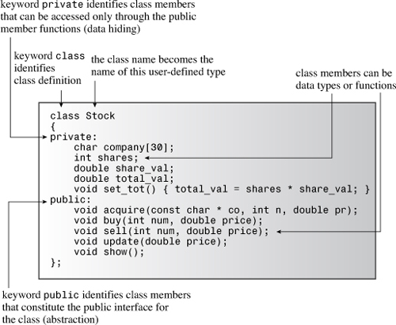
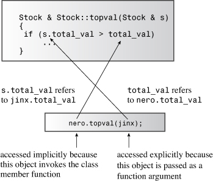
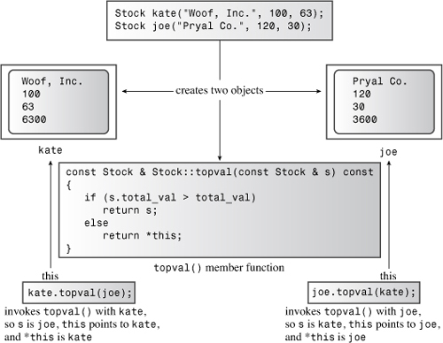

## 10. 对象和类

在本章中，您将了解以下内容：

• 过程式和面向对象编程• 类的概念• 如何定义和实现类•公共和私人课程访问• 类数据成员• 类方法（也称为类函数成员）• 创建和使用类对象• 类构造函数和析构函数• 成员函数`const`• 指针`this`• 创建对象数组• 类范围• 抽象数据类型面向对象编程 （OOP） 是一种用于设计程序的特定概念方法，C++增强了 C，其功能简化了该方法的应用方式。以下是最重要的 OOP 功能：• 抽象• 封装和数据隐藏• 多态性• 继承• 代码的可重用性

该类是实现这些功能并将其绑定在一起的唯一最重要的C++增强功能。本章开始对类的考察。它解释了抽象、封装和数据隐藏，并演示了类如何实现这些功能。它讨论了如何定义类，如何为类提供公共和私有部分，以及如何创建使用类数据的成员函数。此外，本章还向您介绍了构造函数和析构函数，它们是用于创建和释放属于类的对象的特殊成员函数。最后，您将遇到此指针，`它是`某些类编程的重要组成部分。以下各章将此讨论扩展到运算符重载（另一种多态性）和继承，这是重用代码的基础。

过程和面向对象编程虽然在本书中，我们偶尔会从OOP的角度来探索编程，但我们通常非常接近C、Pascal和BASIC等语言的标准过程方法。让我们看一个示例，它阐明了 OOP 的前景与过程式编程的前景有何不同。作为类型巨人垒球队的最新成员，您被要求保留球队统计数据。当然，您向计算机寻求帮助。如果你是一个程序程序员，你可能会沿着这些思路思考：让我们看看，我想输入名称，击球时间，击球次数，击球平均值（对于那些不遵循棒球或垒球的人来说，击球平均数是击球次数除以球员在击球时的官方次数;当球员上垒或出局时，击球次数终止， 但某些事件，如散步，不算作击球的官方时间），以及每个球员的所有其他重要基本统计数据。等等，计算机应该让我的生活更轻松，所以我想让它弄清楚其中的一些东西，比如击球平均数。我也希望程序报告结果。我应该如何组织它？我想我应该把事情做对，使用函数。是的，我将调用一个函数来获取输入，调用另一个函数进行计算，然后调用第三个函数来报告结果。嗯，当我从下一个游戏中获取数据时会发生什么？我不想再从头开始。好的，我可以添加一个函数来更新统计信息。天哪，也许我需要一个菜单来选择输入，计算，更新和显示数据。嗯......我将如何表示数据？我可以使用一个字符串数组来保存玩家的名字，另一个数组来保存每个玩家的at蝙蝠，另一个数组来保存命中，依此类推。不，这很愚蠢。我可以设计一个结构来保存单个玩家的所有信息，然后使用这些结构的数组来代表整个团队。`main()``main()`简而言之，使用过程方法，您首先专注于将要遵循的过程，然后考虑如何表示数据。（这样您就不必让程序在整个赛季中运行，您可能还希望能够将数据保存到文件中并从文件中读取数据。

现在让我们看看当你戴上OOP帽子（在有吸引力的多态设计中）时，你的视角会如何变化。您首先考虑数据。此外，您不仅要考虑如何表示数据，还要考虑如何使用数据：

让我们看看，我在跟踪什么？当然是球手。所以我想要一个代表整个球员的对象，而不仅仅是她的击球平均数或击球时间。是的，这将是我的基本数据单元，一个代表球员姓名和统计数据的对象。我需要一些方法来处理此对象。嗯，我想我需要一种方法来获取这个单元的基本信息。计算机应该计算一些东西，比如击球平均值——我可以添加方法来进行计算。程序应该自动执行这些计算，而无需用户记住要求完成它们。此外，我还需要更新和显示信息的方法。因此，用户可以通过三种方式与数据进行交互：初始化、更新和报告。这就是用户界面。简而言之，使用OOP方法，您可以专注于用户感知的对象，考虑描述对象所需的数据以及描述用户与数据交互的操作。开发该接口的描述后，继续决定如何实现该接口和数据存储。最后，你把一个程序放在一起，使用你的新设计。抽象和类生活充满了复杂性，我们应对复杂性的一种方式是简化抽象。你是一个超过八边形原子的集合。一些心灵的学生会说，你的心灵是几种半自律剂的集合。但是，将自己视为一个单一的实体要简单得多。在计算中，抽象是根据信息与用户的接口来表示信息的关键步骤。也就是说，您将问题的基本操作特征抽象化，并用这些术语表达解决方案。在垒球统计信息示例中，该接口描述用户如何初始化、更新和显示数据。从抽象开始，它是到用户定义类型的一个简短步骤，C++是实现抽象接口的类设计。什么是类型？

让我们进一步思考一下类型构成要素。例如，什么是书？如果你认同流行的刻板印象，你可能会想到一个视觉上的书——厚厚的黑框眼镜，装满钢笔的口袋保护器，等等。经过一番思考，你可能会得出结论，一个书在操作上被更好地定义——例如，根据他或她如何应对尴尬的社交场合。如果你不介意拉伸类比，你有类似的情况，使用诸如C之类的过程语言。起初，您倾向于根据数据类型的外观（即它在内存中的存储方式）来考虑数据类型。例如，`char` 是 1 字节的内存，而`双精度`值通常是 8 字节的内存。但是，稍加思考，您就会得出结论，数据类型也是根据可以对其执行的操作来定义的。例如，`int` 类型可以使用所有算术运算。您可以对整数进行加、减、乘和除。您还可以对它们使用模数运算符 （`%`）。

另一方面，考虑指针。指针可能需要与 相同的内存量。它甚至可以在内部表示为整数。但是指针不允许执行与整数相同的操作。例如，您不能将两个指针相互乘以。这个概念毫无意义，所以C++没有实现它。因此，当您将变量声明为或指针指向时，您不仅要分配内存，还要确定可以使用该变量执行哪些操作。简而言之，指定基本类型有三点作用：`int``int``float`• 它确定数据对象需要多少内存。• 它确定如何解释内存中的位。（A 和 a 在内存中可能使用相同数量的位，但它们被转换为数值的方式不同。`long``float`• 它确定可以使用数据对象执行哪些操作或方法。对于内置类型，有关操作的信息内置于编译器中。但是，当您在C++中定义用户定义类型时，您必须自己提供相同类型的信息。作为这种额外工作的交换，您可以获得功能和灵活性，以自定义适合新数据类型以满足实际要求。C++的课程*类*是将抽象转换为用户定义类型的C++工具。它将数据表示和用于操作该数据的方法组合到一个整洁的包中。让我们看一个表示股票的类。首先，你必须考虑一下如何代表股票。您可以将一股股票作为基本单位，并定义一个类来表示股票。但是，这意味着您需要 100 个对象来表示 100 个份额，这是不切实际的。相反，您可以将一个人在特定股票中的当前持仓量表示为基本单位。拥有的股票数量将是数据表示的一部分。一种现实的办法是，为了税务目的，必须保留诸如初始购买价格和购买日期之类的记录。此外，它还必须管理诸如股票分割之类的事件。对于定义类的第一次努力来说，这似乎有点雄心勃勃，因此您可以对问题采取理想化，简化的观点。特别是，您可以将可以执行的操作限制为：• 收购公司股票。•购买同一股票的更多股票。•出售股票。• 更新股票的每股价值。• 显示有关馆藏的信息。

您可以使用此列表来定义 stock 类的公共接口（如果您有兴趣，可以在以后添加其他功能。要支持此接口，您需要存储一些信息。同样，您可以使用简化的方法。例如，不要担心美国以八分之一美元的倍数评估股票的做法。（显然，纽约证券交易所一定在本书的上一版中看到了这种简化，因为它已经决定改用这里使用的系统。以下是要存储的信息列表：

• 公司名称• 拥有的股票数量• 每股价值• 所有股票的总价值接下来，您可以定义该类。通常，类规范有两个部分：• 一个*类声明*，它用数据成员来描述数据组件，用成员函数来描述公共接口，用术语*来描述方法*• *类方法定义*，描述如何实现某些类成员函数粗略地说，类声明提供了类概述，而方法定义提供了详细信息。

什么是接口？

*接口*是两个系统之间交互的共享框架，例如，计算机与打印机之间或用户与计算机程序之间。例如，用户可能是您，程序可能是字处理器。当您使用文字处理器时，您不会将单词直接从您的大脑传输到计算机内存中。相反，您可以与程序提供的接口进行交互。您按一个键，计算机会在屏幕上显示一个字符。移动鼠标，计算机在屏幕上移动光标。你不小心点击了鼠标，你打字的段落发生了一些奇怪的事情。程序界面管理将您的意图转换为存储在计算机中的特定信息。对于类，我们说的是公共接口。在这种情况下，public 是使用类的程序，交互系统由类对象组成，接口由编写类的人提供的方法组成。该接口使程序员能够编写与类对象交互的代码，从而使程序能够使用类对象。例如，要查找对象中的字符数，请不要将对象打开到内部的内容;您只需使用类创建者提供的方法即可。事实证明，类设计拒绝直接访问公共用户。但公众可以使用这种方法。因此，该方法是用户和类对象之间的公共接口的一部分。同样，该方法是类公共接口的一部分;使用的程序不会直接修改对象的内部来读取一行输入;相反，做工作。`string``size()``size()``size()``string``getline()``istream``cin``cin``getline()`如果你想要一个更加个人的关系，而不是认为程序使用一个类作为公共用户，你可以把使用类编写程序的人想象成公共用户。但无论如何，要使用类，您需要知道它的公共接口;要编写类，您需要创建其公共接口。

开发一个类和一个使用它的程序需要几个步骤。与其一次完成所有开发，不如将开发分解为更小的阶段。通常，C++程序员将接口（以类定义的形式）放在头文件中，并以类方法的代码形式将实现放在源代码文件中。所以让我们成为典型。[清单 10.1](#ch10ex01) 给出了第一阶段，即名为 的类的暂定类声明。该文件使用 等，如[第 9 章](ch09.html#ch09) “[内存模型和命名空间](ch09.html#ch09)”中所述，以防止包含多个文件。`Stock``#ifndef`

为了帮助识别类，本书遵循了将类名大写的常见但不通用的约定。您会注意到，[清单 10.1](#ch10ex01) 看起来像一个结构声明，其中包含一些额外的褶皱，例如成员函数以及公共和私有部分。我们很快就会改进此声明（因此不要将其用作模型），但首先让我们看看此定义的工作原理。

**清单 10.1.`库存00.h`**

------

stock00.h -- 股票类接口
// 版本 00
\#ifndef STOCK00_H_
\#define STOCK00_H_

\#include <字符串>

类股票 // 类声明
{
private：
std：：string company;
long shares;
double share_val;
double total_val;
void set_tot（） { total_val = shares * share_val; }
public：
void acquire（const std：：string & co， long n， double pr）;
无效买入（长数，双倍价格）;
空卖（长数字，双倍价格）;
无效更新（双倍价格）;
void show（）;
};注意末尾

的分号#endif

稍后您将仔细查看类的详细信息，但首先让我们检查一下更常规的功能。首先，C++ 关键字类将[清单 10.1](#ch10ex01) 中的代码标识为定义类的设计。（在此上下文中，关键字 class 和 typename 不像它们在模板参数中那样是同义词;typename 不能在这里使用。语法将 Stock 标识为此新类的类型名称。此声明使您能够声明 Stock 类型的变量、被调用*对象*或*实例*。每个单独的对象表示一个保留。例如，以下声明创建两个名为 和 的 Stock 对象：`sally``solly`

股票莎莉;
高汤索利;

例如，该对象可以表示Sally在特定公司中的持股情况。`sally`

接下来，请注意，您决定存储的信息以类数据成员的形式显示，例如 和 。例如，成员持有公司名称，会员持有Sally拥有的股份数量，会员持有每股的价值，会员持有所有股份的总价值。同样，所需的操作显示为类函数成员（或方法），例如 和 。例如，可以就地定义成员函数，也可以像此类中的其他成员函数一样，由原型表示。其他成员函数的完整定义稍后将在实现文件中提供，但原型足以描述函数接口。将数据和方法绑定到单个单元中是该类最引人注目的功能。由于这种设计，创建对象会自动建立控制如何使用该对象的规则。`company``shares``company``sally``share``share_val``total_val``sell()``update()``set_tot()``Stock`

您已经了解 了 和 类如何具有成员函数，例如 和 。类声明中的函数原型演示如何建立成员函数。例如，头文件在类声明中有一个原型。`istream``ostream``get()``getline()``Stock``iostream``getline()``istream`

##### 存取控制

关键字和 .这些标签描述类成员的*访问控制*。任何使用特定类的对象的程序都可以直接访问公共部分。程序*只能通过*使用公共成员函数（或者，如您将在[第 11 章](ch11.html#ch11) “[使用类](ch11.html#ch11)”中看到的）通过友元函数访问对象的私有成员。例如，更改类成员的唯一方法是使用其中一个成员函数。因此，公共成员函数充当程序和对象的私有成员之间的中间人;它们提供对象和程序之间的接口。这种对程序直接访问数据的隔离称为*数据隐藏*。（C++提供了第三个访问控制关键字 *protected*，我们将在[第 13 章](ch13.html#ch13) “类继承”中讨论[该关键字](ch13.html#ch13)。（请参见[图 10.1](#ch10fig01)。虽然数据隐藏可能是股票基金招股说明书中的不道德行为，但这是计算中的一种很好的做法，因为它可以保持数据的完整性。`private``public``shares``Stock``Stock`

**图 10.1.`股票`类。**

类设计尝试将公共接口与实现的细节分开。公共接口表示设计的抽象组件。将实现细节收集在一起并将它们与抽象分离称为*封装*。*数据隐藏*（将数据放入类的私有部分）是封装的一个实例，因此在私有部分中隐藏实现的功能细节也是如此，就像该类对 .封装的另一个示例是将类函数定义放在与类声明不同的文件中的常见做法。`Stock``set_tot()`

面向和C++

OOP是一种编程风格，您可以在一定程度上与任何语言一起使用。当然，你可以将许多OOP的想法融入到普通的C程序中。例如，[第 9 章](ch09.html#ch09)提供了一个示例（参见[清单 9.1](ch09.html#ch09ex01)、[9.2](ch09.html#ch09ex02)、[9.3](ch09.html#ch09ex03)），其中头文件包含一个结构原型以及用于操作该结构的函数的原型。该函数只是定义该结构类型的变量，并使用关联的函数来处理这些变量; 不直接访问结构成员。实质上，该示例定义了一个抽象类型，该类型将存储格式和函数原型放在头文件中，从而隐藏了 中的实际数据表示形式。`main()``main()``main()`

C++包括专门用于实现 OOP 方法的功能，因此它使您能够比使用 C 更进一步地执行该过程。首先，将数据表示形式和函数原型放入单个类声明中，而不是将它们分开，通过将所有内容放在一个类声明中来统一描述。其次，将数据表示设为私有会强制实施只有授权函数才能访问数据的限制。如果在 C 示例中直接访问结构成员，则违反了 OOP 的精神，但不会违反任何 C 语言规则。但是，尝试直接访问（例如，对象的成员）确实违反了C++语言规则，编译器将捕获它。`main()``shares``Stock`

------

请注意，数据隐藏不仅会阻止您直接访问数据，而且还会免除您（作为类的用户）需要知道数据的表示方式。例如，`show（）` 成员显示持有的总价值等。这个值可以存储为对象的一部分，就像[清单 10.1](#ch10ex01) 中的代码一样，或者可以在需要时计算。从使用类的角度来看，使用哪种方法没有区别。您需要知道的是不同的成员功能完成什么;也就是说，您需要知道成员函数采用哪种参数以及它具有哪种返回值。原则是将实现的细节与接口的设计分开。如果以后找到更好的方法来实现数据表示或成员函数的详细信息，则可以在不更改程序接口的情况下更改这些详细信息，从而使程序更易于维护。

##### 成员访问控制：公共还是私有？

您可以在类的公共部分或私有部分中声明类成员，无论它们是数据项还是成员函数。但是，由于OOP的主要规则之一是隐藏数据，因此数据项通常会进入私有部分。构成类接口的成员函数进入公共部分;否则，您无法从程序中调用这些函数。如声明所示，您还可以将成员函数放在私有部分中。不能直接从程序调用此类函数，但公共方法可以使用它们。通常，使用私有成员函数来处理不构成公共接口一部分的实现详细信息。`Stock`

您不必在类声明中使用关键字，因为这是类对象的默认访问控制：`private`

class World
{
float mass; // private by default
char name[20]; // private by default
public：
void tellall（void）;
...
};

然而，本书明确使用标签是为了强调数据隐藏的概念。`private`

------

类和结构

类描述看起来很像结构声明，添加了成员函数和可见性标签。实际上，C++扩展到类具有的相同功能的结构。唯一的区别是结构的默认访问类型是 ，而类的默认类型是 。C++程序员通常使用类来实现类描述，同时将结构限制为表示纯数据对象（通常称为*普通旧数据*结构或*POD*结构）。`public``private``public``private`

实现类成员函数我们仍然需要创建类规范的第二部分：为类声明中由原型表示的成员函数提供代码。成员函数定义与常规函数定义非常相似。每个都有一个函数头和一个函数体。成员函数定义可以具有返回类型和参数。但它们也有两个特殊特征：• 定义成员函数时，使用作用域解析运算符 （） 来标识函数所属的类。`::`• 类方法可以访问类的组件。`private`现在让我们来看看这些要点。首先，成员函数的函数标头使用作用域解析运算符 （） 来指示函数所属的类。例如，成员函数的标头如下所示：`::``update()`无效 库存：：更新（双倍价格）此表示法表示您正在定义作为类成员的函数。这不仅标识为成员函数，还意味着您可以对不同类的成员函数使用相同的名称。例如，类的函数将具有以下函数标头：`update()``Stock``update()``update()``Buffoon`void Buffoon：：update（）因此，范围解析运算符解析方法定义所适用的类的标识。我们说标识符具有*类作用域*。如有必要，该类的其他成员函数可以在不使用作用域解析运算符的情况下使用该方法。那是因为它们属于同一个类，在范围上。但是，在类声明和方法定义之外使用需要特殊措施，我们很快就会介绍这些措施。`update()``Stock``update()``update()``update()`查看方法名称的一种方法是类方法的完整名称包含类名。 称为函数的*限定名称*。另一方面，简单是全名的缩写（*非限定名*）——只能在类范围内使用。`Stock::update()``update()`方法的第二个特殊特征是方法可以访问类的私有成员。例如，该方法可以使用如下代码：`show()`

std：：cout << “公司： ” <<公司
<< “ 股份： ” <<股 << endl
<< “ 股价： $” << share_val
<< “总价值： $” << total_val << endl;

在这里，`公司`，`股票`等是`股票`类的私有数据成员。如果您尝试使用非成员函数来访问这些数据成员，编译器会阻止您进入正轨。（但是，友元函数，其 [第11章](ch11.html#ch11)讨论，提供一个例外。

考虑到这两点，我们可以实现类方法，如[清单 10.2](#ch10ex02) 所示。我们已将它们放在单独的实现文件中，因此该文件需要包含头文件，以便编译器可以访问类定义。为了提供更多的命名空间体验，代码在某些方法中使用限定符，而在其他方法中使用声明。`stock00.h``std::``using`

**清单 10.2.`库存00.cpp`**

------

stock00.cpp -- 实现 Stock class
// version 00
\#include <iostream
\>#include “stock00.h”
void Stock：：acquire（const std：：string & co， long n， double pr）
{
company = co;
if （n < 0）
{
std：：cout << “股数不能为负数; ”
<<公司<<“设置为0.\n”的股份;
股数 = 0;
}
else
shares = n;
share_val = pr;
set_tot（）;
}

void Stock：：buy（long num， double price）
{
if （num < 0）
{
std：：cout << “購買的股票數量不能為負數。
<<“事务已中止。\n”;
}
else
{
shares += num;
share_val = price;
set_tot（）;
}
}

void Stock：：sell（long num， double price）
{
using std：：cout;
if （num < 0）
{
cout << “售出的股票数量不能为负数”。
<<“事务已中止。\n”;
}
else if （num > shares）
{
cout << “你不能卖得比你拥有的多！
<<“事务已中止。\n”;
}
else
{
shares -= num;
share_val = price;
set_tot（）;
}
}

void Stock：：update（double price）
{
share_val = price;
set_tot（）;
}

void Stock：：show（）
{
std：：cout << “Company： ” << company
<< “ 股份： ” <<股 << '\n'
<< “股价： $” << share_val
<< “总价值： $” << total_val << '\n';
}成员功能说明

`acquire（）` 函数管理给定公司的首次股票收购，而`买入（）`和`卖出（）`管理现有持股的增减。`买入（）`和`卖出（）`方法确保买入或卖出的股票数量不是负数。此外，如果用户试图出售比他或她拥有的更多的股票，`则 sell（）` 函数将终止交易。使数据私有并限制对公共功能的访问的技术使您可以控制如何使用数据;在这种情况下，它允许您插入这些针对错误交易的保护措施。

其中四个成员函数设置或重置成员值。该类不是将此计算写入四次，而是让每个函数调用该函数。由于此函数只是实现代码的手段，而不是公共接口的一部分，因此该类使私有成员函数。（也就是说，是编写类的人使用的成员函数，但编写使用该类的代码的人不使用的成员函数。如果计算时间很长，这可以节省一些键入和代码空间。但是，这里的主要价值是，通过使用函数调用而不是每次都重新键入计算，可以确保完成完全相同的计算。此外，如果您必须修改计算（在这种特殊情况下不太可能），则必须仅在一个位置修改它。`total_val``set_tot()``set_tot()``set_tot()`内联方法任何在类声明中具有定义的函数都将自动成为内联函数。因此，是一个内联函数。类声明通常将内联函数用于短成员函数，并在该帐户上进行限定。`Stock::set_tot()``set_tot()`如果您愿意，可以在类声明之外定义成员函数，并且仍将其内联。为此，只需在类实现部分中定义函数时使用限定符：`inline`类 股票
{
私人：
...
void set_tot（）;定义保持单独
公开：
...
};

内联 void Stock：：set_tot（） // 在定义
中使用内联{
total_val = 股票 * share_val;
}内联函数的特殊规则要求在使用它们的每个文件中定义它们。确保内联定义可用于多文件程序中所有文件的最简单方法是将内联定义包含在定义了相应类的同一头文件中。（某些开发系统可能具有智能链接器，允许内联定义进入单独的实现文件。

顺便说一句，根据*重写规则*，在类声明中定义方法等效于用原型替换方法定义，然后在类声明后立即将定义重写为内联函数。也就是说，[清单 10.1](#ch10ex01) 中 `set_tot（）` 的原始内联定义等效于刚才显示的定义，其定义跟在类声明之后。

##### 方法使用哪个对象？

现在我们来看看使用对象最重要的方面之一：如何将类方法应用于对象。诸如此类的代码使用对象的成员：`shares`

股数 += 数字;

但是哪个对象呢？这是一个很好的问题！要回答这个问题，首先考虑如何创建对象。最简单的方法是声明类变量：

股票凯特，乔;

这将创建该类的两个对象，一个已命名，另一个命名为 。`Stock``kate``joe`

接下来，考虑如何将成员函数与这些对象之一一一起使用。与结构和结构成员一样，答案是使用成员资格运算符：

kate.show（）;kate 对象调用成员函数
joe.show（）;joe 对象调用成员函数

此处的第一个调用作为对象的成员调用。这意味着该方法解释为 和 。同样，该调用使方法分别解释和 as 和 。`show()``kate``shares``kate.shares``share_val``kate.share_val``joe.show()``show()``shares``share_val``joe.shares``joe.share_val`

------

注意

调用成员函数时，它将使用用于调用成员函数的特定对象的数据成员。

类似地，函数调用调用函数就像调用函数一样，导致该函数从对象中获取其数据。`kate.sell()``set_tot()``kate.set_tot()``kate`

您创建的每个新对象都包含其自己的内部变量（类成员）的存储。但是，同一类的所有对象共享同一组类方法，每个方法只有一个副本。例如，假设 `kate` 和 `joe` 是 `Stock` 对象。在这种情况下，`kate.shares` 占用一个内存块，`joe.shares` 占用第二个内存块。但是 `kate.show（）` 和 `joe.show（）` 都调用相同的方法，也就是说，它们都执行相同的代码块。他们只是将代码应用于不同的数据。调用成员函数是一些OOP语言所说的*发送消息*。因此，将同一消息发送到两个不同的对象会调用相同的方法，但会将其应用于两个不同的对象（请参见[图 10.2](#ch10fig02)）。

**图 10.2.对象、数据和成员函数。**

使用类

在本章中，您已经了解了如何定义类及其类方法。下一步是生成一个创建和使用类的对象的程序。C++目标是使使用类尽可能类似于使用基本的内置类型，如 `int` 和 `char`。可以通过声明类变量或使用 `new` 分配类类型的对象来创建类对象。您可以将对象作为参数传递，将它们作为函数返回值返回，并将一个对象分配给另一个对象。C++提供了用于初始化对象，教`cin`和`cout`识别对象的工具，甚至在类似类的对象之间提供自动类型转换的功能。在完成所有这些操作之前还需要一段时间，但现在让我们从更简单的属性开始。实际上，您已经了解了如何声明类对象并调用成员函数。[清单 10.3](#ch10ex03) 提供了一个使用接口和实现文件的程序。它将创建一个名为 的对象。该程序很简单，但它测试了该类中内置的功能。要编译完整的程序，请使用[第 1 章](ch01.html#ch01) “[C++入门](ch01.html#ch01)”和第 [9 章](ch09.html#ch09)中所述的多文件程序技术。特别是，将其编译并存在于同一目录或文件夹中。`Stock``fluffy_the_cat``stock00.cpp``stock00.h`

**清单 10.3.`usestok0.cpp`**

------

usestck0.cpp -- 客户端程序
// 编译 stock00.cpp
\#include <iostream>
\#include “stock00.h”
int main（）
{
Stock fluffy_the_cat;
fluffy_the_cat.acquire（“NanoSmart”， 20， 12.50）;
fluffy_the_cat.show（）;
fluffy_the_cat.buy（15， 18.125）;
fluffy_the_cat.show（）;
fluffy_the_cat.sell（400， 20.00）;
fluffy_the_cat.show（）;
fluffy_the_cat.买入（300000，40.125）;
fluffy_the_cat.show（）;
fluffy_the_cat.卖出（300000，0.125）;
fluffy_the_cat.show（）;
返回 0;
}

下面是[清单 10.3](#ch10ex03) 中程序的输出：

公司： NanoSmart 股票： 20
股价： $12.5 总价值： $250
公司： NanoSmart 股份： 35
股价： $18.125 总价值： $634.375
你不能卖得比你拥有的多！事务已中止。
公司： NanoSmart Shares： 35
股价： $18.125 总价值： $634.375
公司： NanoSmart 股份： 300035
股价： $40.125 总价值： $1.20389e+007
公司： NanoSmart 股份： 35
股价： $0.125 总价值： $4.375

请注意，这只是用于测试类设计的工具。当类按您希望的方式工作时，可以在其他程序中将其用作用户定义类型。使用新类型的关键点是了解成员函数的作用;您不必考虑实现细节。请参阅以下边栏“[客户端/服务器模型](#ch10sb04)”。`main()``Stock``Stock`

------

客户端/服务器模型

OOP程序员经常从客户端/服务器模型的角度来讨论程序设计。在此概念化中，*客户端*是使用该类的程序。类声明（包括类方法）构成*服务器*，服务器是可供需要它的程序使用的资源。客户端仅通过公开定义的接口使用服务器。这意味着客户端的唯一责任，以及扩展，客户端程序员的唯一责任，就是知道该接口。服务器的责任，以及扩展，服务器的设计者的责任，是确保服务器根据该接口可靠、准确地执行。服务器设计人员对类设计所做的任何更改都应该是实现的细节，而不是接口。这允许程序员独立地改进客户端和服务器，而不会对服务器中的更改对客户端的行为产生不可预见的影响。

更改实现

除了Fluffy the Cat缺乏财务敏锐度之外，程序输出可能还有一些东西困扰着你 - 数字的格式有些不一致。这是一个在保持接口不变的同时优化实现的机会。`ostream` 类包含控制格式设置的成员函数。在不涉及太多细节的情况下，您可以通过使用 `setf（）` 方法避免使用 e 表示法，就像我们在[清单 8.8](ch08.html#ch08ex08) 中所做的那样：

std：：cout.setf（std：：ios_base：：fixed， std：ios_base：：floatfield）;

这将在对象中设置一个标志，指示使用定点表示法。同样，在使用定点表示法时，以下语句会导致显示小数点右侧的三个位置：`cout``cout``cout`

标准：：精度（3）;

您可以在[第 17 章](ch17.html#ch17) “[输入、输出和文件](ch17.html#ch17)”中找到更多详细信息。

这些工具可以在方法中用于控制格式设置，但还有另一点需要考虑。更改方法的实现时，这些更改不应影响客户端程序的其他部分。刚才提到的格式更改将保持不变，直到再次更改，因此它们可能会影响客户端程序中的后续输出。因此，礼貌的做法是将格式设置信息重置为调用之前存在的状态。这可以像[清单 8.8](ch08.html#ch08ex08) 中那样，使用 set 语句的返回值来完成：`show()``show()``show()`

std：：streamsize prec =
std：：cout.precision（3）;保存前面的精度值
...
std：：cout.precision（prec）;重置为旧值

// 存储原始标志
std：：ios_base：：fmtflags orig = std：：cout.setf（std：：ios_base：：fixed）;
...
// 重置为存储值
std：：cout.setf（orig， std：：ios_base：：floatfield）;

您可能还记得，它是在类中定义的类型，该类型在命名空间中定义，因此 是 相当长的类型名称。其次，保存所有标志，reset 语句使用该信息重置部分中的信息，其中包括定点记数法和科学记数法的标志。第三，让我们不要太担心这里的细节。要点是，更改仅限于实现文件，并且这些更改不会影响使用该类的程序的其他方面。`fmtflags``ios_base``std``orig``orig``floatfield`

使用这些信息，我们可以将实现文件中的 `show（）` 定义替换为：

void Stock：：show（）
{
using std：：cout;
using std：：ios_base;
// set format to #.###
ios_base：：fmtflags orig =
cout.setf（ios_base：：fixed， ios_base：：floatfield）;
std：：streamsize prec = cout.precision（3）;

cout << “公司：”<<公司
<<“股份：”<<股份<<'\n';
cout << “股价： $” << share_val;
// 将格式设置为 #.##
cout.precision（2）;
cout << “总价值： $” << total_val << '\n';

恢复原始格式
cout.setf（orig， ios_base：：floatfield）;
cout.precision（prec）;
}完成此替换并保持头文件和客户端文件不变后，可以重新编译程序。现在输出将如下所示：公司： NanoSmart 股票： 20
股价： $12.500 总价值： $250.00
公司： NanoSmart 股份： 35
股价： $18.125 总价值： $634.38
你不能卖得比你拥有的多！事务已中止。
公司： NanoSmart 股票： 35
股价： $18.125 总价值： $634.38
公司： NanoSmart 股份： 300035
股价： $40.125 总价值： $12038904.38
公司： NanoSmart 股份： 35
股价： $0.125 总价值： $4.38回顾我们迄今为止的故事

指定类设计的第一步是提供类声明。类声明是在结构声明之后建模的，可以包含数据成员和函数成员。该声明具有一个私有部分，在该部分中声明的成员只能通过成员函数进行访问。该声明还具有一个公共部分，并且可以使用类对象的程序直接访问在那里声明的成员。通常，数据成员进入私有部分，成员函数进入公共部分，因此典型的类声明具有以下形式：

类 *className*
{
private：
*data member declaration public*
：
*member function prototypes*
};公共部分的内容构成了设计的抽象部分，即公共界面。将数据封装在私有部分中可保护数据的完整性，称为数据隐藏。因此，使用类是使实现 OOP 功能抽象、数据隐藏和封装变得C++方法。指定类设计的第二步是实现类成员函数。您可以在类声明中使用完整的函数定义而不是函数原型，但通常的做法（非常简短的函数除外）是单独提供函数定义。在这种情况下，您需要使用作用域解析运算符来指示成员函数属于哪个类。例如，假设该类有一个名为的成员函数，该函数返回指向 的指针。函数头将如下所示：`Bozo``Retort()``char`char * Bozo：：Retort（）换句话说，不仅仅是一个类型函数;它是属于该类的类型函数。函数的完整名称或限定名称为 。另一方面，名称是限定名称的缩写，它只能在某些情况下使用，例如在类方法的代码中。`Retort()``char *``char *``Bozo``Bozo::Retort()``Retort()`描述这种情况的另一种方法是说名称具有类作用域，因此，当在类声明和类方法之外使用名称时，需要作用域解析运算符来限定该名称。`Retort`要创建一个对象（它是类的特定示例），请使用类名，就好像它是类型名一样：Bozo bozetta;这之所以有效，是因为类*是*用户定义的类型。通过使用类对象调用类成员函数或方法。通过使用点成员资格运算符来执行此操作：cout << Bozetta.Retort（）;这将调用成员函数，并且每当该函数的代码引用特定数据成员时，该函数都会使用该成员在对象中具有的值。`Retort()``bozetta`类构造函数和析构函数

此时，您需要对 `Stock` 类执行更多操作。通常应为类提供某些标准函数（称为*构造函数*和*析构函数*）。让我们谈谈为什么需要它们以及如何编写它们。

C++的目标之一是使使用类对象类似于使用标准类型。但是，本章到目前为止提供的代码不允许以普通或 .也就是说，通常的初始化语法不会继承该类型`Stock``int``struct``Stock`国际年 = 2001;valid initialization
struct thing
{
char * pn;
int m;
};
thing amabob = {“wodget”， -23};有效初始化
Stock hot = {“Sukie's Autos， Inc.”， 200， 50.25};不！编译错误无法以这种方式初始化对象的原因是，数据部分具有私有访问状态，这意味着程序无法直接访问数据成员。如您所见，程序访问数据成员的唯一方法是通过成员函数。因此，如果要成功初始化对象，则需要设计适当的成员函数。（如果将数据成员设为公共而不是私有，则可以初始化类对象，但使数据公开与使用类的主要理由之一：数据隐藏背道而驰。`Stock`通常，最好在创建所有对象时对其进行初始化。例如，请考虑以下代码：股票礼品;
礼品.购买（10， 24.75）;对于该类的当前实现，该对象对成员没有值。类设计假定用户在调用任何其他成员函数之前进行调用，但无法强制实施该假设。解决此困难的一种方法是在创建对象时自动初始化对象。为了实现这一点，C++提供了称为*类构造函数*的特殊成员函数，特别是用于构造新对象和为其数据成员赋值。更准确地说，C++提供这些成员函数的名称和使用它们的语法，并提供方法定义。该名称与类名相同。例如，该类的可能构造函数是名为 的成员函数。构造函数原型和标头具有一个有趣的属性：尽管构造函数没有返回值，但它不是声明的类型。实际上，构造函数没有声明的类型。`Stock``gift``company``acquire()``Stock``Stock()``void`声明和定义构造函数

现在，您需要构建一个 `Stock` 构造函数。由于 `Stock` 对象有三个值要从外部世界提供，因此应为构造函数提供三个参数。（第四`个值（total_val` 成员）是根据`份额`和`share_val`计算得出的，因此您不必将其提供给构造函数。可能，您可能只想提供`公司`成员值，并将其他值设置为零;你可以通过使用默认参数来做到这一点（参见[第8章](ch08.html#ch08)“[函数中的冒险](ch08.html#ch08)”）。因此，原型将如下所示：

构造函数原型与一些默认参数
Stock（const string & co， long n = 0， double pr = 0.0）;

第一个参数是指向用于初始化成员的字符串的指针。和 参数为 和 成员提供值。请注意，没有返回类型。原型位于类声明的公共部分。`company string``n``pr``shares``share_val`

接下来，下面是构造函数的一个可能的定义：

构造函数定义
Stock：：Stock（const string & co， long n， double pr）
{
company = co;

如果 （n < 0）
{
std：：cerr << “股数不能为负数;”
<<公司<<“股票设置为0.\n”;
股数 = 0;
}
else
shares = n;
share_val = pr;
set_tot（）;
}

这与本章前面使用的函数的代码相同。不同之处在于，在这种情况下，程序在声明对象时会自动调用构造函数。`acquire()`

------

成员名称和参数名称

通常，那些刚接触构造函数的人会尝试使用类成员名称作为构造函数中的参数名称，如以下示例所示：不！
股票：：Stock（const string & company， long shares， double share_val）
{
...
}这是错误的。构造函数参数不表示类成员;它们表示分配给类成员的值。因此，它们必须具有不同的名称，否则您最终会得到令人困惑的代码，如下所示：股份 = 股份;帮助避免此类混淆的一种常见编码做法是使用前缀来标识数据成员名称：`m_`类 Stock
{
private：
字符串 m_company;
长m_shares;
...另一种常见的做法是对成员名称使用下划线后缀：类 Stock
{
private：
字符串 company_;
长shares_;
...使用任一约定，您都可以在公共接口中使用 和 作为参数名称。`company``shares`

使用构造函数

C++提供了两种使用构造函数初始化对象的方法。第一种方法是显式调用构造函数：

库存食品 = 库存（“世界卷心菜”， 250， 1.25）;这会将对象的成员设置为字符串，将成员设置为 ，依此类推。`company``food``"World Cabbage"``shares``250`第二种方法是隐式调用构造函数：毛坯服装（“毛茸茸的梅森”，50，2.5）;这种更紧凑的形式等效于以下显式调用：库存服装 = 库存（“毛茸茸的梅森”， 50， 2.5））;C++在创建类的对象时使用类构造函数，即使用于动态内存分配也是如此。下面介绍如何将构造函数与 ：`new``new`股票 *pstock = 新股票（“Electroshock Games”， 18， 19.0）;

此语句创建一个 `Stock` 对象，将其初始化为参数提供的值，并将该对象的地址分配给 `pstock` 指针。在这种情况下，对象没有名称，但您可以使用指针来管理对象。我们将在第 11 章中进一步讨论指向对象的指针。

构造函数的使用方式与其他类方法不同。通常，使用对象来调用方法：

stock1.show（）;stock1 对象调用 show（） 方法

但是，不能使用对象来调用构造函数，因为在构造函数完成其创建对象的工作之前，没有对象。构造函数不是由对象调用的，而是用于创建对象。

#### 默认构造函数

*默认构造函数*是一种构造函数，用于在不提供显式初始化值时创建对象。也就是说，它是用于类似如下声明的构造函数：

股票fluffy_the_cat;使用默认构造函数

嘿，[清单 10.3](#ch10ex03) 已经做到了！此语句有效的原因是，如果未能提供任何构造函数，C++会自动提供默认构造函数。它是默认构造函数的隐式版本，不执行任何操作。对于该类，默认构造函数将如下所示：`Stock`

库存：：股票（） { }

最终结果是，创建对象时其成员未初始化，就像以下创建对象时未提供 值一样：`fluffy_the_cat``x``x`

整型 x;

默认构造函数没有参数这一事实反映了声明中不显示任何值的事实。

关于默认构造函数的一个奇怪的事实是，仅当您不定义任何构造函数时，编译器才会提供一个。为类定义任何构造函数后，为该类提供默认构造函数的责任将从编译器传递到您。如果提供非默认构造函数（如 ），并且不提供自己的默认构造函数版本，则像这样的声明将变为错误：`Stock(const string & co, long n, double pr)`

库存库存1;使用当前构造函数时无法实现

此行为的原因是您可能希望使无法创建未初始化的对象。但是，如果您希望创建不显式初始化的对象，则必须定义自己的默认构造函数。这是一个不带参数的构造函数。可以通过两种方式定义默认构造函数。一种是为所有参数提供现有构造函数的默认值：

Stock（const string & co = “Error”， int n = 0， double pr = 0.0）;

第二种是使用函数重载来定义第二个构造函数，一个没有参数的构造函数：

股票（）;只能有一个默认构造函数，因此请确保不要同时执行这两个操作。实际上，通常应该初始化对象，以确保所有成员都以已知的合理值开头。因此，用户提供的默认构造函数通常为所有成员值提供隐式初始化。例如，您可以为类定义一个：`Stock`Stock：：Stock（） // 默认构造函数
{
company = “no name”;
shares = 0;
share_val = 0.0;
total_val = 0.0;
}

提示

设计类时，通常应提供隐式初始化所有类成员的默认构造函数。

使用任一方法（无参数或所有参数的默认值）创建默认构造函数后，可以声明对象变量而无需显式初始化它们：股票优先;调用默认构造函数隐
式 Stock first = Stock（）;明确称
其为股票 *前列 = 新股票;隐式调用它但是，您不应该被非默认构造函数的隐式形式误导：库存优先（“混凝土集团”）;调用构造
函数 Stock second（）;声明函数
Stock third;调用默认构造函数此处的第一个声明调用非默认构造函数，即接受参数的构造函数。第二个声明声明它是返回对象的函数。隐式调用默认构造函数时，不使用括号。`second()``Stock`析 构 函数

使用构造函数创建对象时，程序将负责跟踪该对象，直到它过期。此时，程序会自动调用一个带有强大标题*析构函数*的特殊成员函数。析构函数应该清理所有碎屑，因此它实际上起到了有用的作用。例如，如果构造函数使用 `new` 来分配内存，则析构函数应使用 `delete` 来释放该内存。`Stock` 构造函数不会像使用 `new` 那样执行任何花哨的事情，因此 `Stock` 类析构函数实际上没有任何任务要执行。在这种情况下，您可以简单地让编译器生成一个隐式的、无所事事的析构函数，这正是 `Stock` 类的第一个版本所做的。另一方面，当然值得研究如何声明和定义析构函数，因此让我们为 `Stock` 类提供一个析构函数。

与构造函数一样，析构函数也有一个特殊名称：它由前面带有波浪号 （） 的类名组成。因此，该类的析构函数称为 。与构造函数一样，析构函数可以没有返回值，也没有声明的类型。与构造函数不同，析构函数必须没有参数。因此，析构函数的原型必须是这样的：`~``Stock``~Stock()``Stock`~股票（）;由于析构函数没有重要的职责，因此您可以将其编码为无所事事函数：`Stock`库存：：~库存（）
{
}但是，为了便于您看到何时调用析构函数，让我们按以下方式对其进行编码：Stock：：~Stock（） // class destructor
{
cout << “Bye， ” << company << “！\n”;
}

何时应调用析构函数？编译器处理此决定;通常，您的代码不应显式调用析构函数。（请参阅“”部分[再次查看`放置新`](ch12.html#ch12lev2sec18)“在第 [12 章](ch12.html#ch12)”[类和动态内存分配](ch12.html#ch12)“中，这是一个例外。如果创建静态存储类对象，则在程序终止时会自动调用其析构函数。如果创建一个自动存储类对象（如示例中所做的那样），则当程序退出定义该对象的代码块时，将自动调用其析构函数。如果对象是通过使用 创建的，则该对象驻留在堆内存或可用存储中，并且在 使用 来释放内存时会自动调用其析构函数。最后，程序可以创建临时对象来执行某些操作;在这种情况下，程序在使用完对象后会自动调用对象的析构函数。`new``delete`

因为析构函数是在类对象过期时自动调用的，所以应该有一个析构函数。如果未提供，编译器将隐式声明默认构造函数，并且如果它检测到导致对象析构的代码，则会为析构函数提供定义。

#### 改进类`Stock`

此时，我们需要将构造函数和析构函数合并到类和方法定义中。鉴于添加构造函数的重要性，我们将名称从 推进到 。类方法进入一个名为 的文件。最后，我们将使用这些资源的程序放在第三个文件中。`stock00.h``stock10.h``stock10.cpp``usestok2.cpp`

##### 头文件

[清单 10.4](#ch10ex04) 显示了 stock 程序的头文件。它将构造函数和析构函数的原型添加到原始类声明中。此外，它省略了函数，现在该类具有构造函数，因此不再需要该函数。该文件还使用[第 9 章](ch09.html#ch09)中描述的技术来防止多次包含此文件。`acquire()``#ifndef`

**清单 10.4.`库存10.h`**

------

stock10.h -- 带有构造函数的股票类声明，添加了
析构函数#ifndef STOCK10_H_
\#define STOCK01_H_
\#include <string>

class Stock
{
private：
std：：string company;
long shares;
double share_val;
double total_val;
void set_tot（） { total_val = shares * share_val; }
公共：
// 两个构造函数
Stock（）;默认构造
函数 Stock（const std：：string & co， long n = 0， double pr = 0.0）;
~股票（）;嘈杂的破坏者
空洞买入（长数字，双倍价格）;
空卖（长数字，双倍价格）;
无效更新（双倍价格）;
void show（）;
};

\#endif实现文件

[清单 10.5](#ch10ex05) 提供了 stock 程序的方法定义。它包含该文件以提供类声明。（回想一下，将文件名括在双引号而不是方括号中会导致编译器在源文件所在的同一位置搜索它。另外[清单 10.5](#ch10ex05) 包含了提供 I/O 支持的头文件。该清单还提供了使用声明和限定名称（如 ）来提供对头文件中各种声明的访问。此文件将构造函数和析构函数方法定义添加到前面的方法中。为了帮助您查看何时调用这些方法，它们各自显示一条消息。这不是构造函数和析构函数的常见功能，但它可以帮助您更好地可视化类如何使用它们。`stock10.h``iostream``std::string`

**清单 10.5.`库存10.cpp`**

------

// stock10.cpp -- 带有构造函数的 Stock 类，添加了
析构函数#include <iostream>
\#include “stock10.h”

// 构造函数 （详细版本）
Stock：：Stock（） // 默认构造函数
{
std：：cout << “Default constructor called\n”;
company = “no name”;
shares = 0;
share_val = 0.0;
total_val = 0.0;
}

Stock：：Stock（const std：：string & co， long n， double pr）
{
std：：cout << “Constructor using ” << co << “ called\n”;
公司 = 公司;

如果 （n < 0）
{
std：：cout << “股数不能为负数;”
<<公司<<“设置为 0.\n”;
股数 = 0;
}
else
shares = n;
share_val = pr;
set_tot（）;
}
// 类析构函数
Stock：：~Stock（） // verbose class 析构函数
{
std：：cout << “Bye， ” << company << “！\n”;
}

// 其他方法
无效 Stock：：buy（long num， double price）
{
if （num < 0）
{
std：：cout << “购买的股票数量不能为负数。
<< “事务已中止。\n”;
}
else
{
shares += num;
share_val = price;
set_tot（）;
}
}

void Stock：：sell（long num， double price）
{
using std：：cout;
if （num < 0）
{
cout << “卖出的股票数量不能为负数”。
<< “事务已中止。\n”;
}
else if （num > shares）
{
cout << “你不能卖得比你拥有的多！
<<“事务已中止。\n”;
}
else
{
shares -= num;
share_val = price;
set_tot（）;
}
}

void Stock：：update（double price）
{
share_val = price;
set_tot（）;
}

void Stock：：show（）
{
using std：：cout;
using std：：ios_base;
// 将格式设置为 #.###
ios_base：：fmtflags orig =
cout.setf（ios_base：：fixed， ios_base：：floatfield）;
std：：streamsize prec = cout.precision（3）;

cout << “公司：”<<公司
<<“股份：”<<股份<<'\n';
cout << “股价： $” << share_val;
// 将格式设置为 #.##
cout.precision（2）;
cout << “总价值： $” << total_val << '\n';

恢复原始格式
cout.setf（orig， ios_base：：floatfield）;
cout.precision（prec）;
}

------

客户端文件

[清单 10.6](#ch10ex06) 提供了一个简短的程序，用于测试 stock 程序中的新方法。因为它只使用类，所以此列表是该类的客户端。像 一样，它包含提供类声明的文件。该程序演示构造函数和析构函数。它还使用[与清单 10.3](#ch10ex03) 调用的相同的格式化命令。要编译完整的程序，请使用[第 1 章和第 9 章](ch01.html#ch01)中描述的多文件程序[技术](ch09.html#ch09)。`Stock``Stock``stock10.cpp``stock10.h`

**清单 10.6.`usestok1.cpp`**

------

usestok1.cpp -- 使用 Stock 类
// 编译 stock10.cpp
\#include <iostream>
\#include “stock10.h”

int main（）
{
{
使用 std：：cout;
cout << “使用构造函数创建新对象\n”;
股票1（“NanoSmart”， 12， 20.0）;语法 1
stock1.show（）;
Stock2 = Stock （“Boffo Objects”， 2， 2.0）;语法 2
stock2.show（）;

cout << “将 stock1 分配给 stock2：\n”;
库存 2 = 库存 1;
cout << “上市股票1 和股票2：\n”;
stock1.show（）;
stock2.show（）;

cout <<“使用构造函数重置对象\n”;
stock1 = Stock（“Nifty Foods”， 10， 50.0）;临时对象
cout << “已修订的 stock1：\n”;
stock1.show（）;
cout << “Done\n”;
}
返回 0;
}

编译[清单 10.4、10.5](#ch10ex04) 和 [10.6](#ch10ex05) 所表示的程序会生成一个可执行程序。下面是一个编译器从可执行程序输出的输出：

使用构造函数创建新对象
使用NanoSmart构造函数 称为
公司：NanoSmart 股票：12
股价：20.00 美元 总价值：240.00
使用 Boffo 构造函数 对象 称为
公司：Boffo 对象 股票：2
股价：2.00 美元 总价值：4.00
将股票1分配给股票2：
上市股票1和股票2：
公司：NanoSmart 股票：12
股价：20.00 美元 总价值：240.00
美元公司： NanoSmart 股票： 12
股价： $20.00 总价值： $240.00
使用构造函数重置对象
构造函数 使用 Nifty Foods 称为
Bye， Nifty Foods！
修订后的股票1：
公司：Nifty Foods股票：10
股价：$ 50.00 总价值：$ 500.00
完成
再见，NanoSmart！
再见了，漂亮的食物！

某些编译器可能会生成具有以下初始输出的程序，该程序具有一个附加行：

使用构造函数创建新对象
使用NanoSmart构造函数称为
公司：NanoSmart 股票：12
股价：$ 20.00 总价值：$ 240.00
构造函数使用Boffo对象称为
Bye，Boffo对象！<<条附加线
公司：Boffo对象 股票：2
股价：2.00 美元 总价值：4.00
美元...

下面的“[程序说明](#ch10lev3sec9)”部分解释了此输出的行。`"Bye, Boffo Objects!"`

------

注意

您可能已经注意到，[清单 10.6](#ch10ex06) 在 的开头和结尾处有一个额外的大括号。自动变量，例如 和 在程序退出包含其定义的块时过期。如果没有额外的大括号，该块将是 的主体，因此在完成执行之前不会调用析构函数。在窗口环境中，这意味着窗口将在最后两个析构函数调用之前关闭，从而阻止您看到最后两条消息。但是使用大括号时，最后两个析构函数调用发生在到达 return 语句之前，因此将显示消息。`main()``stock1``stock2``main()``main()`

------

##### 计划说明

在[清单 10.6](#ch10ex06) 中，语句

股票1（“NanoSmart”， 12， 20.0）;

创建一个调用的对象，并将其数据成员初始化为指示的值：`Stock``stock1`

使用NanoSmart的构造商称为
公司：NanoSmart股票：12

以下语句使用另一种语法来创建和初始化名为 的对象：`stock2`

Stock2 = Stock （“Boffo Objects”， 2， 2.0）;

C++标准为编译器提供了几种执行第二种语法的方法。一种是使其行为与第一种语法完全相同：

使用 Boffo 对象的构造函数称为
公司：Boffo 对象 份额：2

第二种方法是允许对构造函数的调用创建一个临时对象，然后将其复制到 。然后丢弃临时对象。如果编译器使用此选项，则会为临时对象调用析构函数，而是生成以下输出：`stock2`

构造函数使用 Boffo 对象称为
Bye，Boffo 对象！
公司： 博福对象 股份： 2

生成此输出的编译器会立即释放临时对象，但编译器可能会等待更长时间，在这种情况下，稍后将显示析构函数消息。

以下语句说明可以将一个对象分配给另一个相同类型的对象：

库存 2 = 库存 1;对象赋值

与结构赋值一样，默认情况下，类对象赋值会将一个对象的成员复制到另一个对象。在这种情况下，的原始内容将被覆盖。`stock2`

------

注意

将一个对象分配给同一类的另一个对象时，默认情况下，C++ 会将源对象的每个数据成员的内容复制到目标对象的相应数据成员。

除了初始化新对象之外，还可以使用构造函数。例如，程序在 ：`main()`stock1 = Stock（“Nifty Foods”， 10， 50.0）;该对象已存在。因此，此语句不是初始化 ，而是将新值分配给对象。它通过让构造函数创建一个新的临时对象，然后将新对象的内容复制到 .然后，程序释放临时对象，并调用析构函数，如以下带注释的输出所示：`stock1``stock1``stock1`使用构造函数重置对象
构造函数 使用Nifty Foods称为>>临时对象创建
Bye，Nifty Foods！>>临时物品被
销毁 修订后的股票1：
公司：Nifty Foods 股票：10 >>数据现在复制到stock1
股价：$ 50.00 总价值：$ 500.00某些编译器可能会在以后释放临时对象，从而延迟析构函数调用。最后，在最后，程序显示以下内容：再见
了，纳米智能！
再见了，漂亮的食物！当函数终止时，它的局部变量 （ 和 ） 从你的存在平面传递。由于此类自动变量位于堆栈上，因此创建的最后一个对象是第一个删除的对象，创建的第一个对象是最后一个删除的对象。（回想一下，它最初在 中，但后来转移到 ，并被重置为 。）`main()``stock1``stock2``"NanoSmart"``stock1``stock2``stock1``"Nifty Foods"`输出指出，以下两个语句之间存在根本区别：Stock2 = Stock （“Boffo Objects”， 2， 2.0）;
stock1 = Stock（“Nifty Foods”， 10， 50.0）;临时对象这些语句中的第一个调用初始化;它创建具有指示值的对象，并且可能会或可能不会创建临时对象。第二个语句调用赋值。以这种方式在赋值语句中使用构造函数始终会导致在赋值发生之前创建临时对象。

提示

如果可以通过初始化或分配来设置对象值，请选择“初始化”。它通常更有效率。

C++11 列表初始化

使用C++11，是否可以对类使用列表初始化语法？是的，您可以，前提是大括号内容与构造函数的参数列表匹配：

股票hot_tip = {“衍生品加加”， 100， 45.0};
Stock jock {“Sport Age Storage， Inc”};
库存温度 {};前两个声明中的大括号列表与以下构造函数匹配：Stock：：Stock（const std：：string & co， long n = 0， double pr = 0.0）;因此，该构造函数将用于创建这两个对象。对于 ，的默认值和 将用于第二个和第三个参数。第三个声明与默认构造函数匹配，因此是使用它构造的。`jock``0``0.0``temp`

此外，C++11 还提供了一个名为 `std：：initializer_list` 的类，该类可用作函数或方法参数的类型。此类可以表示任意长度的列表，前提是所有条目都属于同一类型或可以转换为相同类型。[第 16 章](ch16.html#ch16)“类和标准模板库”将返回到本主题。`string`

##### `const`成员函数

请考虑以下代码段：

const Stock land = Stock（“Kludgehorn Properties”）;
land.show（）;

使用当前C++，编译器应反对第二行。为什么？因为 的代码无法保证它不会修改调用对象，因为它是 ，所以不应该更改。我们之前已经通过将函数的参数声明为指向 的引用或指针来解决此类问题。但是有一个语法问题：该方法没有任何参数来限定。相反，它使用的对象由方法调用隐式提供。我们需要的是一种新的语法，一种说函数承诺不修改调用对象的语法。C++解决方案是将关键字放在函数括号之后。也就是说，声明应如下所示：`show()``const``const``const``show()``const``const``show()`

void show（） const;承诺不更改调用对象

同样，函数定义的开头应如下所示：

void stock：：show（） const // 承诺不更改调用对象

以这种方式声明和定义的类函数称为成员函数。正如您应该在适当的时候使用引用和指针作为形式化的函数参数一样，只要类方法不修改调用对象，就应该使用它们。从现在开始，我们将遵循此规则。`const``const``const`

#### 正在审查的构造函数和析构函数

现在我们已经介绍了一些构造函数和析构函数的示例，您可能希望暂停并吸收已传递的内容。为了帮助您，以下是这些方法的摘要。

构造函数是一个特殊的类成员函数，每当创建该类的对象时都会调用它。类构造函数与其类具有相同的名称，但通过函数重载的奇迹，您可以拥有多个具有相同名称的构造函数，前提是每个构造函数都有自己的签名或参数列表。此外，构造函数没有声明的类型。通常，构造函数用于初始化类对象的成员。初始化应与构造函数的参数列表匹配。例如，假设该类具有类构造函数的以下原型：`Bozo`Bozo（const char * fname， const char * lname）;构造函数原型在这种情况下，您可以使用它来初始化新对象，如下所示：Bozo bozetta = bozo（“Bozetta”， “Biggens”）;主要形式
Bozo fufu（“Fufu”， “O'Dweeb”）;缩写形式
Bozo *pc = new Bozo（“Popo”， “Le Peu”）;动态对象如果C++11 规则有效，则可以改用列表初始化：Bozo bozetta = {“Bozetta”， “Biggens”};C++11
Bozo fufu{“Fufu”， “O'Dweeb”} // C++11;
Bozo *pc = new Bozo{“Popo”， “Le Peu”};C++11如果构造函数只有一个参数，则如果将对象初始化为与构造函数参数具有相同类型的值，则会调用该构造函数。例如，假设您有以下构造函数原型：Bozo（int age）;然后，可以使用以下任何形式来初始化对象：博佐运球= 博佐（44）;主要形式
Bozo roon（66）;次级形式
Bozo tubby = 32;单参数构造函数的特殊形式

实际上，第三个例子是一个新的观点，而不是一个评论点，但这似乎是一个很好的时机来告诉你它。 [第11章](ch11.html#ch11)提到了一种关闭此功能的方法，因为它可能导致令人不快的惊喜。

------

谨慎

可以与单个参数一起使用的构造函数允许您使用赋值语法将对象初始化为值：类名对象 = 值;

此功能可能会导致问题，但可以阻止它，如[第 11 章](ch11.html#ch11)中所述。

------

默认构造函数没有参数，如果在创建对象时未显式初始化它，则会使用它。如果未能提供任何构造函数，编译器将为您定义一个默认构造函数。否则，您必须提供自己的默认构造函数。它可以没有参数，或者它必须具有所有参数的默认值：

博佐（）;默认构造函数原型
Bistro（const char * s = “Chez Zero”）;小酒馆类的默认值该程序对未初始化的对象使用默认构造函数：Bozo bubi;使用默认
的 Bozo *pb = new Bozo;使用默认值就像程序在创建对象时调用构造函数一样，它在对象被销毁时调用析构函数。每个类只能有一个析构函数。它没有返回类型（甚至没有），它没有参数，它的名称是前面有波浪号的类名。例如，类析构函数具有以下原型：`void``Bozo`~博佐（）;类析构函数当类构造函数使用 时，使用的类析构函数变得必要。`delete``new`了解您的对象：指针`this`你可以对类做更多的事情。到目前为止，每个类成员函数只处理了一个对象：调用它的对象。但是，有时一个方法可能需要处理两个对象，这样做可能涉及一个名为 的奇怪的C++指针。让我们来看看需求是如何展开的。`Stock``this``this`尽管类声明显示数据，但它缺乏分析能力。例如，通过查看输出，您可以判断哪些馆藏具有最大的价值，但程序无法分辨，因为它无法直接访问。让程序了解存储数据的最直接方法是提供返回值的方法。通常，您可以使用内联代码来实现此目的，如以下示例所示：`Stock``show()``total_val`类 股票
{
私人：
...
双total_val;
...
public：
double total（） const { return total_val; }
...
};

实际上，就直接程序访问而言，此定义`使total_val`只读存储器。也就是说，可以使用 `total_val（）` 方法来获取值，但该类不提供专门重置 `total_val 值的方法`。（其他方法，如`买入（）`，`卖出（）`和`更新（）`，作为重置`股票`和`share_val`成员的副产品`，`可以修改total_val。

通过将此函数添加到类声明中，可以让程序调查一系列股票以找到具有最大价值的股票。但是，您可以采用不同的方法，帮助您了解指针。方法是定义一个成员函数，该成员函数查看两个对象并返回对两个对象中较大一个对象的引用。尝试实现这种方法会引发一些有趣的问题，我们现在将研究这些问题。`this``Stock`首先，如何为成员函数提供两个对象进行比较？例如，假设您决定将方法命名为 。然后，函数调用访问对象的数据，而消息访问对象的数据。如果希望该方法比较两个对象，则必须将第二个对象作为参数传递。为了提高效率，可以通过引用传递参数。也就是说，可以让该方法使用类型参数。`topval()``stock1.topval()``stock1``stock2.topval()``stock2``topval()``const Stock &`其次，如何将方法的答案传回调用程序？最直接的方法是让该方法返回对具有较大总值的对象的引用。因此，比较方法应具有以下原型：const Stock & topval（const Stock & s） const;此函数隐式访问一个对象和一个显式访问一个对象，并返回对这两个对象之一的引用。括号中的表示函数不会修改显式访问的对象，而括号后面的 表示函数不会修改隐式访问的对象。由于该函数返回对两个对象之一的引用，因此返回类型也必须是引用。`const``const``const``const`然后，假设您要比较对象，并将具有较大总值的对象分配给对象。您可以使用以下任一语句来执行此操作：`Stock``stock1``stock2``top`top = stock1.topval（stock2）;
top = stock2.topval（stock1）;

第一个窗体隐式访问 `stock1` 并显式访问 `stock2`，而第二个窗体显式访问 `stock1`，隐式访问 `stock2`（参见[图 10.3](#ch10fig03)）。无论哪种方式，该方法都会比较两个对象，并返回对总值较高的对象的引用。

**图 10.3.使用成员函数访问两个对象。**

实际上，这种表示法有点令人困惑。如果您可以以某种方式使用关系运算符`>`来比较两个对象，那会更清楚。您可以通过运算符重载来执行此操作，第 [11 章](ch11.html#ch11)对此进行了讨论。

同时，仍然有实施需要注意。这引起了一个小问题。下面是突出显示问题的部分实现：`topval()`

const Stock & Stock：：topval（const Stock & s） const
{
if （s.total_val > total_val）
return s; // argument object
else
return ?????; // invoking object
}

下面是作为参数传递的对象的总值，并且是消息发送到的对象的总值。如果大于 ，则该函数返回对 的引用。否则，它将返回对用于调用该方法的对象的引用。（在 OOP 对话中，这是消息发送到的对象。问题是：你怎么称呼这个物体？如果进行调用 ，则 是 的引用（即 ，的别名），但没有 的别名。`s.total_val``total_val``s.total_val``total_val``s``topval``stock1.topval(stock2)``s``stock2``stock2``stock1`

此问题C++解决方案是使用一个名为 `this` 的特殊指针。`this` 指针指向用于调用成员函数的对象。（基本上，`这是`作为隐藏参数传递给方法的。因此，调用 `stock1.topval（stock2）` 的函数`将此`设置为 `stock1` 对象的地址，并使该指针可用于 `topval（）` 方法。类似地，调用 `stock2.topval（stock1）` 的函数`将其`设置为 `stock2` 对象的地址。通常，所有类方法都设置有一个指向调用该方法的对象的地址的 `this` 指针。事实上，`topval（）` 中的`total_val`只是`这个>total_val`的简写符号。（从 [第 4 章](ch04.html#ch04) “[复合类型](ch04.html#ch04)”，使用运算符通过指针访问结构成员。对于类成员也是如此。（请参见[图 10.4](#ch10fig04)。`->`

**图 10.4.`这`指向调用对象。**

注意

每个成员函数（包括构造函数和析构函数）都有一个指针。指针的特殊属性是它指向调用对象。如果一个方法需要将调用对象作为一个整体来引用，它可以使用表达式 。在函数参数括号后使用限定符有资格成为指向 的指针;在这种情况下，不能 用于更改对象的值。`this``this``*this``const``this``const``this`

但是，您要返回的不是因为是对象的地址。您希望返回对象本身，该对象由 符号化。（回想一下，将取消引用运算符应用于指针将生成指针指向的值。现在，您可以通过使用作为调用对象的别名来完成方法定义：`this``this``*this``*``*this`const Stock & Stock：：topval（const Stock & s） const
{
if （s.total_val > total_val）
return s; // argument object
else
return *this; // involing object
}

返回类型是引用这一事实意味着返回的对象是调用对象本身，而不是返回机制传递的副本。 [清单 10.7](#ch10ex07) 显示了新的头文件。

**清单 10.7.`库存20.h`**

------

stock20.h -- 增强版
\#ifndef STOCK20_H_
\#define STOCK20_H_
\#include <string>

class Stock
{
private：
std：：string company;
int shares;
double share_val;
double total_val;
void set_tot（） { total_val = shares * share_val; }
公共：
股票（）;默认构造
函数 Stock（const std：：string & co， long n = 0， double pr = 0.0）;
~股票（）;无所事事做破坏者
空洞买入（长数，双倍价格）;
空卖（长数字，双倍价格）;
无效更新（双倍价格）;
void show（）const;
const Stock & topval（const Stock & s） const;
};

\#endif

[清单 10.8](#ch10ex08) 提供了修订后的类方法文件。它包括新方法。另外，您已经了解了构造函数和析构函数的工作原理，[清单 10.8](#ch10ex08) 将它们替换为静默版本。`topval()`

**清单 10.8.`库存20.cpp`**

------

// stock20.cpp -- 增强版
\#include <iostream>
\#include “stock20.h”

// 构造函数
Stock：：Stock（） // 默认构造函数
{
company = “no name”;
shares = 0;
share_val = 0.0;
total_val = 0.0;
}

Stock：：Stock（const std：：string & co， long n， double pr）
{
company = co;

如果 （n < 0）
{
std：：cout << “股数不能为负数;”
<<公司<<“设置为0.\n”的股份;
股数 = 0;
}
else
shares = n;
share_val = pr;
set_tot（）;
}

// 类析构函数
Stock：：~Stock（） // quiet 类析构函数
{
}

// 其他方法
void Stock：：buy（long num， double price）
{
if （num < 0）
{
std：：cout << “购买的股票数量不能为负数。
<< “事务已中止。\n”;
}
else
{
shares += num;
share_val = price;
set_tot（）;
}
}

void Stock：：sell（long num， double price）
{
using std：：cout;
if （num < 0）
{
cout << “售出的股票数量不能为负数”。
<<“事务已中止。\n”;
}
else if （num > shares）
{
cout << “你不能卖得比你拥有的多！
<< “事务已中止。\n”;
}
else
{
shares -= num;
share_val = price;
set_tot（）;
}
}

void Stock：：update（double price）
{
share_val = price;
set_tot（）;
}

void Stock：：show（） const
{
using std：：cout;
using std：：ios_base;
// 将格式设置为 #.###
ios_base：：fmtflags orig =
cout.setf（ios_base：：fixed， ios_base：：floatfield）;
std：：streamsize prec = cout.precision（3）;

cout << “公司：”<<公司
<<“股份：”<<股份<<'\n';
cout << “股价： $” << share_val;
// 将格式设置为 #.##
cout.precision（2）;
cout << “总价值： $” << total_val << “\n”;

恢复原始格式
cout.setf（orig， ios_base：：floatfield）;
cout.precision（prec）;
}

const Stock & Stock：：topval（const Stock & s） const
{
if （s.total_val > total_val）
return s;
else
return *this;
}

------

当然，您想看看 `this` 指针是否有效，并且使用新方法的自然位置是在具有对象数组的程序中，这将引导我们进入下一个主题。

对象数组通常，与示例一样，您希望创建同一类的多个对象。您可以创建单独的对象变量，就像本章到目前为止的示例所做的那样，但是创建对象数组可能更有意义。这可能听起来像是向未知领域的重大飞跃，但实际上，您声明对象数组的方式与声明任何标准类型的数组的方式相同：`Stock`股票神秘[4];创建包含 4 个 Stock 对象的数组回想一下，程序在创建未显式初始化的类对象时始终调用默认类构造函数。此声明要求类根本不显式定义任何构造函数（在这种情况下，将使用隐式无执行默认构造函数），或者（在本例中）定义显式默认构造函数。每个元素—, ,依此类推）都是一个对象，因此可以与以下方法一起使用：`mystuff[0]``mystuff[1]``Stock``Stock`mystuff[0].update（）;将 update（） 应用于 1st element
mystuff[3].show（）;将 show（） 应用于第 4 个元素
const Stock * tops = mystuff[2].topval（mystuff[1]）;
比较第三和第二元素和机顶
盒 // 指向总值较高的元素可以使用构造函数来初始化数组元素。在这种情况下，您必须为每个单独的元素调用构造函数：const int STKS = 4;
股票[STKS] = {
股票（“NanoSmart”， 12.5， 20），
股票（“Boffo Objects”， 200， 2.0），
股票（“整体方尖碑”， 130， 3.25），
股票（“Fleep Enterprises”， 60， 6.5）
  };

此处，代码使用标准形式来初始化数组：以逗号分隔的值列表，括在大括号中。在这种情况下，对构造函数方法的调用表示每个值。如果类具有多个构造函数，则可以对不同的元素使用不同的构造函数：

const int STKS = 10;
股票[STKS] = {
股票（“NanoSmart”， 12.5， 20），
股票（“），
股票（”整体方尖碑“， 130， 3.25），
};这将初始化并使用构造函数以及使用构造函数。由于此声明仅部分初始化数组，因此将使用默认构造函数初始化其余七个成员。`stocks[0]``stocks[2]``Stock(const string & co, long n, double pr)``stocks[1]``Stock()`

[清单 10.9](#ch10ex09) 将这些原则应用于一个简短的程序，该程序初始化四个数组元素，显示它们的内容，并测试这些元素以找到具有最高总值的元素。由于一次只检查两个对象，因此程序使用循环来检查整个数组。此外，它还使用指向-的指针来跟踪哪个元素具有最高值。此清单使用[清单 10.7](#ch10ex07) 头文件和[清单 10.8](#ch10ex08) 方法文件。`topval()``for``Stock`

**清单 10.9.`usestok2.cpp`**

------

usestok2.cpp -- 使用 Stock 类
// 编译 stock20.cpp
\#include <iostream>
\#include “stock20.h”

const int STKS = 4;
int main（）
{
// 创建一个初始化对象
数组 Stock stocks[STKS] = {
Stock（“NanoSmart”， 12， 20.0），
Stock（“Boffo Objects”， 200， 2.0），
Stock（“Monolithic Obelisks”， 130， 3.25），
Stock（“Fleep Enterprises”， 60， 6.5）
};

std：：cout << “Stock Holdings：\n”;
int st;
for （st = 0; st < STKS; st++）
stocks[st].show（）;
// 设置指向第一个元素
的指针 const Stock * top = &stock[0];
for （st = 1; st < STKS; st++）
top = &top->topval（stocks[st]）;
// 现在最高指向最有价值的持有
std：：cout << “\n最有价值的持有：\n”;
top->show（）;
返回 0;
}

下面是[清单 10.9](#ch10ex09) 中程序的输出：

股票持有：
公司：NanoSmart股票：12
股价：20.000美元 总价值：240.00
美元 公司：Boffo对象股票：200
股价：2.000美元 总价值：400.00
美元 公司：整体方尖碑股票：130
股价：3.250美元 总价值：422.50
美元 公司：Fleep企业股份：60
股价：6.500美元 总价值：390.00

美元 最有价值的持有量：
公司： 整体方尖碑 股份： 130
股价： $3.250 总价值： $422.50

关于[清单 10.9](#ch10ex09) 需要注意的一点是，大部分工作都花在了设计类上。完成后，编写程序本身就相当简单了。

顺便说一句，了解指针可以更容易地看到C++在皮肤下是如何工作的。例如，最初的Unix实现使用C++前端，将C++程序转换为C程序。要处理方法定义，它所要做的就是将C++方法定义转换为`this``cfront`

void Stock：：show（） const
{
cout << “Company： ” << company
<< “ Shares： ” << shares： “<< shares << '\n'
<< ”share price： $“
<< share_val << ”Total Worth： $“ << total_val << '\n';
}

到以下 C 样式定义：

void show（const Stock * this）
{
cout << “Company： ” << this->company
<< “ Shares： ” << this->shares << '\n'
<< “股价： $” << this->share_val
<< “total worth： $” << this->total_val << '\n';
}

也就是说，它将 `Stock：：` 限定符转换为函数参数，该参数是指向 `Stock 的`指针，然后使用该指针访问类成员。

类似地，前端转换的函数调用如下top.show（）;对此：show（&top）;以这种方式，为指针分配调用对象的地址。（实际细节可能涉及更多。`this`类作用域

[第 9 章](ch09.html#ch09)讨论了全局（或文件）作用域和本地（或块）作用域。回想一下，您可以在包含其定义的文件中的任意位置使用具有全局作用域的变量，而具有局部作用域的变量是包含其定义的块的局部变量。函数名称也可以具有全局作用域，但它们永远不会具有局部作用域。C++类引入了一种新的范围：类范围。

类作用域适用于类中定义的名称，例如类数据成员和类成员函数的名称。具有类作用域的项在类中是已知的，但在类外部是未知的。因此，您可以在不同的类中使用相同的类成员名称而不会发生冲突。例如，类的成员与类的成员不同。此外，类作用域意味着您无法从外部世界直接访问类的成员。即使对于公共功能成员也是如此。也就是说，要调用公共成员函数，您必须使用一个对象：`shares``Stock``shares``JobRide`

库存卧铺（“独家矿石”， 100， 0.25）;创建对象
sleeper.show（）;使用对象调用成员函数
show（）;无效 -- 无法直接调用方法

同样，在定义成员函数时，必须使用作用域解析运算符：

无效库存：：更新（双倍价格）
{
...
}

简而言之，在类声明或成员函数定义中，可以使用未修饰的成员名称（非限定名称），就像调用成员函数一样。构造函数名称在被调用时被识别，因为它的名称与类名相同。否则，在使用类成员名称时，必须使用直接成员资格运算符 （）、间接成员资格运算符 （） 或范围解析运算符 （），具体取决于上下文。以下代码段说明了如何访问具有类作用域的标识符：`sell()``set_tot()``.``->``::`

class Ik
{
private：
int fuss; // fuss have class scope
public：
Ik（int f = 9） {fuss = f; } // fuss is in scope
void ViewIk（） const; // ViewIk has class scope
};

void Ik：：ViewIk（） const //Ik：： 将 ViewIk 放入 Ik scope
{
cout << fuss << endl; // fuss in scope in class methods
}
...
int main（）
{
Ik * pik = new Ik;
Ik ee = Ik（8）;构造函数在作用域中，因为具有类名
ee。ViewIk（）;类对象将 ViewIk 带入 scope
pik->ViewIk（）;指向 Ik 的指针将 ViewIk 带入了范围
...

类范围常量有时，具有类范围的符号常量会很好。例如，类声明可以使用文本来指定数组大小。由于该常量对于所有对象都是相同的，因此最好创建一个由所有对象共享的常量。您可能会认为以下解决方案：`30`class Bakery
{
private：
const int Month = 12; // 声明一个常量？失败
双倍成本[月];
...

但这不起作用，因为声明类描述了对象的外观，但不会创建对象。因此，在创建对象之前，没有存储值的位置。（实际上，C++11 提供了成员初始化，但不是以一种使前面的数组声明工作的方式; [第 12 章](ch12.html#ch12)将返回到本主题。但是，有几种方法可以达到基本上相同的预期效果。

首先，可以在类中声明枚举。类声明中给出的枚举具有类作用域，因此可以使用枚举为整数常量提供类作用域符号名称。也就是说，您可以通过以下方式开始声明：`Bakery`

class Bakery
{
private：
enum {Month = 12};
Double costs[Month];
...

请注意，以这种方式声明枚举不会创建类数据成员。也就是说，每个单独的对象都不带有枚举。相反，它只是一个符号名称，编译器在类作用域的代码中遇到它时会将其替换为该名称。`Len``30`由于该类仅使用枚举来创建符号常量，而无意创建枚举类型的变量，因此无需提供枚举标记。顺便说一句，对于许多实现，该类在其公共部分中执行类似的操作;这是标识符的来源，例如.下面通常是在类中定义的枚举器。`Bakery``ios_base``ios_base::fixed``fixed``ios_base`C++有第二种在类中定义常量的方法 - 使用关键字：`static`class Bakery
{
private：
static const int Month = 12;
double costs[Month];
...

这将创建一个名为 `Month` 的常量，该常量与其他静态变量一起存储，而不是存储在对象中。因此，所有`烘焙`对象只共享一`个月`常量。[第 12 章](ch12.html#ch12)进一步探讨了静态类成员。在 C++98 中，只能将此技术用于声明具有整数和枚举值的静态常量。因此，C++98不允许你以这种方式存储常量。C++11 删除了该限制。`double`

#### 作用域枚举 （C++11）

传统的枚举存在一些问题。一个是来自两个不同定义的枚举器可能会发生冲突。假设您正在从事一个涉及鸡蛋和T恤的项目。你可以尝试这样的事情：`enum`

枚举蛋{小，中，大，巨型};
枚举 t_shirt {小， 中， 大， 超大};

这不会飞，因为 和 将 位于 同一范围内，并且名称冲突。C++11 提供了一种新的枚举形式，通过为其枚举器设置类作用域来避免此问题。此窗体的声明如下所示：`egg Small``t_shirt Small`

枚举类蛋{小，中，大，巨型};
枚举类 t_shirt {小， 中， 大， 超大};

或者，可以使用关键字 `struct` 而不是 `class`。在任一情况下，您现在都需要使用`枚举`名称来限定枚举数：

鸡蛋选择=鸡蛋：：大;弗洛伊德t_shirt蛋枚举
数的大枚举数 = t_shirt：：大;t_shirt枚举的大型枚举器现在，枚举器具有类作用域，来自不同定义的枚举器不再具有潜在的名称冲突，并且您的蛋和 T 恤项目可以继续进行。`enum`C++11 还加强了作用域枚举的类型安全性。在某些情况下，常规枚举会自动转换为整数类型，例如分配给变量或在比较表达式中使用，但作用域枚举没有到整数类型的隐式转换：`int`枚举egg_old {小， 中， 大， 巨型};无作用域
枚举类 t_shirt {小， 中， 大， 超大};范围
egg_old 1 = 中;无作用域
t_shirt rolf = t_shirt：：大;scope int
king = one;无作用域 int 环的
隐式类型转换 = rolf;不允许，没有隐式类型转换
，如果（king < Jumbo）//允许
std：：cout <<“Jumbo 在比较之前转换为 int”。\n“;
如果 （king < t_shirt：：Medium） // 不允许
std：：cout << “不允许：<未为作用域枚举定义。\n”;但是，如果您认为必须执行以下操作，则可以执行显式类型转换：int Frodo = int（t_shirt：：Small）;弗罗多设置为 0枚举由一些基础整数类型表示，在C98下，该选择与实现相关。因此，包含枚举的结构在不同的系统上可能具有不同的大小。C++11 删除了作用域枚举的依赖关系。默认情况下，C++11 作用域枚举的基础类型为 。此外，还有一种语法用于指示不同的选择：`int`披萨的基础类型是 short
enum 类 ： short pizza {Small， Mid， Large， XLarge};将基础类型指定为 。基础类型必须是整数类型。在 C++11 下，还可以使用此语法来指示无作用域枚举的基础类型，但如果不选择类型，则编译器所做的选择将依赖于实现。`: short``short`抽象数据类型

`Stock` 类非常具体。但是，程序员通常定义类来表示更一般的概念。例如，使用类是实现计算机科学家描述为*抽象数据类型*（ADT）的好方法。顾名思义，ADT 以一般方式描述数据类型，而不引入语言或实现详细信息。例如，考虑堆栈。通过使用堆栈，您可以存储数据，以便始终在堆栈顶部添加或删除数据。例如，C++程序使用堆栈来管理自动变量。当生成新的自动变量时，它们会添加到堆栈的顶部。当它们过期时，它们将从堆栈中删除。

让我们以一般的抽象方式看一下堆栈的属性。首先，一个堆栈包含多个项目。（该属性使其成为一个*容器*，一个更通用的抽象。接下来，堆栈的特征是您可以对其执行的操作：• 您可以创建一个空堆栈。• 您可以将项目添加到堆栈的顶部（即，您可以*推送*项目）。•您可以从顶部删除项目（即，您可以*弹出*项目）。•您可以检查堆栈是否已满。•您可以检查堆栈是否为空。您可以将此描述与类声明进行匹配，其中公共成员函数提供表示堆栈操作的接口。私有数据成员负责存储堆栈数据。类概念与 ADT 方法非常匹配。

私有部分必须自行承诺如何保存数据。例如，可以使用普通数组、动态分配的数组或一些更高级的数据结构，如链表。但是，公共接口应隐藏确切的表示形式。相反，它应该用一般术语来表示，例如创建堆栈，推送项目等。[清单 10.10](#ch10ex10) 显示了一种方法。它假定该类型已实现。如果尚未在您的系统上实现它，则可以使用 、 和 而不是 、 和 。`bool``int``0``1``bool``false``true`

**清单 10.10.`堆栈.h`**

------

stack.h -- 堆栈 ADT
\#ifndef STACK_H_
\#define STACK_H_

typedef 无符号长 Item 的类定义;

类 Stack
{
private：
enum {MAX = 10}; // 特定于类
Item items[MAX]的常量; // hold stack items
int top; // top stack item
public：
Stack（）;
bool isempty（） const;
bool isfull（） const;
// push（） 如果 stack 已经满，则返回 false，否则返回 true 否则
bool push（const Item & item）; // 将 item 添加到堆栈
pop（） 如果堆栈已经为空，则返回 false，否则
返回 true bool pop（Item & item）;将顶部弹出到项目
};
\#endif

在[清单 10.10](#ch10ex10) 的示例中，私有部分显示堆栈是使用数组实现的，但公共部分没有揭示这一事实。因此，您可以将数组替换为动态数组，而无需更改类接口。这意味着更改堆栈实现不需要您对使用堆栈的程序进行重新编码。您只需重新编译堆栈代码并将其与现有程序代码链接即可。

该接口是冗余的，因为它返回有关堆栈状态（完整或空）的信息，而不是类型。这为程序员提供了几个选项，用于如何处理超过堆栈限制或清空堆栈。他或她可以在尝试修改堆栈之前使用 和 进行检查，或者使用 的返回值 和 来确定操作是否成功。`pop()``push()``void``isempty()``isfull()``push()``pop()`

该类不是根据某些特定类型定义堆栈，而是根据常规类型来描述它。在这种情况下，头文件用于使 与 相同。例如，如果需要一堆 s 或一个结构类型，可以更改 ，并使类声明和方法定义保持不变。类模板（参见[第 14 章](ch14.html#ch14)“[在C++重用代码](ch14.html#ch14)”）提供了一种更强大的方法，用于将存储的数据类型与类设计隔离开来。`Item``typedef``Item``unsigned long``double``typedef`

接下来，您需要实现类方法。[清单 10.11](#ch10ex11) 显示了一种可能性。

**清单 10.11.`堆栈.cpp`**

------

stack.cpp -- Stack 成员函数
\#include “stack.h”
Stack：：Stack（） // 创建一个空堆栈
{
top = 0;
}

bool Stack：：isempty（） const
{
return top == 0;
}

bool Stack：：isfull（） const
{
return top == MAX;
}

bool Stack：:p ush（const Item & item）
{
if （top < MAX）
{
items[top++] = item;
return true;
}
否则
返回 false;
}

bool Stack：:p op（Item & item）
{
if （top > 0）
{
item = items[--top];
return true;
}
否则
返回 false;
}

默认构造函数保证所有堆栈都创建为空。`pop（）` 和 `push（）` 的代码保证堆栈的顶部得到正确管理。像这样的保证是使OOP可靠的因素之一。假设您创建一个单独的数组来表示堆栈，并创建一个自变量来表示顶部的索引。在这种情况下，您有责任在每次创建新堆栈时获得正确的代码。如果没有私人数据提供的保护，总是有可能犯一些程序错误，无意中改变数据。

让我们测试此堆栈。 [清单 10.12](#ch10ex12) 使用堆栈的 LIFO（后进先出）方法，模拟了从篮中顶部处理采购订单的职员的生活。

**清单 10.12.`堆垛机.cpp`**

------

stacker.cpp -- 使用命名空间 std 测试 Stack 类
\#include <iostream
\>#include <cctype> // 或 ctype.h
\#include “stack.h”
int main（）
{
;
Stack st;创建一个空堆栈
字符 ch;
无符号长 po;
cout <<“请输入 A 以添加采购订单，\n”
<<“P 用于处理采购订单，或输入 Q 以退出。\n”;
while （cin >> ch && toupper（ch） ！= 'Q'）
{
while （cin.get（） ！= '\n'）
continue;
if （！isalpha（ch））
{
cout << '\a';
continue;
}
switch（ch）
{
案例 'A'：
case 'a'： cout << “输入一个 PO 编号以添加： ”;
cin >> po;
if （st.isfull（））
cout << “stack have full\n”;
else
st.push（po）;
休息;
案例 “P”：
案例 “p”： if （st.isempty（））
cout << “stack have empty\n”;
else {
st.pop（po）;
cout << “PO #” << po << “ popped\n”;
}
休息;
}
cout <<“请输入 A 以添加采购订单，\n”
<<“P 处理采购订单，或输入 Q 退出。\n”;
}
cout << “Bye\n”;
返回 0;
}

[清单 10.12](#ch10ex12) 中去除该行其余部分的 little `while` 循环在这一点上并不是绝对必要的，但它将在第 [14 章](ch14.html#ch14)中对该程序的修改中派上用场。下面是一个示例运行：

Please enter A to add a purchase order,
P to process a PO, or Q to quit.
**A**
Enter a PO number to add: **17885**
Please enter A to add a purchase order,
P to process a PO, or Q to quit.
**P**
PO #17885 popped
Please enter A to add a purchase order,
P to process a PO, or Q to quit.
**A**
Enter a PO number to add: **17965**
Please enter A to add a purchase order,
P to process a PO, or Q to quit.
**A**
Enter a PO number to add: **18002**
Please enter A to add a purchase order,
P to process a PO, or Q to quit.
**P**
PO #18002 popped
Please enter A to add a purchase order,
P to process a PO, or Q to quit.
**P**
PO #17965 popped
Please enter A to add a purchase order,
P to process a PO, or Q to quit.
**P**
stack already empty
Please enter A to add a purchase order,
P to process a PO, or Q to quit.
**Q**
Bye

总结OOP 强调程序如何表示数据。使用OOP方法解决编程问题的第一步是根据数据与程序的接口来描述数据，指定数据的使用方式。接下来，您需要设计一个实现接口的类。通常，私有数据成员存储信息，而公共成员函数（也称为方法）提供对数据的唯一访问。该类将数据和方法组合到一个单元中，私有方面完成数据隐藏。通常，将类声明分为两部分，通常保存在单独的文件中。类声明 proper 进入头文件，其方法由函数原型表示。定义成员函数的源代码将进入方法文件。此方法将接口的描述与实现的详细信息分开。原则上，您只需要知道公共类接口即可使用该类。当然，您可以查看实现（除非它仅以编译形式提供给您），但是您的程序不应依赖于实现的详细信息，例如知道特定值存储为 .只要程序和类仅通过定义接口的方法进行通信，您就可以自由地分别改进任何一部分，而不必担心不可预见的交互。`int`

类是用户定义类型，对象是类的实例。这意味着对象是该类型的变量或变量的等效项，例如根据类规范由 `new` 分配的内存。C++尝试使用户定义类型尽可能类似于标准类型，以便您可以声明对象、指向对象的指针和对象数组。您可以将对象作为参数传递，将它们作为函数返回值返回，并将一个对象分配给同一类型的另一个对象。如果提供构造函数方法，则可以在创建对象时对其进行初始化。如果提供析构函数方法，则程序将在对象过期时执行该方法。

每个对象都保存类声明的数据部分的副本，但它们共享类方法。如果 是特定对象的名称并且是成员函数，则可以使用点成员资格运算符调用成员函数：。OOP 术语将此函数调用描述为向对象发送消息。然后，对方法中类数据成员的任何引用都将应用于对象的数据成员。同样，函数调用访问对象的数据成员。`mr_object``try_me()``mr_object.try_me()``try_me``mr_object``try_me()``mr_object``i_object.try_me()``i_object`如果希望成员函数对多个对象执行操作，则可以将其他对象作为参数传递给该方法。如果某个方法需要显式引用调用它的对象，则可以使用指针。指针设置为唤起对象的地址，因此是对象本身的别名。`this``this``*this`类与描述 ADT 非常匹配。公共成员函数接口提供 ADT 描述的服务，类的私有部分和类方法的代码提供对类的客户端隐藏的实现。章节回顾

[**1.**](app10.html#ch10qa1a1) 什么是类？

[**2.**](app10.html#ch10qa1a2) 类如何完成抽象、封装和数据隐藏？

[**3.**](app10.html#ch10qa1a3) 对象和类之间的关系是什么？

[**4.**](app10.html#ch10qa1a4) 除了是函数之外，类函数成员与类数据成员有什么不同？

[**5.**](app10.html#ch10qa1a5) 定义一个类来表示银行帐户。数据成员应包括存款人的姓名、帐号（使用字符串）和余额。成员函数应允许以下情况：

• 创建对象并对其进行初始化。

• 显示存款人的姓名、账号和余额

•存入一笔由争论给出的金额

•提取由争论给出的金额

只显示类声明，而不是方法实现。（编程练习 1 为您提供了编写实现的机会。

[**6.**](app10.html#ch10qa1a6) 何时调用类构造函数？何时调用类析构函数？

[**7.**](app10.html#ch10qa1a7) 为第 5 章复习题 5 中的银行账户类的构造函数提供代码。

[**8.**](app10.html#ch10qa1a8) 什么是默认构造函数？拥有一个有什么好处？

[**9.**](app10.html#ch10qa1a9) 修改类定义（中的版本），使其具有返回各个数据成员值的成员函数。注意：返回公司名称的成员不应提供更改数组的武器。也就是说，它不能简单地返回引用。它可以返回引用。`Stock``stock20.h``string``const`

[**10.**](app10.html#ch10qa1a10) 什么是和？`this``*this`

### 编程练习

**1.** 为复习题 5 中描述的类提供方法定义，并编写一个简短的程序来说明所有功能。

**2.** 这是一个相当简单的类定义：

class Person {
private：
static const LIMIT = 25;
string lname; // Person's last name
char fname[LIMIT]; // Person's first name
public：
Person（） {lname = “”;fname[0] = '\0';} // #1
Person（const string & ln， const char * fn = “Heyyou”）;#2
// 以下方法显示 lname 和 fname
void Show（） const;名字姓氏格式
void FormalShow（） const;姓氏，名字格式
};（它同时使用对象和字符数组，以便您可以比较这两种形式的使用方式。编写一个程序，通过为未定义的方法提供代码来完成实现。使用类的程序还应使用三个可能的构造函数调用（无参数、一个参数和两个参数）和两个 display 方法。下面是一个使用构造函数和方法的示例：`string`人一;使用默认构造
函数 Person two（“Smythecraft”）;使用#2和一个默认参数
Person three（“Dimwiddy”，“Sam”）;使用#2，没有默认值
。Show（）;
cout << endl;
一。FormalShow（）;
// 等 为二和三

**3.** 执行[第 9 章](ch09.html#ch09)中的编程练习 1，但将此处显示的代码替换为适当的类声明。替换为具有提供初始值的适当参数的构造函数。保留 `setgolf（）` 的交互式版本，但使用构造函数实现它。（例如，对于 `setgolf（）` 的代码，获取数据，将数据传递给构造函数以创建临时对象，并将临时对象分配给调用对象，即 `*this`。`golf``setgolf(golf &, const char*, int)`

**4.** 从[第 9 章](ch09.html#ch09)开始进行编程练习 4，但将结构及其关联函数转换为类及其方法。将函数替换为构造函数。使用构造函数实现交互式方法。将类保留在命名空间中。`Sales``setSales(Sales &, double [], int)``setSales(Sales &)``SALES`

**5.** 考虑以下结构声明：

struct customer {
  char fullname[35];
  double payment;
};编写一个程序，用于在堆栈中添加和删除客户结构，由类声明表示。每次删除客户时，都应将他或她的付款添加到运行总计中，并应报告运行总计。注意：您应该能够原封不动地使用该类;只需更改声明，使其为类型而不是 。`Stack``Stack``typedef``Item``customer``unsigned long`

**6.** 这是一个类声明：

类 Move
{
private：
double x;
double y;
public：
Move（双 a = 0， 双 b = 0）;将 x， y 设置为 a， b
showmove（） const;显示当前 x， y 值
Move add（const Move & m） const;
此函数将 x 的 m 添加到调用对象的 x 中以获得新的 x，
// 将 m 的 y 添加到调用对象的 y 以获得新的 y，创建一个新的
// 移动初始化为新的 x， y 值并返回它
reset（双 a = 0， 双 b = 0）;将 x，y 重置为 a， b
};创建成员函数定义和练习该类的程序。

**7.** Betelgeusean plorg具有以下特性：

**数据**一个plorg的名字不超过19个字母。plorg 有一个满足指数 （CI），它是一个整数。**操作**一个新的 plorg 以一个名称和 CI 50 开头。一个 plorg 的 CI 可以改变。一个 plorg 可以报告其名称和 CI。默认 plorg 的名称为 。`"Plorga"`编写表示 plorg 的类声明（包括数据成员和成员函数原型）。编写成员函数的函数定义。编写一个简短的程序来演示该类的所有功能。`Plorg``Plorg`

**8.** 您可以描述一个简单的列表，如下所示：

•简单列表可以容纳零个或多个特定类型的项目。• 您可以创建一个空列表。• 您可以向列表中添加项目。• 您可以确定列表是否为空。• 您可以确定列表是否已满。•您可以访问列表中的每个项目并对其执行一些操作。如您所见，此列表确实很简单。例如，它不允许插入或删除。设计一个类来表示此抽象类型。应提供一个包含类声明的头文件和一个包含类方法实现的文件。您还应该创建一个利用您的设计的简短程序。`List``list.h``list.cpp`

保持列表规范简单的主要原因是简化此编程练习。可以将列表实现为数组，或者，如果您熟悉数据类型，则可以将其实现为链接列表。但是公共接口不应该取决于你的选择。也就是说，公共接口不应具有数组索引、指向节点的指针等。它应该用创建列表、向列表添加项等一般概念来表达。处理访问每个项目并执行操作的常用方法是使用将函数指针作为参数的函数：

void visit（void （*pf）（Item &））;此处指向一个函数（不是成员函数），该函数采用对参数的引用，其中是列表中项的类型。该函数将此函数应用于列表中的每个项。您可以使用该类作为一般指南。`pf``Item``Item``visit()``Stack`