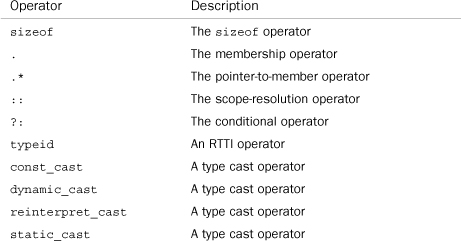
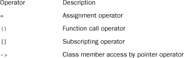
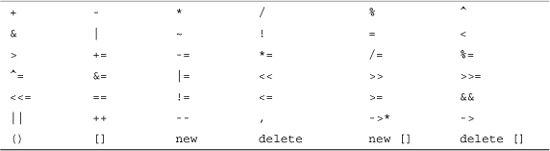
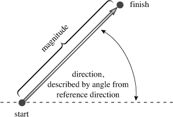
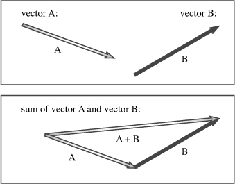
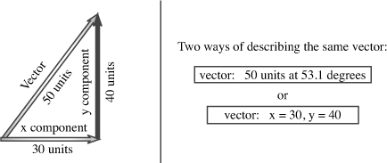

## 11. 使用类

在本章中，您将了解以下内容：

• 操作员过载• 好友功能• 使输出运算符过载`<<`• 成员国• 用于生成随机值`rand()`• 类的自动转换和类型转换• 类转换函数

C++类功能丰富、复杂且功能强大。在第 [10 章](ch10.html#ch10)“[对象和类](ch10.html#ch10)”中，您通过学习定义和使用一个简单的类，开始了面向对象编程之旅。您了解了类如何定义数据类型，方法是定义要用于表示对象的数据类型，并通过成员函数定义可对该数据执行的操作。您还了解了两个特殊成员函数，构造函数和析构函数，它们管理创建和丢弃根据类规范创建的对象。本章将进一步探讨类属性，重点介绍类设计技术，而不是一般原则。您可能会发现这里介绍的一些功能很简单，有些功能更微妙。为了最好地理解这些新功能，您应该尝试这些示例并进行试验：如果对此函数使用常规参数而不是引用参数，会发生什么情况？如果将某些内容从析构函数中遗漏，会发生什么情况？不要害怕犯错误;通常，你可以从解开错误中学到更多的东西，而不是通过正确地做某事，但通过死记硬背。（但是，不要以为一连串的错误不可避免地会带来令人难以置信的洞察力。最后，您将获得更全面地了解C++的工作原理以及C++能为您做些什么。

本章从运算符重载开始，它允许您使用标准C++运算符，例如 and 和 类对象。然后，它检查朋友，这是让非成员函数访问私有数据的C++机制。最后，它介绍了如何指示C++对类执行自动类型转换。当您阅读本章和第 [12 章](ch12.html#ch12)“[类和动态内存分配](ch12.html#ch12)”时，您将更好地了解类构造函数和类析构函数所扮演的角色。此外，您还将看到在开发和改进类设计时可能经历的一些阶段。`=``+`

学习C++的一个困难，至少在你进入这个主题这么远的时候，是有很多东西需要记住。期望记住这一切是不合理的，直到你记录了足够的经验来悬挂你的记忆。在这方面，学习C++就像学习一个充满功能的文字处理器或电子表格程序。没有一个功能是令人生畏的，但是，在实践中，大多数人真正只知道他们经常使用的那些功能，例如搜索文本或斜体。您可能还记得在某处读过如何生成替代角色或创建目录，但是这些技能可能不会成为您日常曲目的一部分，直到您面临经常需要它们的情况。在本章中吸收大量材料的最佳方法可能是开始将其中一些新功能合并到您自己的C++编程中。随着您的体验增强了您对这些功能的理解和欣赏，您可以开始添加其他C++功能。正如C++的创建者Bjarne Stroustrup在一次面向专业程序员C++会议上所建议的那样：“让自己轻松适应这门语言。不要觉得你必须使用所有功能，也不要试图在第一天就全部使用它们。

### 运算符重载

让我们看一下一种使对象操作看起来更漂亮的技术。*运算符重载*是C++多态性的一个示例。在第 [8 章](ch08.html#ch08)“[函数历险记”中](ch08.html#ch08)，您了解了C++如何使您能够定义多个具有相同名称的函数，前提是它们具有不同的签名（参数列表）。这称为*函数重载*或*函数多态性*。其目的是允许您对相同的基本操作使用相同的函数名，即使将操作应用于不同的数据类型也是如此。（想象一下，如果你必须对每种不同类型的对象使用不同的动词形式，例如，lift_lft你的左脚，但lift_sp勺子，英语会多么尴尬。运算符重载将重载概念扩展到运算符，使您可以为C++运算符分配多个含义。实际上，许多C++（和C）运算符已经过载。例如，运算符在应用于某个地址时，将生成存储在该地址的值。但是，应用于两个数字会产生值的乘积。C++使用操作数的数量和类型来决定要执行的操作。`*``*`

C++允许您将运算符重载扩展到用户定义的类型，例如，允许您使用符号添加两个对象。同样，编译器使用操作数的数量和类型来确定要使用的加法定义。重载的运算符通常可以使代码看起来更自然。例如，一个常见的计算任务是添加两个数组。通常，这看起来像以下循环：`+``for`

for （int i = 0; i < 20; i++）
night[i] = sam[i] + janet[i];逐个元素添加

但是在C++中，您可以定义一个表示数组并重载 `+` 运算符的类，以便您可以执行以下操作：

晚上 = 山姆 + 珍妮特;添加两个数组对象这种简单的加法符号隐藏了机制，并强调了本质，这是OOP的另一个目标。若要重载运算符，请使用称为运算符函数的特殊*函数*形式。运算符函数具有以下形式，其中 *`op`* 是被重载的运算符的符号：运算符*op*（*参数列表*)例如，重载运算符并重载运算符。*`op`* 必须是有效的C++运算符;你不能只是编造一个新的符号。例如，不能有函数，因为C++没有运算符。但是该函数将重载该运算符，因为它是数组索引运算符。例如，假设您有一个类，您为其定义了一个成员函数来重载运算符，以便它将一个销售人员对象的销售数字添加到另一个对象。然后，如果 、 和 都是该类的对象，则可以编写以下等式：`operator+()``+``operator*()``*``operator@()``@``operator[]()``[]``[]``Salesperson``operator+()``+``district2``sid``sara``Salesperson`区2 = sid + sara;编译器将操作数识别为属于该类，将运算符替换为相应的运算符函数：`Salesperson`district2 = sid.operator+（sara）;然后，该函数隐式使用对象（因为它调用了该方法）和显式使用对象（因为它作为参数传递）来计算总和，然后返回该总和。当然，好的部分是您可以使用漂亮的运算符表示法，而不是笨拙的函数表示法。`sid``sara``+`C++对操作员过载施加了一些限制，但是在您了解了过载的工作原理之后，它们最容易理解。因此，让我们开发一些示例来阐明该过程，然后讨论其局限性。时间在我们手上：开发运算符重载示例

如果您在Priggs帐户上工作了2小时35分钟，下午工作了2小时40分钟，那么您在帐户上总共工作了多长时间？下面是一个示例，其中加法的概念很有意义，但要添加的单位（小时和分钟的混合）与内置类型不匹配。[第7章](ch07.html#ch07)“[函数：C++的编程模块](ch07.html#ch07)”通过定义结构和用于添加此类结构的函数来处理类似的情况。现在，让我们将其推广到一个类中，使用一种方法来处理加法。让我们从一个名为 `Sum（）` 的普通方法开始，然后了解如何将其转换为重载运算符。 [清单 11.1](#ch11ex01) 显示了类声明。`travel_time``sum()``Time`

**清单 11.1.`我的时间0.h`**

------

mytime0.h -- 运算符重载之前的时间类
\#ifndef MYTIME0_H_
\#define MYTIME0_H_

类 Time
{
private：
int hours;
int minutes;
公共：
时间（）;
时间（整型 h， 整型 m = 0）;
void AddMin（int m）;
void AddHr（int h）;
void Reset（int h = 0， int m = 0）;
Time Sum（const Time & t） const;
void Show（） const;
};
\#endif

```
Time` 类提供了用于调整和重置时间、显示时间值以及添加两次的方法。 [清单 11.2](#ch11ex02) 显示了方法定义;请注意 and 方法如何在总分钟数超过 59 时使用整数除法和模运算符来调整 and 值。另外，由于使用的唯一功能是并且因为它仅使用一次，因此使用而不是使用整个命名空间似乎很经济。`AddMin()``Sum()``minutes``hours``iostream``cout``std::cout``std
```

**清单 11.2.`我的时间0.cpp`**

------

mytime0.cpp -- 实现 Time 方法
\#include <iostream>
\#include “mytime0.h”

Time：：Time（）
{
hours = minutes = 0;
}

时间：：时间（整型 h， 整型 m ）
{
小时 = h;
分钟 = m;
}

void Time：：AddMin（int m）
{
minutes += m;
小时 += minutes / 60;
minutes %= 60;
}

void Time：：AddHr（int h）
{
hours += h;
}

void Time：：Reset（int h， int m）
{
hours = h;
minutes = m;
}

Time Time：：Sum（const Time & t） const
{
Time sum;
sum.minutes = minutes + t.minutes;
sum.hours = hours + t.hours + sum.minutes / 60;
sum.minutes %= 60;
return sum;
}

void Time：：Show（） const
{
std：：cout << 小时 << “小时， ” << 分钟 << “分钟”;
}

考虑 `Sum（）` 函数的代码。请注意，参数是引用，但返回类型不是引用。使该论点成为参考的原因是效率。如果 `Time 对象按`值传递，则代码将产生相同的结果，但仅传递引用通常更快、更节省内存。


但是，返回值不能是引用。原因是该函数创建了一个新的 `Time` 对象（`sum`），该对象表示其他两个 `Time` 对象的总和。返回对象（如此代码一样）将创建调用函数可以使用的对象的副本。但是，如果返回类型是 `Time &`，则引用将指向 `sum` 对象。但是 `sum` 对象是一个局部变量，当函数终止时会被销毁，因此引用将是对不存在的对象的引用。但是，使用 `Time` 返回类型意味着程序在销毁 `sum` 之前构造 sum *的副本*，并且调用函数获取副本。


谨慎

不要返回对局部变量或其他临时对象的引用。当函数终止并且局部变量或临时对象消失时，引用将成为对不存在的数据的引用。


最后，[清单 11.3](#ch11ex03) 测试类的时间求和部分。`Time`

**清单 11.3.`使用时间0.cpp`**

------

usetime0.cpp -- 使用 Time 类
// 编译 usetime0.cpp 和 mytime0.cpp 的第一稿一起使用
\#include <iostream>
\#include “mytime0.h”

int main（）
{
using std：：cout;
using std：：endl;
时间规划;
时间编码（2， 40）;
时间固定（5， 55）;
总时间;

cout << “计划时间 = ”;
规划。Show（）;
cout << endl;

cout << “编码时间 = ”;
编码。Show（）;
cout << endl;

cout << “固定时间 = ”;
定影。Show（）;
cout << endl;

总计 = 编码。总和（固定）;
cout <<“编码。总和（固定） = “;
总。Show（）;
cout << endl;

返回 0;
}

下面是[清单 11.1、11.2](#ch11ex01) 和 [11.3](#ch11ex02) 中程序的输出：

计划时间 = 0 小时，0 分钟
编码时间 = 2 小时，40 分钟
固定时间 = 5 小时，55 分钟
编码。总和（固定） = 8 小时 35 分钟

#### 添加加法运算符

将类转换为使用重载加法运算符很简单。您只需将 的名称更改为外观奇怪的名称。没错：您只需将运算符符号（在本例中）附加到末尾，并将结果用作方法名称。在这里，您可以在标识符名称中使用字母、数字或下划线以外的字符。[清单 11.4](#ch11ex04) 和 [11.5](#ch11ex05) 反映了这一小变化。`Time``Sum()``operator+()``+``operator`

**清单 11.4.`我的时间1.h`**

------

mytime1.h -- 运算符重载
之前的时间类#ifndef MYTIME1_H_
\#define MYTIME1_H_

类 Time
{
private：
int hours;
int minutes;
公共：
时间（）;
时间（整型 h， 整型 m = 0）;
void AddMin（int m）;
void AddHr（int h）;
void Reset（int h = 0， int m = 0）;
Time operator+（const Time & t） const;
void Show（） const;
};
\#endif

**清单 11.5.`我的时间1.cpp`**

------

mytime1.cpp -- 实现 Time 方法
\#include <iostream>
\#include “mytime1.h”

Time：：Time（）
{
hours = minutes = 0;
}

时间：：时间（整型 h， 整型 m ）
{
小时 = h;
分钟 = m;
}

void Time：：AddMin（int m）
{
minutes += m;
小时 += minutes / 60;
minutes %= 60;
}

void Time：：AddHr（int h）
{
hours += h;
}

void Time：：Reset（int h， int m）
{
hours = h;
minutes = m;
}

Time Time：：operator+（const Time & t） const
{
Time sum;
sum.minutes = minutes + t.minutes;
sum.hours = hours + t.hours + sum.minutes / 60;
sum.minutes %= 60;
return sum;
}

void Time：：Show（） const
{
std：：cout << 小时 << “小时， ” << 分钟 << “分钟”;
}

与 `Sum（）` 一样，`operator+（）` 由 `Time` 对象调用，将第二个 `Time` 对象作为参数，并返回 `Time` 对象。因此，您可以使用 Sum（） 使用的相同语法来调用 `operator+``（）` 方法：

total = coding.operator+（fix）;函数表示法

但是命名方法 `operator+（）` 也允许您使用运算符表示法：

总计 = 编码 + 固定;运算符表示法

任一表示法都调用 `operator+（）` 方法。请注意，使用运算符表示法时，运算符左侧的对象（在本例中为`编码`）是调用对象，而右侧的对象（在本例中为`固定`）是作为参数传递的对象。[清单 11.6](#ch11ex06) 说明了这一点。

**清单 11.6.`使用时间1.cpp`**

------

usetime1.cpp -- 使用 Time 类
// 编译 usetime1.cpp 和 mytime1.cpp 的第二稿#include <
iostream>
\#include “mytime1.h”

int main（）
{
using std：：cout;
using std：：endl;
时间规划;
时间编码（2， 40）;
时间固定（5， 55）;
总时间;

cout << “计划时间 = ”;
规划。Show（）;
cout << endl;

cout << “编码时间 = ”;
编码。Show（）;
cout << endl;

cout << “固定时间 = ”;
定影。Show（）;
cout << endl;

总计 = 编码 + 固定;
// 运算符表示法
cout << “编码 + 修复 = ”;
总。Show（）;
cout << endl;

时间修正（3， 28）;
cout << “更多的固定时间=”;
更多修复。Show（）;
cout << endl;
total = morefixing.operator+（total）;
函数表示法
cout << “morefixing.operator+（total） = ”;
总。Show（）;
cout << endl;

返回 0;
}

下面是[清单 11.4](#ch11ex04)、[11.5](#ch11ex05) 和 [11.6](#ch11ex06) 中程序的输出：

计划时间 = 0 小时，0 分钟
编码时间 = 2 小时，40 分钟
修复时间 = 5 小时，55 分钟
编码 + 修复 = 8 小时，35 分钟
以上修复时间 = 3 小时，28 分钟
更多修复。operator+（总计） = 12 小时 3 分钟

简而言之，函数的名称允许使用函数表示法或运算符表示法来调用它。编译器使用操作数类型来确定要执行的操作：`operator+()`

int a， b， c;
时间 A， B， C;
c = a + b;使用int加法
C = A + B;使用为时间对象定义的加法

可以添加两个以上的对象吗？例如，如果 、 、 和 都是对象，是否可以执行以下操作？`t1``t2``t3``t4``Time`

t4 = t1 + t2 + t3;有效？

回答这个问题的方法是考虑如何将语句转换为函数调用。由于加法是从左到右的运算符，因此该语句首先转换为：

t4 = t1.operator+（t2 + t3）;有效？

然后，函数参数本身被转换为函数调用，给出如下结果：

t4 = t1.operator+（t2.operator+（t3））;有效？是的

这有效吗？是的，它是。该函数调用返回一个对象，该对象表示 和 的总和。然后，此对象将成为函数调用的对象，并且该调用返回 和 和 之和的对象之和。简而言之，最终的返回值是 、 和 的总和，就像期望的那样。`t2.operator+(t3)``Time``t2``t3``t1.operator+()``t1``Time``t2``t3``t1``t2``t3`

#### 过载限制

大多数C++运算符（参见[表 11.1](#ch11table01)）都可以按照上一节中所述的方式进行重载。重载运算符（有一些例外）不一定是成员函数。但是，至少有一个操作数必须是用户定义的类型。让我们仔细看看C++对用户定义的运算符重载施加的限制：

• 重载运算符必须至少有一个用户定义类型的操作数。这可以防止重载标准类型的运算符。因此，不能重新定义减号运算符 （），以便它产生两个值的总和，而不是它们的差值。此限制保留了程序的合理性，尽管它可能会妨碍创造性的记帐。`-``double`

• 不能以违反原始运算符语法规则的方式使用运算符。例如，不能重载模运算符 （），以便它可以与单个操作数一起使用：`%`

整型 x;
时间湿婆;
% x;对于模数算
子%湿婆无效;对于重载运算符无效

同样，您不能更改运算符优先级。因此，如果重载加法运算符以允许添加两个类，则 new 运算符的优先级与普通加法运算符相同。

• 您无法创建新的运算符符号。例如，不能定义函数来表示幂。`operator**()`

• 不能重载以下运算符：



这仍然使[表 11.1](#ch11table01) 中的所有运算符都可用于重载。

• [表 11.1](#ch11table01) 中的大多数运算符都可以通过使用成员函数或非成员函数进行重载。但是，*只能使用成员*函数来重载以下运算符：



**表 11.1.可以重载的运算符**




注意


本章不涵盖限制列表或[表 11.1](#ch11table01) 中提到的每个运算符。但是，[附录 E](app05.html#app05)“[其他运算符](app05.html#app05)”总结了本文正文中未涵盖的运算符。

------

除了这些正式限制之外，还应在重载运算符中使用合理的约束。例如，不应重载运算符，以便它交换两个对象的数据成员。符号中的任何内容都不会表明运算符做了什么，因此最好使用解释性名称（例如 .） 定义一个类方法。`*``Time``Swap()`

#### 更多重载运算符

其他一些操作对类有意义。例如，您可能希望从另一个时间中减去一个时间，或者将一个时间乘以一个因子。这表明重载减法和乘法运算符。该技术与加法运算符相同：您创建和方法。也就是说，将以下原型添加到类声明中：`Time``operator-()``operator*()`

Time operator-（const Time & t） const;
时间运算符*（双 n） 常量;

[清单 11.7](#ch11ex07) 显示了新的头文件。

**清单 11.7.`我的时间2.h`**

------

mytime2.h -- 运算符重载
后的时间类#ifndef MYTIME2_H_
\#define MYTIME2_H_

类 Time
{
private：
int hours;
int minutes;
公共：
时间（）;
时间（整型 h， 整型 m = 0）;
void AddMin（int m）;
void AddHr（int h）;
void Reset（int h = 0， int m = 0）;
Time operator+（const Time & t） const;
Time operator-（const Time & t） const;
时间运算符*（双 n） 常量;
void Show（） const;
};
\#endif

然后，将新方法的定义添加到实现文件中，如[清单 11.8](#ch11ex08) 所示。

**清单 11.8.`我的时间2.cpp`**

------


// mytime2.cpp -- 实现 Time 方法
\#include <iostream>
\#include “mytime2.h”

Time：：Time（）
{
hours = minutes = 0;
}

时间：：时间（整型 h， 整型 m ）
{
小时 = h;
分钟 = m;
}

void Time：：AddMin（int m）
{
minutes += m;
小时 += minutes / 60;
minutes %= 60;
}
void Time：：AddHr（int h）
{
hours += h;
}

void Time：：Reset（int h， int m）
{
hours = h;
minutes = m;
}

Time Time：：operator+（const Time & t） const
{
Time sum;
sum.minutes = minutes + t.minutes;
sum.hours = hours + t.hours + sum.minutes / 60;
sum.minutes %= 60;
return sum;
}

Time：：operator-（const Time & t） const
{
Time diff;
int tot1， tot2;
tot1 = t.minutes + 60 * t.hours;
tot2 = minutes + 60 * hours;
diff.minutes = （tot2 - tot1） % 60;
diff.hours = （tot2 - tot1） / 60;
return diff;
}

时间：：运算符*（双倍 mult） const
{
时间结果;
长总分钟数 = 小时 * mult * 60 + 分钟 * mult;
result.hours = 总分钟数 / 60;
result.minutes = 总分钟数 % 60;
返回结果;
}

void Time：：Show（） const
{
std：：cout << hours << “hours， ” << minutes << “minutes”;
}

------


With these changes made, you can test the new definitions with the code shown in [Listing 11.9](#ch11ex09).

**Listing 11.9. `usetime2.cpp`**

------

// usetime2.cpp -- using the third draft of the Time class
// compile usetime2.cpp and mytime2.cpp together
\#include <iostream>
\#include "mytime2.h"

int main()
{
  using std::cout;
  using std::endl;
  Time weeding(4, 35);
  Time waxing(2, 47);
  Time total;
  Time diff;
  Time adjusted;

  cout << "weeding time = ";
  weeding.Show();
  cout << endl;

  cout << "waxing time = ";
  waxing.Show();
  cout << endl;

  cout << "total work time = ";
  total = weeding + waxing;  // use operator+()
  total.Show();
  cout << endl;

  diff = weeding - waxing;  // use operator-()
  cout << "weeding time - waxing time = ";
  diff.Show();
  cout << endl;

  adjusted = total * 1.5;   // use operator+()
  cout << "adjusted work time = ";
  adjusted.Show();
  cout << endl;

  return 0;
}

Here is the output of the program in [Listings 11.7](#ch11ex07), [11.8](#ch11ex08), and [11.9](#ch11ex09):

weeding time = 4 hours, 35 minutes
waxing time = 2 hours, 47 minutes
total work time = 7 hours, 22 minutes
weeding time - waxing time = 1 hours, 48 minutes
adjusted work time = 11 hours, 3 minutes

### Introducing Friends

As you’ve seen, C++ controls access to the private portions of a class object. Usually, public class methods serve as the only access, but sometimes this restriction is too rigid to fit particular programming problems. In such cases, C++ provides another form of access: the *friend*. Friends come in three varieties:

• Friend functions

• Friend classes

• Friend member functions

By making a function a friend to a class, you allow the function the same access privileges that a member function of the class has. We’ll look into friend functions now, leaving the other two varieties to [Chapter 15](ch15.html#ch15), “[Friends, Exceptions, and More](ch15.html#ch15).”

Before seeing how to make friends, let’s look into why they might be needed. Often, overloading a binary operator (that is, an operator with two arguments) for a class generates a need for friends. Multiplying a object by a real number provides just such a situation, so let’s study that case.`Time`

In the previous class example, the overloaded multiplication operator is different from the other two overloaded operators in that it combines two different types. That is, the addition and subtraction operators each combine two values, but the multiplication operator combines a value with a value. This restricts how the operator can be used. Remember, the left operand is the invoking object. That is,`Time``Time``Time``double`

A = B * 2.75;

translates to the following member function call:

A = B.operator*(2.75);

But what about the following statement?

A = 2.75 * B;   // cannot correspond to a member function

Conceptually, should be the same as , but the first expression cannot correspond to a member function because is not a type object. Remember, the left operand is the invoking object, but is not an object. So the compiler cannot replace the expression with a member function call.`2.75 * B``B * 2.75``2.75``Time``2.75`

One way around this difficulty is to tell everyone (and to remember yourself) that you can only write `B * 2.75` but never write `2.75 * B`. This is a server-friendly, client-beware solution, and that’s not what OOP is about.

However, there is another possibility—using a nonmember function. (Remember, most operators can be overloaded using either member or nonmember functions.) A nonmember function is not invoked by an object; instead, any values it uses, including objects, are explicit arguments. Thus, the compiler could match the expressionA = 2.75 * B;   // cannot correspond to a member functionto the following nonmember function call:A = operator*(2.75, B);The function would have this prototype:Time operator*(double m, const Time & t);With the nonmember overloaded operator function, the left operand of an operator expression corresponds to the first argument of the operator function, and the right operand corresponds to the second argument. Meanwhile, the original member function handles operands in the opposite order—that is, a value multiplied by a value.`Time``double`Using a nonmember function solves the problem of getting the operands in the desired order (first and then ), but it raises a new problem: Nonmember functions can’t directly access private data in a class. Well, at least ordinary nonmember functions lack access. But there is a special category of nonmember functions, called *friends*, that can access private members of a class.`double``Time`Creating FriendsThe first step toward creating a friend function is to place a prototype in the class declaration and prefix the declaration with the keyword :`friend`friend Time operator*(double m, const Time & t); // goes in class declarationThis prototype has two implications:• Although the function is declared in the class declaration, it is not a member function. So it isn’t invoked by using the membership operator.`operator*()`• Although the function is not a member function, it has the same access rights as a member function.`operator*()`The second step is to write the function definition. Because it is not a member function, you don’t use the qualifier. Also you don’t use the keyword in the definition. The definition should look like this:`Time::``friend`

Time operator*(double m, const Time & t) // friend not used in definition
{
  Time result;
  long totalminutes = t.hours * mult * 60 +t. minutes * mult;
  result.hours = totalminutes / 60;
  result.minutes = totalminutes % 60;
  return result;
}

有了这个声明和定义，语句A = 2.75 * B;转换为以下内容并调用刚刚定义的非成员友元函数：A = 运算符*（2.75， B）;简而言之，类的友元函数是具有与成员函数相同的访问权限的非成员函数。


朋友对OOP不忠吗？

乍一看，朋友似乎违反了数据隐藏的OOP原则，因为朋友机制允许非成员功能访问私有数据。然而，这是一个过于狭隘的观点。相反，您应该将友元函数视为类的扩展接口的一部分。例如，从概念的角度来看，将 a 乘以值几乎与将值乘以 .第一个需要一个友函数，而第二个可以用成员函数来完成，这是C++语法的结果，而不是深刻的概念差异。通过使用友元函数和类方法，可以使用相同的用户界面来表达任一操作。还要记住，只有类声明才能决定哪些函数是友元的，因此类声明仍控制哪些函数访问私有数据。简而言之，类方法和友元只是表示类接口的两种不同机制。`double``Time``Time``double`

实际上，您可以通过更改定义将此特定朋友函数编写为非朋友函数，以便它切换乘法中哪个值排在第一位：Time operator*（double m， const Time & t）
{
return t * m; // use t.operator*（m）
}原始版本访问并明确，所以它必须是朋友。此版本仅将对象作为一个整体使用，让成员函数处理私有值，因此此版本不必是好友。尽管如此，也有理由让这个版本成为朋友。最重要的是，它将函数作为官方类接口的一部分进行绑定。其次，如果您后来发现函数需要直接访问私有数据，则只需更改函数定义，而不必更改类原型。`t.minutes``t.hours``Time``t`


提示

如果要重载类的运算符，并且要使用带有非类项的运算符作为第一个操作数，则可以使用友元函数来反转操作数顺序。

一种常见的朋友：使运算符过载`<<`

类的一个非常有用的功能是，您可以重载 `<<` 运算符，以便可以将其与 `cout` 一起使用来显示对象的内容。在某些方面，这种重载比前面的示例稍微棘手一些，因此我们将分两步而不是一步开发它。

假设 是一个对象。为了显示值，我们一直在使用 .但是，如果您可以执行以下操作，那不是很好吗？`trip``Time``Time``Show()`<<旅行;让 cout 识别时间类？

您可以这样做`，因为<<`是可以重载C++运算符之一。事实上，它已经严重超载。在其最基本的化身中，`<<`运算符是C和C++位操作运算符之一;它将位移位在值中向左（参见[附录E](app05.html#app05)）。但该类会重载运算符，将其转换为输出工具。回想一下，这是一个对象，它足够聪明，可以识别所有基本的C++类型。这是因为类声明包含每个基本类型的重载定义。也就是说，一个定义使用参数，一个定义使用参数，依此类推。因此，教识别对象的一种方法是向类声明中添加新的函数运算符定义。但是，更改文件并使用标准界面进行混乱是一个危险的想法。相反，请使用类声明来教类如何使用 。`ostream``cout``ostream``ostream``operator<<()``int``double``cout``Time``ostream``iostream``Time``Time``cout`

##### 重载的第一个版本`<<`

要教班级使用，可以使用朋友功能。为什么？因为像下面这样的语句使用两个对象，类对象 （） 首先：`Time``cout``ostream``cout`

<<旅行;

如果使用成员函数重载 ，则对象将排在第一位，就像使用成员函数重载运算符时一样。这意味着您必须以这种方式使用运算符：`Time``<<``Time``*``<<`

绊倒<<;如果运算符<<（） 是 Time 成员函数

这会令人困惑。但是通过使用 friend 函数，您可以通过以下方式重载运算符：

void operator<<（ostream & os， const Time & t）
{
os << t.hours << “hours， ”<< t.minutes << “minutes”;
}

这使您可以使用

<<旅行;

以以下格式打印数据：

4 小时， 23 分钟

------

朋友还是没有朋友？

新的类声明使该函数成为该类的友元函数。但是这个函数虽然对类并不有害，但也不是该类的朋友。该函数接受一个参数和一个参数，因此此函数似乎必须是这两个类的伙伴。但是，如果您查看该函数的代码，您会注意到该函数访问对象的各个成员，但仅将对象作为一个整体使用。由于直接访问私有对象成员，因此它必须是类的好友。但是由于它不直接访问私有对象成员，因此该函数不必是该类的好友。这很好，因为这意味着您不必修改定义。`Time``operator<<()``Time``ostream``operator<<()``ostream``Time``Time``ostream``operator<<()``Time``Time``ostream``ostream``ostream`

请注意，新定义使用引用作为其第一个参数。通常，引用对象，就像它在表达式 中所做的那样。但是，您可以将运算符与其他对象一起使用，在这种情况下，将引用这些对象。`operator<<()``ostream``os``os``cout``cout << trip``ostream``os`


什么？您不知道任何其他 `ostream` 对象？


另一个 `ostream` 对象是 `cerr`，它将输出路由到标准错误流，默认情况下，标准错误流是显示。但在 Unix、Linux 和 Windows 命令行环境中，您可以将标准错误流重定向到文件。另请记住，[第 6 章](ch06.html#ch06)“[分支语句和逻辑运算符](ch06.html#ch06)”介绍了对象，这些对象可用于将输出发送到文件。通过继承的魔力（参见[第13章](ch13.html#ch13)“[类继承](ch13.html#ch13)”），对象可以使用方法。因此，您可以使用该定义将数据写入文件以及屏幕。您只需传递一个适当初始化的对象，而不是作为第一个参数。`ofstream``ofstream``ostream``operator<<()``Time``ofstream``cout`

------

调用应使用对象本身，而不是副本，因此函数将对象作为引用而不是按值传递。因此，表达式导致 成为 的别名，而表达式导致 成为 的别名。对象可以按值或通过引用传递，因为任一形式都使对象值可用于函数。同样，通过引用传递比按值传递使用的内存和时间更少。`cout << trip``cout``cout << trip``os``cout``cerr << trip``os``cerr``Time`

##### 重载的第二个版本`<<`

刚才介绍的实现有问题。像这样的语句工作正常：

<<旅行;

但是，该实现不允许您将重新定义的运算符与通常使用的运算符组合在一起：`<<``cout`

cout << “行程时间：” <<行程<< “ （星期二）\n”;不能做

要了解为什么这不起作用以及必须做些什么才能使其工作，您首先需要更多地了解操作方式。请考虑以下语句：`cout`

整型 x = 5;
int y = 8;
cout << x << y;

C++从左到右读取输出语句，这意味着它等效于以下内容：（cout << x） << y;运算符（如 中所定义）将对象置于其左侧。显然，表达式满足该要求，因为它是一个对象。但是 output 语句还要求整个表达式是一个类型对象，因为该表达式位于 的左侧。因此，该类实现该函数，以便返回对对象的引用。特别是，它返回对调用对象的引用，在本例中。因此，表达式本身就是对象，它可以在运算符的左侧使用。`<<``iostream``ostream``cout << x``cout``ostream``(cout << x)``ostream``<< y``ostream``operator<<()``ostream``cout``(cout << x)``ostream``cout``<<`您可以对友元函数采用相同的方法。您只需修改函数，使其返回对对象的引用：`operator<<()``ostream`ostream & operator<<（ostream & os， const Time & t）
{
os << t.hours << “hours， ”<< t.minutes << “minutes”;
返回 os;
}请注意，返回类型为 。回想一下，这意味着该函数返回对对象的引用。由于程序将对象引用传递给函数以开始，因此最终效果是函数的返回值只是传递给它的对象。也就是说，语句`ostream &``ostream`cout << trip;becomes the following function call:operator<<(cout, trip);And that call returns the object. So now the following statement does work:`cout`cout << "Trip time: " << trip << " (Tuesday)\n"; // can doLet’s break this into separate steps to see how it works. First, the following invokes the particular definition of that displays a string and returns the object:`ostream``<<``cout`cout << "Trip time: "So the expression displays the string and then is replaced by its return value, . This reduces the original statement to the following one:`cout << "Trip time: "``cout`cout << trip << " (Tuesday)\n";

Next, the program uses the `Time` declaration of `<<` to display the trip values and to return the `cout` object again. This reduces the statement to the following:

cout << " (Tuesday)\n";The program now finishes up by using the definition of for strings to display the final string.`ostream``<<`As a point of interest, this version of also can be used for file output:`operator<<()`#include <fstream>
...
ofstream fout;
fout.open("savetime.txt");
Time trip(12, 40);
fout << trip;The last statement becomes this:操作员<<（fout，trip）;

正如[第8章](ch08.html#ch08)所指出的，类继承的属性允许引用引用对象和对象。`ostream``ostream``ofstream`

------

提示

通常，要重载运算符以显示类 *`c_name`* 的对象，请使用具有以下格式定义的友元函数：`<<`ostream & operator<<（ostream & os， const *c_name* & obj）
{
os << ... ; // display object contents
return os;
}


[清单 11.10](#ch11ex10) 显示了修改为包含两个友元函数和 的类定义。它将第一个实现为内联函数，因为代码太短了。（当定义也是原型时，如本例所示，请使用前缀。`operator*()``operator<<()``friend`

------

谨慎

只能在类声明中找到的原型中使用关键字。不要在函数定义中使用它，除非该定义也是原型。`friend`


**清单 11.10.`我的时间3.h`**

------

mytime3.h -- 与朋友
\#ifndef MYTIME3_H_
\#define MYTIME3_H_
\#include <iostream>

class Time
{
private：
int hours;
int minutes;
公共：
时间（）;
时间（整型 h， 整型 m = 0）;
void AddMin（int m）;
void AddHr（int h）;
void Reset（int h = 0， int m = 0）;
Time operator+（const Time & t） const;
Time operator-（const Time & t） const;
时间运算符*（双 n） 常量;
friend Time operator*（double m， const Time & t）
{ return t * m; } // inline definition
friend std：：ostream & operator<<（std：：ostream & os， const Time & t）;
};

\#endif

[清单 11.11](#ch11ex11) 显示了修订后的定义集。再次注意，这些方法使用限定符，而友元函数则不使用。还要注意，因为包含和提供了声明，所以 in 提供了在实现文件中使用的支持。`Time::``mytime3.h``iostream``using``std::ostream``mytime3.h``mytime3.cpp``ostream`

**清单 11.11.`我的时间3.cpp`**

------


// mytime3.cpp -- 实现 Time 方法
\#include “mytime3.h”

Time：：Time（）
{
小时 = 分钟 = 0;
}

时间：：时间（整型 h， 整型 m ）
{
小时 = h;
分钟 = m;
}

void Time：：AddMin（int m）
{
minutes += m;
小时 += minutes / 60;
minutes %= 60;
}

void Time：：AddHr（int h）
{
hours += h;
}

void Time：：Reset（int h， int m）
{
hours = h;
minutes = m;
}

Time Time：：operator+（const Time & t） const
{
Time sum;
sum.minutes = minutes + t.minutes;
sum.hours = hours + t.hours + sum.minutes / 60;
sum.minutes %= 60;
return sum;
}

Time：：operator-（const Time & t） const
{
Time diff;
int tot1， tot2;
tot1 = t.minutes + 60 * t.hours;
tot2 = minutes + 60 * hours;
diff.minutes = （tot2 - tot1） % 60;
diff.hours = （tot2 - tot1） / 60;
return diff;
}

时间：：运算符*（双倍 mult） const
{
时间结果;
长总分钟数 = 小时 * mult * 60 + 分钟 * mult;
result.hours = 总分钟数 / 60;
result.minutes = 总分钟数 % 60;
返回结果;
}

std：：ostream & operator<<（std：：ostream & os， const Time & t）
{
os << t.hours << “hours， ” << t.minutes << “minutes”;
返回 os;
}

------


[清单 11.12](#ch11ex12) 显示了一个示例程序。从技术上讲，不必包含，因为已经包含该文件。但是，作为类的用户，您不一定知道类代码中包含哪些文件，因此您将负责声明您知道自己的代码部分需要的那些头文件。`usetime3.cpp``iostream``mytime3.h``Time`

**清单 11.12.`使用时间3.cpp`**

------

usetime3.cpp -- 使用 Time 类
// 编译 usetime3.cpp 和 mytime3.cpp 的第四稿#include <
iostream>
\#include “mytime3.h”

int main（）
{
using std：：cout;
using std：：endl;
时间阿依达（3， 35）;
时间托斯卡（2， 48）;
时间温度;

cout << “Aida and Tosca：\n”;
cout << aida<<“;“ << 托斯卡<<恩德尔;
temp = aida + tosca;operator+（）
cout << “Aida + Tosca： ” << temp << endl;
温度 = 阿依达* 1.17;成员运算符*（）
cout << “Aida * 1.17： ” <<温度 << endl;
cout << “10.0 * Tosca： ” << 10.0 * tosca << endl;

返回 0;
}

下面是[清单 11.10、11.11](#ch11ex10) 和 [11.12](#ch11ex11) 中程序的输出：

阿依达和托斯卡：
3小时35分钟;2小时48分钟
阿依达+托斯卡：6小时23分钟
阿依达* 1.17：4小时11分钟
10.0 *托斯卡：28小时0分钟

### 重载运算符：成员函数与非成员函数

对于许多运算符，您可以选择使用成员函数或非成员函数来实现运算符重载。通常，非成员版本是一个友元函数，以便它可以直接访问类的私有数据。例如，考虑 `Time` 类的加法运算符。它在 `Time` 类声明中具有以下原型：

Time operator+（const Time & t） const;成员版本相反，该类可以使用以下原型：非会员版本
朋友Time operator+（const Time & t1， const Time & t2）;加法运算符需要两个操作数。对于成员函数版本，一个通过指针隐式传递，第二个作为函数参数显式传递。对于朋友版本，两者都作为参数传递。`this`


注意

重载运算符函数的非成员版本需要与运算符具有操作数一样多的形式参数。同一运算符的成员版本需要少一个参数，因为一个操作数作为调用对象隐式传递。

这两个原型中的任何一个都与表达式 匹配，其中 和 是类型对象。也就是说，编译器可以转换语句`T2 + T3``T2``T3``Time`T1 = T2 + T3;更改为以下任一项：T1 = T2.operator+（T3）;成员函数
T1 = 运算符+（T2， T3）;非成员函数请记住，在定义给定运算符时，必须选择一种或另一种形式，但不能同时选择两种形式。由于两种形式都与同一表达式匹配，因此定义这两种形式是一个多义性错误，从而导致编译错误。

那么，哪种形式最好使用呢？对于某些运算符，如前所述，成员函数是唯一有效的选择。否则，它通常不会有太大的区别。有时，根据类设计，非成员版本可能具有优势，尤其是在为类定义了类型转换的情况下。本章末尾[的“皈依和朋友](#ch11lev2sec12)”一节将进一步讨论这种情况。

### 更多重载：向量类

让我们看一下另一个使用运算符重载和友元的类设计 - 一个表示向量的类。此类还阐释了类设计的更多方面，例如将描述同一事物的两种不同方式合并到对象中。即使您不关心向量，也可以在其他上下文中使用此处显示的许多新技术。*向量*，正如工程和物理学中使用的术语一样，是一个同时具有大小（大小）和方向的量。例如，如果你推某物，效果取决于你推的力度（量级）和你推的方向。向一个方向的推动可以拯救一个摇摇欲坠的花瓶，而向另一个方向的推动可以加速其走向厄运的冲动。为了充分描述你的汽车的运动，你应该给出速度（幅度）和方向;与高速公路巡逻队争论，如果你在速度限制下行驶，如果你在错误的方向行驶，你的重量就很小。（免疫学家和计算机科学家可能会以不同的方式使用*术语载体*;忽略它们，至少在 [第 16 章](ch16.html#ch16)“类和标准模板库”，它着眼于计算机科学版本，即模板类。以下边栏告诉您有关矢量的更多信息，但完全了解它们对于遵循示例的C++方面不是必需的。`string``vector`

------

向量

假设你是一只工蜂，发现了一个奇妙的花蜜缓存。你冲回蜂巢，宣布你在120码外找到了花蜜。“信息不够，”其他蜜蜂嗡嗡作响。“你也得告诉我们方向！”你回答说：“它距离太阳方向以北30度。知道距离（大小）和方向，其他蜜蜂冲向甜蜜的地点。蜜蜂知道病媒。

许多量同时涉及量级和方向。例如，推力的效果取决于其强度和方向。在计算机屏幕上移动对象涉及距离和方向。您可以使用矢量来描述此类内容。例如，您可以使用矢量描述在屏幕上移动（置换）对象，您可以将矢量可视化为从起始位置到最终位置绘制的箭头。矢量的长度是其大小，这描述了点被移位的距离。箭头的方向描述了方向（参见[图 11.1](#ch11fig01)）。表示这种位置变化的向量称为*位移向量*。

**图 11.1.用矢量描述位移。**

现在假设你是Lhanappa，伟大的猛犸象猎人。侦察兵报告西北方向14.1公里处有一个庞大的象群。但是由于东南风，你不想从东南方向接近。所以你向西走10公里，然后向北走10公里，从南边接近牛群。您知道这两个位移矢量会将您带到与指向西北的单个 14.1 公里矢量相同的位置。Lhanappa，伟大的猛犸象猎人，也知道如何添加矢量。

添加两个向量具有简单的几何解释。首先，绘制一个向量。然后从第一个矢量的箭头末端开始绘制第二个矢量。最后，从第一个向量的起点到第二个向量的端点绘制一个向量。这第三个向量表示前两个向量的总和（参见[图 11.2](#ch11fig02)）。请注意，总和的长度可以小于各个长度的总和。

**图 11.2.添加两个向量。**




向量是运算符重载的自然选择。首先，您不能用单个数字表示向量，因此创建一个类来表示向量是有意义的。其次，向量与普通算术运算类似，如加法和减法。此并行建议重载相应的运算符，以便将它们与向量一起使用。

为简单起见，在本节中，我们将实现一个二维矢量（如屏幕位移），而不是三维矢量（如可能表示直升机或体操运动员的运动）。您只需要两个数字来描述二维向量，但您可以选择两个数字的集合：•您可以通过其大小（长度）和方向（角度）来描述矢量。• 您可以通过矢量的 x 和 y 分量来表示矢量。

这些分量是水平向量（x 分量）和垂直向量（y 分量），它们加起来就是最终的向量。例如，您可以将运动描述为将点向右移动 30 个单位，向上移动 40 个单位（请参见[图 11.3](#ch11fig03)）。该运动将点放在与以53.1°的角度移动50个单位相同的位置。因此，大小为50且角度为53.1°的矢量等效于水平分量为30，垂直分量为40的矢量。位移矢量最重要的因素是你从哪里开始，从哪里结束，而不是到达那里的确切路线。这种表示选择基本上与[第7章](ch07.html#ch07)程序所涵盖的内容相同，该程序在矩形和极坐标之间进行转换。

**图 11.3.矢量的 x 和 y 分量。**



有时一种形式更方便，有时另一种形式更方便，因此您需要将这两种表示形式合并到类描述中。（请参阅侧边栏”[多个表示和类](#ch11sb05)“，本章后面部分。此外，您将设计该类，以便在更改矢量的一种表示形式时，对象会自动更新另一种表示形式。将这种智能构建到物体中的能力是另一种C++阶级美德。[清单 11.13](#ch11ex13) 提供了一个类声明。为了刷新有关命名空间的记忆，该列表将类声明放在命名空间内。此外，该程序还用于创建几个常量（ and ）来标识这两个表示形式。（我们在[第10章](ch10.html#ch10)中介绍了该技术，因此我们不妨使用它！`VECTOR``enum``RECT``POL`

**清单 11.13.`vect.h`**

------

vect.h -- 具有<<的向量类，模式状态

\#ifndef VECTOR_H_
\#define VECTOR_H_#include <iostream>
命名空间 VECTOR
{
类 Vector
{
public：
enum Mode {RECT， POL};
// RECT for rect，POL 用于极性模式
私有：
双 x; // 水平值
双 y; // 垂直值
双 mag; // 矢量
长度 双昂;度模式模式下矢量
的方向;RECT 或 POL
// 用于设置值
void set_mag（）;
void set_ang（）;
void set_x（）;
void set_y（）;
public：
Vector（）;
向量（双 n1，双 n2，模式形式 = RECT）;
空隙复位（双n1，双n2，模式形式=RECT）;
~Vector（）;
double xval（） const {return x;} // report x value
double yval（） const {return y;} // report y value
double magval（） const {return mag;} // report magnitude
double angval（） const {return ang;} // report angle
void polar_mode（）;将模式设置为 POL
void rect_mode（）;将模式设置为 RECT
// 运算符重载
Vector operator+（const Vector & b） const;
Vector operator-（const Vector & b） const;
向量运算符-（） const;
向量运算符*（双 n） 常量;
朋友
朋友 Vector operator*（double n， const Vector & a）;
friend std：：ostream &
operator<<（std：：ostream & os， const Vector & v）;
};

} // 结束命名空间矢量
\#endif

请注意，[清单 11.13](#ch11ex13) 中报告组件值的四个函数是在类声明中定义的。这会自动使它们成为内联函数。这些函数非常短，这一事实使它们成为内联的绝佳候选者。它们都不应更改对象数据，因此使用修饰符声明它们。您可能还记得第 [10 章](ch10.html#ch10)，这是用于声明不修改它隐式访问的对象的函数的语法。`const`

[清单 11.14](#ch11ex14) 显示了[清单 11.13](#ch11ex13) 中声明的所有方法和友元函数。该清单使用命名空间的开放特性将方法定义添加到命名空间。请注意构造函数和函数如何分别设置矢量的矩形和极坐标表示。因此，如果需要，任何一组值都可以立即使用，而无需进一步计算。同样如[第 4 章](ch04.html#ch04)“[复合类型](ch04.html#ch04)”和第 [7 章](ch07.html#ch07)所述，C++的内置数学函数使用弧度的角度，因此这些函数将度数转换为方法。类实现隐藏了诸如从极坐标转换为矩形坐标或将弧度转换为用户度数之类的内容。用户需要知道的是，该类使用以度为单位的角度，并且它使向量在两个等效的表示形式中可用。`VECTOR``reset()``Vector`


**清单 11.14.`vect.cpp`**

------


vect.cpp -- Vector 类
\#include <cmath>
\#include “vect.h” 的方法 // 包括 <iostream>
us std：：sqrt;
使用 std：：sin;
使用 std：：cos;
使用 std：：atan;
使用 std：：atan2;
使用 std：：cout;

命名空间 VECTOR
{
// 计算度数在一个弧度
常数双Rad_to_deg = 45.0 / atan（1.0）;
// 应该大约 57.2957795130823

// 私有方法
// 从 x 和 y
void 计算大小 Vector：：set_mag（）
{
mag = sqrt（x * x + y * y）;
}

void Vector：：set_ang（）
{
if （x == 0.0 && y == 0.0）
ang = 0.0;
else
ang = atan2（y， x）;
}

// 设置 x 从极坐标
空洞矢量：：set_x（）
{
x = mag * cos（ang）;
}

// 从极坐标
void 向量：：set_y（）
{
y = mag * sin（ang）;
}

// 公共方法
Vector：：Vector（） // 默认构造
函数 {
x = y = mag = ang = 0.0;
mode = RECT;
}

// 如果形式为 r
// （默认值）则从矩形坐标构造向量，或者如果形式为 p
，则从极坐标构造向量：：Vector（double n1， double n2， Mode form）
{
mode = form;
if （form == RECT）
{
x = n1;
y = n2;
set_mag（）;
set_ang（）;
}
else if （form == POL）
{
mag = n1;
ang = n2 / Rad_to_deg;
set_x（）;
set_y（）;
}
else
{
cout << “Vector（） 的错误第三个参数 -- ”;
cout << “向量设置为 0\n”;
x = y = mag = ang = 0.0;
模式 = 矩形;
}
}

// 如果形式为
// RECT（默认值）或从极坐标重置向量，如果
// 形式为 POL
void 向量：： reset（double n1， double n2， Mode form）
{
mode = form;
if （form == RECT）
{
x = n1;
y = n2;
set_mag（）;
set_ang（）;
}
else if （form == POL）
{
mag = n1;
ang = n2 / Rad_to_deg;
set_x（）;
set_y（）;
}
else
{
cout << “Vector（） 的不正确第三个参数 -- ”;
cout << “向量设置为 0\n”;
x = y = mag = ang = 0.0;
模式 = 矩形;
}
}

Vector：：~Vector（） // 析构函数
{
}

void Vector：:p olar_mode（） // 设置为极性模式
{
mode = POL;
}

void Vector：：rect_mode（） // 设置为矩形模式
{
mode = RECT;
}

// 运算符重载
// 添加两个向量
Vector：：operator+（const Vector & b） const
{
return Vector（x + b.x， y + b.y）;
}

// 从 Vector Vector 中减去
Vector b：：operator-（const Vector & b） const
{
return Vector（x - b.x， y - b.y）;
}

Vector
Vector 的反向符号：：operator-（） const
{
return Vector（-x， -y）;
}

// 将向量乘以 n
向量：：运算符*（双 n） const
{
返回 Vector（n * x， n * y）;
}

// 友元方法
// 将 n 乘以 Vector a
Vector operator*（double n， const Vector & a）
{
return a * n;
}

// 如果 mode 是 RECT，则显示矩形坐标 ，
// 如果 mode 是 POL
std：：ostream & operator<<（std：：ostream & os， const Vector & v）
{
if （v.mode == Vector：：RECT）
os << “（x，y） = （” << v.x << “， ” << v.y << “）”;
else if （v.mode == Vector：:P OL）
{
os << “（m，a） = （” << v.mag << “， ”
<< v.ang * Rad_to_deg << “）”;
}
else
os << “矢量对象模式无效”;
返回 os;
}

} // 结束命名空间矢量

------


您可以以不同的方式设计类。例如，对象可以存储矩形坐标，而不是极坐标。在这种情况下，极坐标的计算可以移动到`magval（）`和`angval（）`方法。对于很少使用转换的应用，这可能是一种更有效的设计。此外，`reset（）` 方法也不是真正需要的。假设 `shove` 是一个 `Vector` 对象，并且您有以下代码：

推复位（100，300）;

您可以改用构造函数来获得相同的结果：

推力 = 向量（100，300）;创建并分配临时对象但是，该方法直接更改 的内容，而使用构造函数会增加创建临时对象并将其分配给 的额外步骤。`set()``shove``shove`这些设计决策遵循 OOP 传统，即让类接口专注于基本要素（抽象模型），同时隐藏细节。因此，在使用该类时，可以考虑矢量的一般特征，例如它们可以表示位移，并且可以添加两个矢量。无论是以分量表示法还是以量级表示向量，方向表示法都变得次要，因为您可以设置向量的值并以当时最方便的格式显示它们。`Vector`接下来，我们将更详细地介绍该类的一些功能。`Vector`使用成员国Vector 类同时存储矢量的矩形坐标和极坐标。它使用一个调用来控制构成构造函数、方法和重载函数使用的成员，枚举表示矩形模式（默认值）和极坐标模式。这样的成员被称为*状态成员*，因为它描述了对象所处的状态。若要了解这意味着什么，请查看构造函数的代码：`mode``reset()``operator<<()``RECT``POL`

Vector：：Vector（double n1， double n2， Mode form）
{
mode = form;
if （form == RECT）
{
x = n1;
y = n2;
set_mag（）;
set_ang（）;
}
else if （form == POL）
{
mag = n1;
ang = n2 / Rad_to_deg;
set_x（）;
set_y（）;
}
else
{
cout << “Vector（） 的第三个参数不正确 -- ”;
cout << “向量设置为 0\n”;
x = y = mag = ang = 0.0;
mode = RECT;
}
}

如果第三个参数是或省略了（在这种情况下，原型分配了默认值 ），则输入被解释为矩形坐标，而 的值导致它们被解释为极坐标：`RECT``RECT``POL`矢量愚蠢（3.0， 4.0）;set x = 3， y = 4
Vector foolery（20.0， 30.0， VECTOR：：Vector：:P OL）;设置 mag = 20， ang = 30标识符具有类作用域，因此类定义只能使用非限定名称。但完全限定名是因为在类中定义，并在命名空间中定义。请注意，构造函数使用私有方法，如果您提供 x 和 y 值，则设置量级和角度值;如果您提供量级和角度值，则使用私有和方法设置 x 和 y 值。另请注意，构造函数传递警告消息，并将状态设置为如果指定了 或 以外的内容。`POL``VECTOR::Vector::POL``POL``Vector``Vector``VECTOR``set_mag()``set_ang()``set_x()``set_y()``RECT``RECT``POL`现在，将构造函数以外的内容偷偷引导或传递给构造函数似乎相当困难，因为第三个参数是 类型 。诸如下面的调用不会编译，因为类似整数的整数无法隐式转换为类型：`RECT``POL``VECTOR::Vector::Mode``2``enum`矢量校长（20.0， 30.0， 2）;类型不匹配 - 2 不是枚举类型尽管如此，足智多谋且好奇的用户可以尝试以下方法，看看会发生什么：矢量 rector（20.0， 30.0， 矢量：：矢量：：模式 （2））;类型转换在这种情况下，他被告诫。接下来，该函数使用模式来确定值的显示方式：`operator<<()`如果模式为 RECT，则显示矩形坐标，
// 否则显示极坐标，如果模式为 POL
std：：ostream & operator<<（std：：ostream & os， const Vector & v）
{
if （v.mode == Vector：：RECT）
os << “（x，y） = （” << v.x << “， ” << v.y << “）”;
else if （v.mode == Vector：:P OL）
{
os << “（m，a） = （” << v.mag << “， ”
<< v.ang * Rad_to_deg << “）”;
}
else
os << “矢量对象模式无效”;
返回 os;
}

因为 `operator<<（）` 是一个友元函数，而不是类作用域的一部分，所以它必须使用 `Vector：：RECT` 而不仅仅是 `RECT`。但它位于 `VECTOR` 命名空间中，因此它不需要使用 `VECTOR：：Vector：：RECT` 的完全限定名称。

可以设置模式的各种方法都小心翼翼地仅接受和作为有效值，因此永远不应达到此函数中的 final 值。尽管如此，检查通常还是一个好主意。这样的检查可以帮助捕获其他晦涩难懂的编程错误。`RECT``POL``else`


多种表示形式和类

具有不同但等效表示的量很常见。例如，您可以像美国那样以英里/加仑为单位测量汽油消耗量，也可以像欧洲那样以升/100公里为单位测量汽油消耗量。您可以用字符串形式或数字形式表示数字，也可以将智能表示为IQ或千涡轮增压器。类非常适合在单个对象中包含实体的不同方面和表示形式。首先，您可以在一个对象中存储多个表示。其次，您可以编写类函数，以便为一种表示分配值自动为其他表示形式赋值。例如，类的方法将 和 成员设置为函数参数，但它也设置 and 成员。或者，您可以存储单个制图表达，并使用方法使其他制图表达可用。通过在内部处理转换，类可以帮助您根据数量的本质性质而不是表示来考虑数量。`set_by_polar()``Vector``mag``ang``x``y`

重载类的算术运算符`Vector`使用 x，y 坐标时，添加两个向量非常简单。您只需将两个 x 分量相加即可获得答案的 x 分量，并添加两个 y 分量即可获得答案的 y 分量。从此描述中，您可能会尝试使用此代码：Vector Vector：：operator+（const Vector & b） const
{
Vector sum;
sum.x = x + b.x;
sum.y = y + b.y;
return sum; // incomplete version
}如果对象仅存储 x 和 y 分量，这将很好。不幸的是，此版本的代码无法设置极值。您可以通过添加更多代码来解决此问题：

Vector Vector：：operator+（const Vector & b） const
{
Vector sum;
sum.x = x + b.x;
sum.y = y + b.y;
sum.set_ang（sum.x， sum.y）;
sum.set_mag（sum.x， sum.y）;
返回总和;版本重复不必要}

但是，让构造函数完成工作要简单得多，也更可靠：Vector Vector：：operator+（const Vector & b） const
{
return Vector（x + b.x， y + b.y）; // 返回构造的 Vector
}此处，代码将 x 和 y 组件的两个新值交给构造函数。然后，构造函数使用这些值创建一个无名的新对象，该函数返回该对象的副本。这样，就可以保证根据构造函数中规定的标准规则创建新对象。`Vector``Vector`


提示

如果一个方法需要计算一个新的类对象，你应该看看你是否可以使用类构造函数来完成工作。这不仅可以为您省去麻烦，还可以确保以正确的方式构造新对象。

乘法在视觉上，将向量乘以数字会使向量长或短于该因子。因此，将一个向量乘以 3 会生成一个长度是其三倍但仍然指向同一方向的向量。很容易将该图像转换为类表示向量的方式。在极性方面，您将幅度相乘，而将角度置换。在矩形术语中，通过将向量的 x 和 y 分量分别乘以数字，将向量乘以数字。也就是说，如果向量的分量为 5 和 12，则乘以 3 会使分量为 15 和 36。这就是重载乘法运算符的作用：`Vector`Vector Vector：：operator*（double n） const
{
return Vector（n * x， n * y）;
}与重载加法一样，代码允许构造函数从新的 x 和 y 组件创建正确的对象。这处理将值乘以值。就像在示例中一样，您可以使用内联友元函数来处理时间：`Vector``Vector``double``Time``double``Vector`Vector operator*（double n， const Vector & a） // friend function
{
return a * n; // 将双倍向量转换为矢量倍数
}更多优化：重载运算符重载

在普通C++中，`-` 运算符已经有两个含义。首先，当与两个操作数一起使用时，它是减法运算符。减法运算符称为*二元运算符*，因为它正好有两个操作数。其次，当与一个操作数一起使用时，如 `-x` 中，它是一个减号运算符。这种形式被称为一*元运算符*，这意味着它只有一个操作数。这两种运算（减法和符号反转）对于向量也有意义，因此 `Vector` 类同时具有这两种运算。

要从向量 A 中减去向量 B，只需减去分量，因此重载减法的定义与加法的定义非常相似：Vector operator-（const Vector & b） const;prototype
Vector Vector：：operator-（const Vector & b） const // definition
{
return Vector（x - b.x， y - b.y）; // 返回构造的 Vector
}在这里，获得正确的顺序非常重要。请考虑以下语句：diff = v1 - v2;它转换为成员函数调用：diff = v1.operator-（v2）;这意味着作为显式参数传递的向量是从隐式向量参数中减去的，因此您应该使用 而不是 。`x - b.x``b.x - x`接下来，考虑一元减号运算符，它只占用一个操作数。将此运算符应用于常规数字（如 -x 中所示）会更改值的符号。因此，将此运算符应用于向量可反转每个分量的符号。更准确地说，该函数应返回与原始向量相反的新向量。（在极性术语中，否定使幅度保持不变，但反转方向。然而，许多很少或根本没有受过数学训练的政治家对这种操作有着直观的掌握。以下是重载否定的原型和定义：向量运算符-（） const;
Vector Vector：：operator-（） const
{
return Vector （-x， -y）;
}请注意，现在 有两个单独的定义。这很好，因为这两个定义具有不同的签名。您可以定义运算符的二进制版本和一元版本，因为C++首先提供该运算符的二进制和一元版本。只有二进制形式的运算符（如除法 （））只能重载为二进制运算符。`operator-()``-``/`


注意

由于运算符重载是使用函数实现的，因此只要每个运算符函数具有不同的签名，并且每个运算符函数具有与相应的内置运算符相同的操作数，就可以多次重载同一C++运算符。

实现注释前面几节中描述的实现在对象中存储矢量的矩形和极坐标。但是，公共接口不依赖于这一事实。接口所要求的只是可以显示两种表示形式，并且可以返回单个值。内部实现可能完全不同。如前所述，对象可以只存储 x 和 y 组件。然后，比方说，返回矢量大小的值的方法可以从x和y值计算大小，而不仅仅是查找存储在对象中的值。这种方法改变了实现，但用户界面保持不变。这种接口与实现的分离是OOP的目标之一。它允许您微调实现，而无需更改使用该类的程序中的代码。`Vector``magval()`这两种实现都有优点和缺点。存储数据意味着对象占用更多内存，并且每次更改对象时，代码都必须小心更新矩形和极性表示。但数据查找速度更快。如果应用程序经常需要访问向量的两种表示形式，则此示例中使用的实现将更可取;如果极地数据只是很少需要，那么其他实现会更好。您可以选择在一个程序中使用一个实现，在另一个程序中使用第二个实现，但同时为两者保留相同的用户界面。`Vector`在随机游走中上课`Vector`

[清单 11.15](#ch11ex15) 提供了一个使用修订后的类的简短程序。它模拟了著名的醉鬼走路问题。实际上，现在醉酒者被认为是有严重健康问题的人，而不是娱乐的来源，它通常被称为随机游走问题。这个想法是你把某人放在灯柱上。这个人开始走路，但每一步的方向与前一步的方向随机变化。解决这个问题的一种方式是：随机步行者需要走多少步才能到达距离柱子50英尺的地方？就向量而言，这相当于添加一堆随机定向的向量，直到总和超过50英尺。`Vector`

[清单 11.15](#ch11ex15) 允许您选择要行进的目标距离和漫游者步长。它保持一个运行总计，表示每个步骤后的位置（表示为矢量），并报告达到目标距离所需的步数以及步行者的位置（两种格式）。正如你所看到的，步行者的进度非常低效。1，000步的旅程，每步长2英尺，可以携带步行者距离起点仅50英尺。该程序将净行进距离（在本例中为50英尺）除以步数，以提供步行者效率低下的度量。所有随机方向变化都使此平均值远小于单个步骤的长度。为了随机选择方向，程序使用标准库函数`rand（）`，`srand（）`和`time（）`，如下面的“[程序说明](#ch11lev3sec5)”部分所述。请务必编译[清单 11.14](#ch11ex14) 和[清单 11.15](#ch11ex15)。

**清单 11.15.`散步.cpp`**

------

randwalk.cpp -- 使用 Vector 类
// 编译与 vect.cpp file
\#include <iostream>
\#include <cstdlib> // rand（）， srand（） prototype
\#include <ctime> // time（） prototype
\#include “vect.h”
int main（）
{
using namespace std;
using vector：：Vector;
srand（time（0））; // seed random-number generator
double direction;
矢量步长;
矢量结果（0.0， 0.0）;
无符号长步长 = 0;
双重目标;
双步;
cout << “输入目标距离（q 退出）：”;
而 （cin >> 目标）
{
cout << “输入步长： ”;
如果 （！（cin >> dstep））
break;

while （result.magval（） < target）
{
direction = rand（） % 360;
step.reset（dstep， direction， Vector：:P OL）;
result = result + step;
steps++;
}
cout <<“在”<<步骤<<“步骤之后，主题”
“具有以下位置：\n”;
<< endl<<结果;
result.polar_mode（）;
cout << “ or\n” <<结果 << endl;
cout << “每步的平均向外距离 = ”
<< result.magval（）/steps << endl;
步数 = 0;
结果.重置（0.0， 0.0）;
cout << “输入目标距离（q 退出）：”;
}
cout << “Bye！\n”;
cin.clear（）;
而 （cin.get（） ！= '\n'）
继续;
返回 0;
}

由于该程序具有将 `Vector` 引入范围的 `using` 声明，因此该程序可以使用 `Vector：:P OL` 而不是 `VECTOR：：Vector：:P OL`。


下面是[清单 11.13、11.14](#ch11ex13) 和 [11.15](#ch11ex14) 中程序的示例运行示例：

输入目标距离（q 退出）： **50**
输入步长： **2**
253 步后，受试者具有以下位置：
（x，y） = （46.1512， 20.4902）
或
（m，a） = （50.495， 23.9402）
每步的平均向外距离 = 0.199587
输入目标距离（q 退出）： **50**
输入步长： **2**
951 步后，受试者具有以下位置：
（x，y） = （-21.9577， 45.3019）
或
（m，a） = （50.3429， 115.8593）
每步的平均向外距离 = 0.0529362
输入目标距离 （q 退出）： **50**
输入步长： **1**
在 1716 步之后，受试者具有以下位置：
（x，y） = （40.0164， 31.1244）
或
（m，a） = （50.6956， 37.8755）
每步的平均向外距离 = 0.0295429
输入目标距离（q 退出）：**q**
再见！

该过程的随机性在试验之间产生相当大的差异，即使初始条件相同。然而，平均而言，将步长减半会使覆盖给定距离所需的步数增加四倍。概率论表明，平均而言，达到*D*的净距离所需的长度*s*的步数（*N*）由以下等式给出：

*N* *D**s*`= (``/``)2`

这只是一个平均值，但试验之间会有相当大的差异。例如，1，000次尝试以2英尺的步长行进50英尺的试验，平均产生636步（接近理论值625）的行进距离，但范围是从91到3，951。同样，1，000次以1英尺步旅行50英尺的试验平均为2，557步（接近理论值2，500），范围为345至10，882。因此，如果您发现自己随机行走，请自信并迈出漫长的一步。你仍然无法控制你最终的方向，但至少你会走得更远。

计划说明

首先，让我们注意在[清单 11.15](#ch11ex15) 中使用 `VECTOR` 命名空间是多么简单。以下声明将类的名称置于作用域中：`using``Vector`

使用矢量：：矢量;

由于所有类方法都具有类作用域，因此导入类名也会使这些方法可用，而无需任何进一步的声明。`Vector``Vector``using`

接下来，我们来谈谈随机数。标准 ANSI C 库（也附带C++）包含一个函数，该函数返回从 0 到某个与实现相关的值范围内的随机整数。随机游走程序使用模运算符获取 0 到 359 范围内的角度值。该函数的工作原理是将算法应用于初始种子值以获取随机值。该值用作下一个函数调用的种子，依此类推。这些数字实际上是*伪随机的，*因为10个连续调用通常产生相同的10个随机数集。（确切的值取决于实现。但是，该函数允许您覆盖默认种子值并启动不同的随机数序列。此程序使用 的返回值来设置种子。该函数返回当前日历时间，通常实现为自某个特定日期以来的秒数。（更一般地说，获取类型变量的地址，并将时间放入该变量中，并返回它。使用地址参数可避免使用其他不需要的变量。因此，每次运行程序时，以下语句都会设置不同的种子，从而使随机输出看起来更加随机：`rand()``rand()``srand()``time(0)``time(0)``time()``time_t``0``time_t`

srand（time（0））;

头文件（以前）包含 和 的原型，而（以前）包含原型。（C++11 通过头文件支持的函数提供更广泛的随机数支持。`cstdlib``stdlib.h``srand()``rand()``ctime``time.h``time()``random`

该程序使用矢量来跟踪步行者的进度。在内部循环的每个周期上，程序将向量设置为新方向，并将其添加到当前向量。当 幅度超过目标距离时，环路终止。`result``step``result``result`

通过设置矢量模式，程序以矩形和极性项显示最终位置。

顺便说一句，以下语句具有置于模式的效果，而不管 和 的初始模式如何：`result``RECT``result``step`

结果 = 结果 + 步长;

原因如下。首先，加法运算符函数创建并返回一个保存两个参数之和的新向量。该函数使用默认构造函数创建该矢量，该构造函数在 `RECT` 模式下创建矢量。因此，分配给`结果`的载体处于 `RECT` 模式。默认情况下，赋值会单独分配每个成员变量，因此 `RECT` 将分配给 `result.mode`。如果您更喜欢某些其他行为（如`结果`保留其原始模式），则可以通过为类定义赋值运算符来覆盖默认赋值。 [第12章](ch12.html#ch12)给出了这方面的例子。

顺便说一句，在文件中保存连续位置很简单。首先，包括 ，声明一个对象，并将该对象与文件相关联：`<fstream>``ofstream`

\#include <fstream>
...
流水;
fout.open（“thewalk.txt”）;

然后，在计算结果的循环中，插入如下内容：

fout << result << endl;

这将调用友元函数调用，导致引用参数引用 ，从而将输出发送到文件。还可以 使用 将其他信息写入文件，如 当前由 显示的摘要信息。`operator<<(fout, result)``os``fout``fout``cout`

### 类的自动转换和类型转换

类菜单上的下一个主题是类型转换。我们将研究C++如何处理与用户定义类型之间的转换。为了设置阶段，让我们首先回顾一下C++如何处理其内置类型的转换。当您创建将一个标准类型的值赋给另一个标准类型的变量的语句时，C++会自动将该值转换为与接收变量相同的类型，前提是这两种类型兼容。例如，以下语句都生成数值类型转换：

长计数 = 8;int 值 8 转换为类型长
双倍时间 = 11;int 值 11 转换为类型双
int 侧 = 3.33;双精度值 3.33 转换为类型 int 3

这些赋值之所以有效，是因为C++认识到不同的数值类型都表示相同的基本事物（数字），并且C++包含用于进行转换的内置规则。但是，回想一下[第 3 章](ch03.html#ch03)“[处理数据](ch03.html#ch03)”中的内容，在这些转换中可能会丢失一些精度。例如，赋值到变量会导致获得值 ，丢失零件。`3.33``int``side``side``3``0.33`

C++语言不会自动转换不兼容的类型。例如，以下语句失败，因为左侧是指针类型，而右侧是数字：

int * p = 10;类型冲突

尽管计算机可能在内部用整数表示地址，但整数和指针在概念上是完全不同的。例如，您不会对指针进行平方。但是，当自动转换失败时，可以使用类型转换：

int * p = （int *） 10;ok， p 和 （int *） 10 两个指针这会通过类型转换将指向地址的指针设置为 type-to-（即类型 ）。这个任务是否有意义是另一回事。`10``10``int``int *`

您可以定义一个与基本类型或另一个类足够相关的类，以便从一种形式转换为另一种形式是有意义的。在这种情况下，您可以告诉C++如何自动进行此类转换，或者可能通过类型转换进行此类转换。要了解其工作原理，您可以将第3章中的“磅对石头”程序重铸为类形式。首先，您需要设计一个合适的类型。从根本上说，你以两种方式（磅和石头）代表一件事（重量）。类提供了一种将一个概念的两种表示形式合并到单个实体中的绝佳方法。因此，将权重的两种表示形式放入同一类中，然后提供以不同形式表示权重的类方法是有意义的。[清单 11.16](#ch11ex16) 提供了类头文件。

**清单 11.16.`斯通`**

------

stonewt.h -- Stonewt class
的定义#ifndef STONEWT_H_
\#define STONEWT_H_
class Stonewt
{
private：
enum {Lbs_per_stn = 14}; // pounds per stone
int stone; // whole stones
double pds_left; // fractional pounds
double pounds; // 整个重量（以磅
为单位）：
Stonewt（double lbs）; // double pounds
的构造函数 Stonewt（int stn， double lbs）;石头的构造器，磅
斯通威特（）;默认构造
函数 ~Stonewt（）;
void show_lbs（） const;以磅格式
显示重量 void show_stn（） const;以石头格式
显示重量};
\#endif

如[第 10 章](ch10.html#ch10)所述，提供了一种定义特定于类的常量的便捷方法，前提是它们是整数。或者，您可以使用以下替代方法：`enum`

静态常数 int Lbs_per_stn = 14;

请注意，`Stonewt` 类有三个构造函数。它们允许您将 `Stonewt` 对象初始化为磅的浮点数或石头和磅的组合。或者，您可以创建一个 `Stonewt` 对象而不对其进行初始化：

Stonewt blossem（132.5）;重量 = 132.5 磅
Stonewt buttercup（10， 2）;重量= 10石，2磅
石材泡沫;权重 = 默认值该类实际上不需要声明析构函数，因为自动默认构造函数对于这种情况很好。另一方面，提供显式声明可以为将来做好准备，此时您必须定义构造函数。

此外，`Stonewt` 类还提供了两个显示函数。一个以磅为单位显示重量，另一个以石头和磅为单位显示重量。[清单 11.17](#ch11ex17) 显示了类方法的实现。请注意，每个构造函数都为所有三个私有成员赋值。因此，创建对象会自动设置两种权重表示形式。`Stonewt`

**清单 11.17.`斯通威特.cpp`**

------

stonewt.cpp -- Stonewt methods
\#include <iostream>
us std：：cout;
\#include “stonewt.h”

// 从双值
Stonewt 构建 Stonewt 对象：：Stonewt（double lbs）
{
stone = int （lbs） / Lbs_per_stn; // 整数除法
pds_left = int （lbs） % Lbs_per_stn + lbs - int（lbs）;
pounds = lbs;
}

// 从石头中构造 Stonewt 对象，双倍值
Stonewt：：Stonewt（int stn， double lbs）
{
stone = stn;
pds_left = lbs;
pounds = stn * Lbs_per_stn +lbs;
}

Stonewt：：Stonewt（） // 默认构造函数，wt = 0
{
stone = pounds = pds_left = 0;
}

Stonewt：：~Stonewt（） // destructor
{
}

// 显示石头
void 中的重量 Stonewt：：show_stn（） const
{
cout << stone << “stone， ”<< pds_left << “ pounds\n”;
}

// 显示重量
磅 void Stonewt：：show_lbs（） const
{
cout << 磅 << “pounds\n”;
}

由于 `Stonewt` 对象表示单个权重，因此提供将整数或浮点值转换为 `Stonewt` 对象的方法很有意义。你已经这样做了！在C++中，任何采用单个参数的构造函数都充当将该参数类型的值转换为类类型的蓝图。因此，以下构造函数用作将类型`双精度`值转换为`类型 Stonewt` 值的说明：

斯通纳特（双磅）;用于双倍到斯通纳特转换的模板也就是说，您可以编写如下所示的代码：斯通维特我的猫;创建一个 Stonewt 对象
myCat = 19.6;使用 Stonewt（double） 将 19.6 转换为 Stonewt程序使用构造函数构造临时对象，用作初始化值。然后，按成员分配将临时对象的内容复制到 中。此过程称为*隐式转换*，因为它会自动发生，而无需显式类型强制转换。`Stonewt(double)``Stonewt``19.6``myCat`只有只能与一个参数一起使用的构造函数才能用作转换函数。以下构造函数有两个参数，因此不能用于转换类型：Stonewt（int stn， double lbs）;不是转换函数但是，如果它为第二个参数提供了默认值，它将充当转换指南：`int`Stonewt（int stn， double lbs = 0）;国际到斯通纳特的转换让构造函数作为自动类型转换函数工作似乎是一个不错的功能。然而，随着程序员获得了更多使用C++的经验，他们发现自动方面并不总是可取的，因为它可能导致意外的转换。因此，C++添加了一个新的关键字 ，以关闭自动方面。也就是说，您可以通过以下方式声明构造函数：`explicit`明确的斯通威特（双磅）;不允许隐式转换这将关闭隐式转换（如前面的示例），但仍允许显式转换，即使用显式类型转换的转换：

斯通维特我的猫;创建一个 Stonewt 对象
myCat = 19.6;如果 Stonewt（double） 被声明为显式
mycat = Stonewt（19.6）， 则无效;好的，显式转换
mycat = （Stonewt） 19.6;好的，用于显式类型转换的旧形式


注意

包含一个参数的C++构造函数定义从参数类型到类类型的类型转换。如果构造函数是用关键字限定的，则构造函数仅用于显式转换;否则，它也用于隐式转换。`explicit`

编译器何时使用该函数？如果在声明中使用关键字，则 仅用于显式类型强制转换;否则，它还用于以下隐式转换：`Stonewt(double)``explicit``Stonewt(double)`• 将对象初始化为类型值时`Stonewt``double`• 为对象指定类型值时`double``Stonewt`• 将类型值传递给需要参数的函数时`double``Stonewt`• 当声明为返回值的函数尝试返回值时`Stonewt``double`• 当上述任何一种情况使用可以明确转换为类型的内置类型时`double`让我们更详细地看一下最后一点。函数原型设计提供的参数匹配过程允许构造函数充当其他数值类型的转换。也就是说，以下两个语句的工作原理是首先转换为构造函数，然后使用构造函数：`Stonewt(double)``int``double``Stonewt(double)`斯通威特巨无霸（7000）;使用 Stonewt（double），将 int 转换为 double
Jumbo = 7300;使用 Stonewt（double），将 int 转换为 double但是，这种两步转换过程仅在有明确的选择时才有效。也就是说，如果类还定义了构造函数，编译器将拒绝这些语句，可能会指出 an 可以转换为 a 或 a ，因此调用是模棱两可的。`Stonewt(long)``int``long``double`

[清单 11.18](#ch11ex18) 使用类构造函数来初始化一些对象并处理类型转换。请务必将[清单 11.17](#ch11ex17) 与[清单 11.18](#ch11ex18) 一起编译。`Stonewt`

**清单 11.18.`石头.cpp`**

------

stone.cpp -- 用户定义的转换
// 使用 stonewt.cpp
\#include <iostream>
usstd：：cout 编译;
\#include “stonewt.h”
void display（const Stonewt & st， int n）;
int main（）
{
Stonewt incognito = 275; // 使用构造函数初始化
Stonewt wolfe（285.7）; // 与 Stonewt wolfe = 285.7 相同;
斯通纳特塔夫脱（21， 8）;

cout <<“名人称重”;
incognito.show_stn（）;
cout << “侦探称重”;
wolfe.show_stn（）;
cout <<“总统称重”;
taft.show_lbs（）;
隐身 = 276.8;使用构造函数进行转换
taft = 325;与 taft = Stonewt（325） 相同;
cout<<“晚饭后，名人称重”;
incognito.show_stn（）;
cout<<“晚饭后，总统称重”;
taft.show_lbs（）;
显示器（塔夫脱， 2）;
cout<<“摔跤手的体重更大了。
显示器（422， 2）;
cout << “没有不劳而获的石头\n”;
返回 0;
}

void display（const Stonewt & st， int n）
{
for （int i = 0; i < n; i++）
{
cout << “Wow！ ”;
st.show_stn（）;
  }
}

下面是[清单 11.18](#ch11ex18) 中程序的输出：

名人重19石，9磅
侦探重20石，5.7磅
总统重302磅
晚饭后，名人重19石，10.8磅
晚饭后，总统重325磅
哇！23石，3磅
哇！23石，3磅
摔跤手的体重甚至更高。
哇！30石，2磅
哇！30石，2磅
没有一块石头不劳而获

#### 计划说明

请注意，当构造函数具有单个参数时，可以在初始化类对象时使用以下形式：

当
//使用带有一个参数
的构造函数时初始化类对象的语法 Stonewt 隐身 = 275;这等效于前面显示的其他两种形式：用于初始化类对象
的标准语法形式 Stonewt incognito（275）;
Stonewt incognito = Stonewt（275）;但是，最后两种形式也可以与具有多个参数的构造函数一起使用。

接下来，请注意[清单 11.18 中的](#ch11ex18)以下两个赋值：

隐身 = 276.8;
taft = 325;

这些赋值中的第一个使用带有类型参数的构造函数转换为类型值。这会将 的成员设置为 。由于它使用构造函数，因此此赋值还会设置类的 和 成员。同样，第二个赋值将类型值转换为类型，然后用于设置流程中的所有三个成员值。`double``276.8``Stonewt``pounds``incognito``276.8``stone``pds_left``int``double``Stonewt(double)`

最后，请注意以下函数调用：

显示器（422， 2）;将422转换为双倍，然后转换为斯托内特

的原型指示其第一个参数应为对象。（参数或正式参数与参数匹配。面对参数，编译器会查找构造函数以将 转换为所需的类型。如果找不到该构造函数，编译器将查找具有其他一些可转换为的内置类型的构造函数。构造函数符合要求。因此，编译器转换为，然后用于将结果转换为对象。`display()``Stonewt``Stonewt``Stonewt &``Stonewt``int``Stonewt(int)``int``Stonewt``int``Stonewt(double)``int``double``Stonewt(double)``Stonewt`

#### 转换函数

[清单 11.18](#ch11ex18) 将数字转换为对象。你能反过来吗？也就是说，是否可以将对象转换为值，如下所示？`Stonewt``Stonewt``double`

斯通沃夫（285.7）;
双主机 = 沃尔夫;// ??可能？？

答案是，您可以执行此操作，但不能通过使用构造函数来执行此操作。构造函数仅提供将另一个类型*转换为*类类型。要执行相反的操作，您必须使用一种特殊形式的C++运算符函数，称为*转换函数*。

转换函数是用户定义的类型转换，您可以像使用类型转换一样使用它们。例如，如果定义了 `Stonewt` 到 `double` 转换函数，则可以使用以下转换：

斯通沃夫（285.7）;
双主机 = 双主机 （沃尔夫）;语法 #1
双思考者 = （双） 沃尔夫;语法 #2或者，您可以让编译器弄清楚该怎么做：斯通沃特井（20， 3）;
双星=井;转换函数的隐式使用编译器注意到右侧是类型，左侧是类型，查看您是否定义了与此描述匹配的转换函数。（如果找不到这样的定义，编译器将生成一条错误消息，大意是它无法将 a 分配给 。）`Stonewt``double``Stonewt``double`那么如何创建转换函数呢？若要转换为 *`typeName 类型`*，请使用以下格式的转换函数：运算符*类型名称*();请注意以下几点：• 转换函数必须是类方法。• 转换函数不得指定返回类型。• 转换函数必须没有参数。例如，要转换为类型的函数将具有以下原型：`double`运算符 double（）;*`typeName`* 部分（在本例中为 *`typeName`* 是 ）告诉转换要转换为的类型，因此不需要返回类型。该函数是类方法的事实意味着它必须由特定的类对象调用，并且告诉函数要转换哪个值。因此，该函数不需要参数。`double`然后，若要添加将对象转换为类型和类型的函数，需要将以下原型添加到类声明中：`stone_wt``int``double`运算符 int（）;
运算符 double（）;

[清单 11.19](#ch11ex19) 显示了修改后的类声明。

**清单 11.19.`石嗖1.h`**

------

stonewt1.h -- Stonewt 类
的修订定义#ifndef STONEWT1_H_
\#define STONEWT1_H_
类 Stonewt
{
private：
enum {Lbs_per_stn = 14}; // 磅每石
int 石头; // 整块石头
双倍pds_left; // 分数磅
双磅; // 以磅
为单位的全重量公共：
Stonewt（双磅）; // 由双磅
构成 Stonewt（int stn， double lbs）;由石头建造，磅
斯通威特（）;默认构造
函数 ~Stonewt（）;
void show_lbs（） const;以磅格式
显示重量 void show_stn（） const;以石头格式
显示重量//转换函数
运算符int（） const;
运算符 double（） const;
};
\#endif

[清单 11.20](#ch11ex20) 显示了经过修改[的清单 11.18](#ch11ex18)，以包含这两个转换函数的定义。请注意，每个函数都返回所需的值，即使没有声明的返回类型也是如此。另请注意，转换定义舍入为最接近的整数，而不是截断。例如，如果 是 ，则是 和 是 。但是如果 是 ，并且是 。`int``pounds``114.4``pounds + 0.5``114.9``int (114.9)``114``pounds``114.6``pounds + 0.5``115.1``int (115.1)``115`

**清单 11.20.`斯通威特1.cpp`**

------

stonewt1.cpp -- Stonewt 类方法 + 转换函数
\#include <iostream>
使用 std：：cout;
\#include “stonewt1.h”

// 从双值
构建 Stonewt 对象 Stonewt：：Stonewt（double lbs）
{
stone = int （lbs） / Lbs_per_stn; // 整数除法
pds_left = int （lbs） % Lbs_per_stn + lbs - int（lbs）;
pounds = lbs;
}

// 从石头中构造 Stonewt 对象，双倍值
Stonewt：：Stonewt（int stn， double lbs）
{
stone = stn;
pds_left = lbs;
pounds = stn * Lbs_per_stn +lbs;
}

Stonewt：：Stonewt（） // 默认构造函数，wt = 0
{
stone = pounds = pds_left = 0;
}

Stonewt：：~Stonewt（） // destructor
{
}

// 显示石头
void 中的重量 Stonewt：：show_stn（） const
{
cout << stone << “stone， ”<< pds_left << “ pounds\n”;
}

// 显示重量磅
void Stonewt：：show_lbs（） const
{
cout << 磅 << “ pounds\n”;
}

转换函数
Stonewt：：operator int（） const
{

return int （pounds + 0.5）;

}

Stonewt：：operator double（）const
{
return pounds;
}

[清单 11.21](#ch11ex21) 测试新的转换函数。程序中的赋值语句使用隐式转换，而最终语句使用显式类型强制转换。请务必将[清单 11.20](#ch11ex20) 与[清单 11.21](#ch11ex21) 一起编译。`cout`

**清单 11.21.`石1.cpp`**

------

stone1.cpp -- 用户定义的转换函数
// 使用 stonewt1.cpp
\#include <iostream>
\#include “stonewt1.h”

int main（）
{
using std：：cout;
Stonewt poppins（9，2.8）;9石，2.8磅
双p_wt=爆竹;隐式转换
cout << “转换为双精度 => ”;
cout << “Poppins： ” << p_wt << “ pounds.\n”;
cout << “转换为 int => ”;
cout << “Poppins： ” << int （poppins） << “ pounds.\n”;
返回 0;
}

下面是[清单 11.19](#ch11ex19)、[11.20](#ch11ex20) 和 [11.21](#ch11ex21) 中程序的输出，它显示了将 type 对象转换为 type 和 type 的结果：`Stonewt``double``int`

转换为双倍=>波平斯：128.8磅。
转换为int = > Poppins：129磅。

##### 自动应用类型转换

[清单 11.21](#ch11ex21) 与 .假设它省略了显式类型转换：`int (poppins)``cout`

cout << “Poppins： ” << poppins << “ pounds.\n”;

程序是否会使用隐式转换，如以下语句所示？

双p_wt = 罂粟花;

答案是否定的。在此示例中，上下文指示 应将其转换为类型 。但在示例中，没有任何内容指示转换是应转换为 还是转换为 。面对这种信息的缺乏，编译器会抱怨您正在使用不明确的转换。语句中的任何内容都不指示要使用的类型。`p_wt``poppins``double``cout``int``double`

有趣的是，如果类只定义了转换函数，编译器将接受该语句。这是因为只有一次转换可能，就没有歧义。`double`

在分配时，您可能会遇到类似的情况。对于当前的类声明，编译器拒绝以下语句，因为该语句不明确：

很久没了=啪啪模糊

在C++中，可以将两者和值都赋给变量，以便编译器可以合法地使用任一转换函数。编译器不希望负责选择哪个。但是，如果消除两个转换函数中的一个，编译器将接受该语句。例如，假设您省略了定义。然后，编译器将使用转换转换为类型值。然后，在将值分配给 时，它将值转换为类型。`int``double``long``double``int``poppins``int``int``long``gone`

当类定义两个或多个转换时，您仍然可以使用显式类型强制转换来指示要使用的转换函数。您可以使用以下任一类型强制转换表示法：

很久没了=（双）罂粟花;使用双转换
Long Gone = int （poppins）;使用整型转换

这些语句中的第一个语句将权重转换为值，然后赋值将值转换为类型 。同样，第二条语句首先转换为类型，然后转换为 。`poppins``double``double``long``poppins``int``long`像转换构造函数一样，转换函数可以是一种混合的祝福。提供进行自动隐式转换的函数的问题在于，它们可能会在您不希望它们时进行转换。例如，假设您在睡眠不足时碰巧编写了以下代码：int ar[20];
...
斯通温（14， 4）;
...
整型温度 = 1;
...
cout << ar[temp] << “！\n”;使用温度而不是温度通常，您希望编译器捕获错误，例如使用对象而不是整数作为数组索引。但是该类定义了 一个 ，因此该对象被转换为 和 用作数组索引。寓意是，通常最好使用显式转换并排除隐式转换的可能性。在 C++98 中，关键字不适用于转换函数，但C++11 消除了这一限制。因此，使用C++11，您可以将转换运算符声明为显式：`Stonewt``operator int()``Stonewt``temp``int 200``explicit`类斯通威特
{
...
转换函数
显式运算符 int（） const;
显式运算符 double（） const;
};有了这些声明，就可以使用类型强制转换来调用运算符。另一种方法是将转换函数替换为执行相同任务的非转换函数，但前提是显式调用。也就是说，您可以替换Stonewt：：operator int（） { return int （pounds + 0.5）; }跟int Stonewt：：Stone_to_Int（） { return int （pounds + 0.5）; }这不允许以下情况：int plb = poppins;

但是，如果您确实需要转换，则允许以下操作：

int plb = poppins.Stone_to_Int（）;


谨慎

您应谨慎使用隐式转换函数。通常，只能显式调用的函数是最佳选择。

总之，C++为类提供了以下类型转换：• 只有一个参数的类构造函数用作将参数类型的值转换为类类型的指令。例如，在将类型值赋给对象时，将自动调用具有类型参数的类构造函数。但是，在构造函数声明中使用会消除隐式转换，只允许显式转换。`Stonewt``int``int``Stonewt``explicit`• 称为转换函数的特殊类成员运算符*函数*用作将类对象转换为某种其他类型的指令。转换函数是类成员，没有声明的返回类型，没有参数，称为 *`typeName`*，其中 *`typeName`* 是要将对象转换为的类型。当您将类对象分配给该类型的变量或使用类型强制转换运算符分配给该类型时，将自动调用此转换函数。`operator``()`转化和好友让我们为类带来补充。如该类的讨论中提到的，可以使用成员函数或友元函数来重载加法。（为了简化问题，假设没有定义表单的转换函数。您可以使用以下成员函数实现加法：`Stonewt``Time``operator double()`Stonewt Stonewt：：operator+（const Stonewt & st） const
{
double pds = pounds + st.pounds;
斯通沃总和（pds）;
返回总和;
}或者，您可以通过以下方式将加法实现为友元函数：Stonewt operator+（const Stonewt & st1， const Stonewt & st2）
{
double pds = st1.pounds + st2.pounds;
斯通沃总和（pds）;
返回总和;
}请记住，您可以提供方法定义或友元定义，但不能同时提供两者。任一表单都允许您执行以下操作：

Stonewt jennySt（9， 12）;
Stonewt BennySt（12， 8）;
斯通纳特总数;
total = jennySt + bennySt;

此外，给定构造函数，每个窗体都允许您执行以下操作：`Stonewt(double)`Stonewt jennySt（9， 12）;
双肯尼D = 176.0;
斯通纳特总数;
total = jennySt + kennyD;但只有朋友函数可以让你这样做：Stonewt jennySt（9， 12）;
双便士D = 146.0;
斯通纳特总数;
总计 = 便士 D + 珍妮St;要了解原因，您可以将每个添加项转换为相应的函数调用。第一total = jennySt + bennySt;成为total = jennySt.operator+（bennySt）;成员函数否则total = operator+（jennySt， bennySt）;好友功能在任一情况下，实际的参数类型都与正式参数匹配。此外，成员函数也根据需要由对象调用。`Stonewt`下一个total = jennySt + kennyD;成为total = jennySt.operator+（kennyD）;成员函数否则total = operator+（jennySt， kennyD）;好友功能同样，成员函数根据需要由对象调用。这一次，在每种情况下，一个参数 （） 是 type ，它调用构造函数将参数转换为对象。`Stonewt``kennyD``double``Stonewt(double)``Stonewt`顺便说一句，定义成员函数会在此时造成混乱，因为这会创建另一个解释选项。编译器可以转换为并执行加法，而不是转换为并执行加法。转换函数过多会产生歧义。`operator double()``kennyD``double``Stonewt``jennySt``double``double`

最后

总计 = 便士 D + 珍妮St;成为total = operator+（pennyD， jennySt）;好友功能在这里，两个参数都是类型，它调用构造函数将它们转换为对象。`double``Stonewt(double)``Stonewt`但是，成员函数版本将无法将 .将加法语法转换为函数调用将如下所示：`dd jennySt``pennyD`total = pennyD.operator+（jennySt）;没有意义但这是没有意义的，因为只有类对象可以调用成员函数。C++不会尝试转换为对象。转换针对成员函数参数进行，而不是针对成员函数调用程序进行。`pennyD``Stonewt`这里的教训是，将加法定义为好友使程序更容易适应自动类型转换。原因是两个操作数都成为函数参数，因此函数原型设计对两个操作数都起作用。实现加法的选择假设您要将数量添加到数量中，则有几个选择。正如您刚才所看到的，第一种方法是将以下内容定义为友元函数，并让构造函数处理类型参数到类型参数的转换：`double``Stonewt``Stonewt(double)``double``Stonewt`operator+（const Stonewt &， const Stonewt &）第二种选择是使用显式使用一个类型参数的函数进一步重载加法运算符：`double`斯通纳特运算符+（双 x）;成员函数
朋友 Stonewt operator+（double x， Stonewt & s）;这样，以下语句与成员函数完全匹配：`operator+(double x)`total = jennySt + kennyD;斯通威特+双以下语句与 friend 函数完全匹配：`operator+(double x, Stonewt & s)`总计 = 便士 D + 珍妮St;双倍 + 斯通威早些时候，我们为乘法做了类似的事情。`Vector`

每个选择都有其优点。第一种选择（依赖于隐式转换）会导致程序更短，因为您定义的函数较少。这也意味着减少你的工作量，减少搞砸的机会。缺点是每当需要转换时调用转换构造函数所需的时间和内存都会增加开销。但是，第二种选择（显式匹配类型的其他函数）是镜像。它使程序更长，您需要更多的工作，但它的运行速度要快一些。

如果您的程序大量使用向对象添加值，则重载添加以直接处理此类情况可能会付出代价。如果程序只是偶尔使用这种加法，那么依靠自动转换或如果您想更加小心，则依靠显式转换会更简单。`double``Stonewt`总结本章介绍定义和使用类的许多重要方面。本章中的一些材料对你来说可能看起来很模糊，直到你自己的经历丰富了你的理解。通常，访问私有类成员的唯一方法是使用类方法。C++通过友元功能缓解了这种限制。要使函数成为友元函数，请在类声明中声明该函数，并在声明前加上关键字 。`friend`C++通过允许您定义描述特定运算符如何与特定类关联的特殊运算符函数，将重载扩展到运算符。运算符函数可以是类成员函数或友元函数。（少数运算符只能是类成员函数。C++允许您通过调用运算符函数或使用重载运算符及其常用语法来调用该运算符函数。运算符 *`op`* 的运算符函数具有以下形式：运算符*op*（*参数列表*)*`参数列表`*表示运算符的操作数。如果运算符函数是类成员函数，则第一个操作数是调用对象，而不是*`参数列表`*的一部分。例如，本章通过为类定义成员函数来重载添加。如果 、 和 是三个向量，则可以使用以下任一语句来调用向量加法：`operator+()``Vector``up``right``result`result = up.operator+（right）;
结果 = 向上 + 向右;对于第二个版本，操作数和 are 类型这一事实告诉C++使用加法的定义。`up``right``Vector``Vector`当运算符函数是成员函数时，第一个操作数是调用该函数的对象。例如，在前面的语句中，对象是调用对象。如果要定义运算符函数，以便第一个操作数不是类对象，则必须使用友元函数。然后，您可以按照所需的任何顺序将操作数传递给函数定义。`up`

运算符重载的最常见任务之一是定义`<<`运算符，以便它可以与 `cout` 对象结合使用以显示对象的内容。若要允许 `ostream` 对象成为第一个操作数，请将运算符函数定义为友元。要允许重新定义的运算符与自身连接，请将返回类型`设置为 ostream &`。下面是满足这些要求的一般表单：

ostream & operator<<（ostream & os， const *c_name* & obj）
{
os << ... ; // display object contents
return os;
}但是，如果该类具有返回要显示的数据成员的值的方法，则可以使用这些方法，而不是在 中直接访问。在这种情况下，该函数不需要（也不应该）成为朋友。`operator<<()`C++允许您建立与类类型之间的转换。首先，任何采用单个参数的类构造函数都充当转换函数，将参数类型的值转换为类类型。如果将参数类型的值分配给对象，C++ 将自动调用构造函数。例如，假设您有一个类，该类具有一个构造函数，该构造函数将值作为其唯一参数。然后，如果 是一个对象，则可以使用以下语句：`String``char *``bean``String`豆= “pinto”;将 char * 类型转换为字符串类型但是，如果在构造函数声明前面加上关键字 ，则构造函数只能用于显式转换：`explicit`bean = String（“pinto”）;将 char * 类型显式转换为字符串类型若要从类转换为另一种类型，必须定义转换函数并提供有关如何进行转换的说明。转换函数必须是成员函数。如果要转换为 *`typeName`* 类型，则应具有以下原型：运算符*类型名称（）*;请注意，它必须没有声明的返回类型，必须没有参数，并且必须（尽管没有声明的返回类型）返回转换后的值。例如，将类型转换为类型的函数将具有以下函数形式：`Vector``double`Vector：：operator double（）
{
...
返回a_double_value;
}经验表明，通常最好不要依赖这种隐式转换函数。您可能已经注意到，与简单的C风格结构相比，类需要更加关注和关注细节。作为回报，他们为您做更多的事情。章节回顾

[**1.**](app10.html#ch11qa1a1) 使用成员函数重载类的乘法运算符;让运算符将数据成员乘以类型值。请注意，这将需要结转为石头磅表示。也就是说，两次10石8磅就是21石2磅。`Stonewt``double`

[**2.**](app10.html#ch11qa1a2) 友元函数和成员函数有什么区别？

[**3.**](app10.html#ch11qa1a3) 非成员函数是否必须是好友才能访问类的成员？

[**4.**](app10.html#ch11qa1a4) 使用友元函数重载类的乘法运算符;让运算符将值乘以值。`Stonewt``double``Stone`

[**5.**](app10.html#ch11qa1a5) 哪些运营商不能过载？

[**6.**](app10.html#ch11qa1a6) 重载以下运算符适用什么限制？和`=``()``[]``->`

[**7.**](app10.html#ch11qa1a7) 为将对象转换为表示矢量大小的类型值的类定义转换函数。`Vector``Vector``double`

### 编程练习

**1.** 修改[清单 11.15](#ch11ex15)，以便将随机步行者的连续位置写入一个文件中。使用步骤编号标记每个位置。还要让程序将初始条件（目标距离和步长）和汇总结果写入文件。文件内容可能如下所示：

目标距离： 100， 步长： 20
0： （x，y） = （0， 0）
1： （x，y） = （-11.4715， 16.383）
2： （x，y） = （-8.68807， -3.42232）
...
26： （x，y） = （42.2919， -78.2594）
27： （x，y） = （58.6749， -89.7309）
27 步后，受试者具有以下位置：
（x，y） = （58.6749， -89.7309）
或
（m，a） = （107.212， -56.8194）
每步的平均向外距离 = 3.97081

**2.** 修改 `Vector` 类头文件和实现文件（[清单 11.13](#ch11ex13) 和 [11.14](#ch11ex14)），以便大小和角度不再存储为数据组件。相反，在调用 和 方法时，应按需计算它们。您应该保持公共接口不变（具有相同参数的相同公共方法），但更改私有部分，包括一些私有方法和方法实现。使用[清单 11.15](#ch11ex15) 测试修改后的版本，该版本应保持不变，因为该类的公共接口未更改。`magval()``angval()``Vector`

**3.** 修改[清单 11.15](#ch11ex15)，这样它就不是报告特定目标/步骤组合的单个试验结果，而是报告 *N* 个试验的最高、最低和平均步数，其中 *N* 是用户输入的整数。

**4.** 重写最终的 `Time` 类示例（[清单 11.10](#ch11ex10)、[11.11](#ch11ex11) 和 [11.12](#ch11ex12)），以便使用友元函数实现所有重载运算符。

**5.** 重写 `Stonewt` 类（[清单 11.16](#ch11ex16) 和 [11.17](#ch11ex17)），以便它有一个状态成员来管理对象是以石头形式、整数磅形式还是浮点磅形式解释。重载运算符以替换 和 方法。重载加法、减法和乘法运算符，以便可以加、减和乘法值。使用使用所有类方法和朋友的简短程序测试您的类。`<<``show_stn()``show_lbs()``Stonewt`

**6.** 重写 `Stonewt` 类（[清单 11.16](#ch11ex16) 和 [11.17](#ch11ex17)），使其重载所有六个关系运算符。运算符应比较成员并返回类型值。编写一个程序，该程序声明一个包含六个对象的数组，并初始化数组声明中的前三个对象。然后，它应该使用循环来读取用于设置其余三个数组元素的值。然后，它应该报告最小的元素，最大的元素，以及有多少元素大于或等于11石。（最简单的方法是创建一个初始化为 11 stone 的对象，并将其他对象与该对象进行比较。`pounds``bool``Stonewt``Stonewt`

**7.** 复数有两部分：实部和虚部。写虚数的一种方法是：（3.0，4.0）。这里3.0是真实部分，4.0是虚构部分。假设 a = （A，Bi） 和 c = （C，Di）。以下是一些复杂的操作：

• 加法：a + c = （A + C， （B + D）i）• 减法：a - c = （A - C， （B - D）i）• 乘法：a × c = （A × C - B×D， （A×D + B×C）i）• 乘法： （x 实数）： x × c = （x×C，x×Di）• 共轭： ~a = （A， - Bi）定义一个复杂类，以便以下程序可以使用它并获得正确的结果：

\#include <iostream>
使用命名空间 std;
\#include “complex0.h” // 以避免与 complex.h
int main（）
{
complex a（3.0， 4.0）; // 初始化为 （3，4i）
complex c;
cout << “Enter a complex （q to quit）：\n”;
而 （cin >> c）
{
cout << “c is ” << c << '\n';
cout << “复数共轭是” << ~c << '\n';
cout << “a is ” << a << '\n“;
cout << “a + c is ” << a + c << '\n';
cout << “a - c is ” << a - c << '\n';
cout << “a * c is ” << a * c << '\n';
cout << “2 * c is ” << 2 * c << '\n';
cout << “输入一个复数 （q 退出）：\n”;
}
cout << “Done！\n”;
返回 0;
}

请注意，您必须重载 和 运算符。标准C++在头文件中已经具有复杂的支持（比此示例中更广泛），因此请使用以避免冲突。在有保证时使用。`<<``>>``complex``complex0.h``const`下面是该程序的示例运行：输入复数（q退出）：
实数：**10**
虚数：**12**
c 是 （10，12i）
复数共轭是 （10，-12i）
a 是 （3，4i）
a + c 是 （13，16i）
a - c 是 （-7，-8i）
a * c 是 （-18，76i）
2 * c 是 （20，24i）
输入一个复数 （q 退出）：
实数： **q**
完成！请注意，通过重载，现在提示输入实部和虚部。`cin >> c`