## 4. compound类型

compound

在本章中，您将了解以下内容：

• 创建和使用数组• 创建和使用 C 样式字符串• 创建和使用 -class 字符串`string`• 使用 和 方法读取字符串`getline()``get()`•混合字符串和数字输入• 创建和使用结构• 创建和使用联合• 创建和使用枚举• 创建和使用指针• 使用 和 管理动态内存`new``delete`• 创建动态数组• 创建动态结构• 自动、静态和动态存储•和类（介绍）`vector``array`

假设你开发了一个名为“用户敌对”的电脑游戏，玩家在其中将智慧与神秘而滥用的计算机界面相匹配。现在，您必须编写一个程序，在五年内跟踪您的每月游戏销售情况。或者你想清点你积累的黑客英雄交易卡牌。您很快就会得出结论，您需要的不仅仅是C++的简单基本类型来满足这些数据要求，而C++提供了更多的东西 - 复合类型。这些类型是从基本整数类型和浮点类型生成的。影响最深远的复合类型是类，这是我们正在向其发展的OOP堡垒。但C++也支持从C中取出的几种更温和的compound类型。例如，数组可以保存相同类型的多个值。特定类型的数组可以保存字符串，字符串是一系列字符。结构可以保存多个不同类型的值。然后是指针，这些指针是告诉计算机放置数据的变量。在本章中，您将检查所有这些复合形式（类除外），首先了解`新的`和`删除`的以及如何使用它们来管理数据，并介绍一下C++`字符串`类，它为您提供了一种使用字符串的替代方法。

数组简介*数组*是一种数据形式，可以保存一种类型的多个值。例如，数组可以包含 60 个表示五年游戏销售数据的类型值、12 个表示每月天数的值或 365 个值（表示一年中每天的餐费）。每个值都存储在单独的数组元素中，计算机将数组的所有元素连续存储在内存中。`int``short``float`若要创建数组，请使用声明语句。数组声明应指示三件事：• 每个元素中要存储的值的类型• 数组的名称• 数组中的元素数通过修改简单变量的声明并添加包含元素数的括号，可以在C++中实现此目的。例如，下面的声明创建一个名为 的数组，该数组具有 12 个元素，每个元素可以保存一个类型值：`months``short`短月[12];创建 12 个短的数组本质上，每个元素都是一个变量，您可以将其视为一个简单的变量。这是声明数组的一般形式：*类型名称数组名称*[*数组大小*];表达式 *`arraySize`*（元素数）必须是整数常量（如 10 或值），或常量表达式（如 ），在进行编译时所有值都是已知的。特别是，*`arraySize`* 不能是在程序运行时设置其值的变量。但是，在本章的后面部分，您将学习如何使用运算符来绕过该限制。`const``8 * sizeof (int)``new`


作为复合类型的数组

数组之所以称为*复合类型*，是因为它是从某种其他类型生成的。（C 使用术语*派生类型，*但由于C++使用派*生*术语来表示类关系，因此它必须提出一个新术语。你不能简单地声明某物是一个数组;它总是必须是某种特定类型的数组。没有通用数组类型。相反，有许多特定的数组类型，例如 array of 或 array of 。例如，请考虑以下声明：`char``long`浮动贷款[20];的类型不是“数组”;相反，它是“数组的”。这强调数组是从类型生成的。`loans``float``loans``float`


数组的大部分有用性来自这样一个事实，即您可以单独访问数组元素。执行此操作的方法是使用*下标*或*索引*对元素进行编号。C++数组编号从零开始。（这是不可协商的;你必须从零开始。Pascal和BASIC用户将不得不进行调整。C++将括号表示法与索引结合使用来指定数组元素。例如，`月 [0]` 是 `month` 数组的第一个元素，`month[11]` 是最后一个元素。请注意，最后一个元素的索引比数组的大小小 1（请参见[图 4.1](#ch04fig01)）。因此，数组声明使您能够使用单个声明创建大量变量，然后可以使用索引来标识和访问各个元素。

**图 4.1.创建数组。**

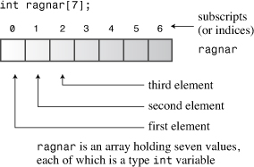


有效下标值的重要性

编译器不会检查您是否使用了有效的下标。例如，如果您为不存在的元素分配值，编译器不会抱怨。但是，当程序运行时，该分配可能会导致问题，可能会损坏数据或代码，并可能导致程序中止。因此，您有责任确保您的程序仅使用有效的下标值。`months[101]`


[清单 4.1](#ch04ex01) 中的 yam 分析程序演示了数组的一些属性，包括声明数组、为数组元素赋值以及初始化数组。

**清单 4.1.`数组一.cpp`**

------

```
arrayone.cpp -- 整数的小数组
\#include <iostream>
int main（）
{
using namespace std;
int yams[3]; // 创建具有三个元素
的数组 yams[0] = 7; // 为第一个元素
yams[1] = 8;
yams[2] = 6;

int yamcosts[3] = {20， 30， 5};创建，初始化数组
// 注意：如果你C++编译器或转换器无法初始化
//此数组，请使用静态 int yamcosts[3] 而不是
// int yamcosts[3]

cout << “Total yams = ”;
<<山药[0] + 山药[1] + 山药[2] <<;
cout << “带有” <<山药[1]的套餐<<“山药成本”;
<<山药[1] << “每山药美分”;
int total = yams[0] * yamcosts[0] + yams[1] * yamcosts[1];
总计 = 总计 + 山药[2] * 山药[2];
<<“山药费用总额为<<<<美分”。

cout << “\n山药阵列的大小 = ” <<山药的大小;
cout << “bytes.\n”;
cout << “一个元素的大小 = ” <<山药的大小[0];
cout << “bytes.\n”;
返回 0;
}
```

下面是[清单 4.1](#ch04ex01) 中程序的输出：

总山药 = 21
8个山药的包装每山药花费30美分。
山药总费用为410美分。

山药阵列的大小 = 12 字节。
一个元素的大小 = 4 个字节。

#### 计划说明

首先，[清单 4.1](#ch04ex01) 中的程序创建了一个名为 的三元素数组。因为有三个元素，所以元素从 到 编号，并使用索引值 through 将值分配给三个单独的元素。每个单独的元素都是具有某种类型的所有权限和特权的，因此可以并且确实为元素赋值，添加元素，相乘元素和显示元素。`yams``yams``0``2``arrayone.cpp``0``2``yam``int``int``arrayone.cpp`

该程序使用很长的路来为元素赋值。C++还允许您初始化声明语句中的数组元素。[清单 4.1](#ch04ex01) 使用这个快捷方式为数组赋值：`yam``yamcosts`

int yamcosts[3] = {20， 30， 5};

它只是提供一个以逗号分隔的值*列表（初始化列表*），并括在大括号中。列表中的空格是可选的。如果不初始化函数内定义的数组，则元素值将保持未定义状态。这意味着该元素具有以前驻留在内存中该位置的任何值。


接下来，程序在几次计算中使用数组值。程序的这一部分看起来杂乱无章，所有下标和括号都杂乱无章。`for` 循环出现在[第 5 章](ch05.html#ch05)“[循环和关系表达式](ch05.html#ch05)”中，它提供了一种处理数组的强大方法，并且无需显式编写每个索引。目前，我们将坚持使用小数组。

您应该记得，运算符返回类型或数据对象的大小（以字节为单位）。请注意，如果将运算符与数组名称一起使用，则将获得整个数组中的字节数。但是，如果与数组元素一起使用，则将获得元素的大小（以字节为单位）。这说明这是一个数组，但只是一个 .`sizeof``sizeof``sizeof``yams``yams[1]``int`

#### 数组的初始化规则

C++有几条关于初始化数组的规则。它们限制何时可以执行此操作，并确定如果数组元素的数量与初始值设定项中的值数量不匹配会发生什么情况。让我们来看看这些规则。

只有在定义数组时*才能*使用初始化表单。以后不能使用它，也不能将一个阵列批量分配给另一个阵列：

int cards[4] = {3， 6， 8， 10};好的
int 手[4];好的
手[4] = {5， 6， 7， 9};不允许的
手牌=牌;不允许

但是，您可以使用下标并将值分别分配给数组的元素。

初始化数组时，可以提供的值少于数组元素。例如，以下语句仅初始化 的前两个元素：`hotelTips`

浮动酒店提示[5] = {5.0， 2.5};

如果部分初始化数组，编译器会将其余元素设置为零。因此，很容易将数组的所有元素初始化为零 - 只需将第一个元素显式初始化为零，然后让编译器将其余元素初始化为零：

长总计[500] = {0};

请注意，如果初始化为 而不是 to ，则只有第一个元素设置为 ;其余的仍设置为 。`{1}``{0}``1``0`

如果在初始化数组时将方括号 （） 留空，则C++编译器将为您计算元素。例如，假设您做出以下声明：`[]`

short things[] = {1， 5， 3， 8};

编译器创建一个由四个元素组成的数组。`things`

------

让编译器来做

通常，让编译器计算元素的数量是一种不好的做法，因为它的计数可能与您认为应该的有所不同。例如，您可能会意外地从列表中省略初始值。但是，此方法对于将字符数组初始化为字符串可能是一种安全的方法，您很快就会看到。如果你主要关心的是程序，而不是你，知道数组有多大，你可以做这样的事情：short things[] = {1， 5， 3， 8};
int num_elements = 事物的大小 / 大小 （短）;这是有用还是懒惰取决于具体情况。

C++11 数组初始化

正如[第 3 章](ch03.html#ch03)“[处理数据](ch03.html#ch03)”中提到的，C++11 使初始化（列表初始化）的大括号形式成为所有类型的通用形式。数组已经使用列表初始化，但 C++11 版本增加了一些功能。

首先，您可以在初始化数组时删除符号：`=`

双倍收益[4] {1.2e4， 1.6e4， 1.1e4， 1.7e4};C++11

其次，您可以使用空大括号将所有元素设置为0：

无符号整数计数[10] = {};所有元素设置为 0
浮动余额[100] {};设置为 0 的所有元素

第三，如[第 3 章](ch03.html#ch03)所述，列表初始化可防止缩小范围：

long plifs[] = {25， 92， 3.0};不允许字符
slifs[4] {'h'， 'i'， 1122011， '\0'};不允许字符
tlifs[4] {'h'， 'i'， 112， '\0'};允许

第一次初始化失败，因为从浮点类型转换为整数类型的范围正在缩小，即使浮点值在小数点后只有零。第二个初始化失败，因为在 a 的范围之外，假设我们有一个 8 位 。第三个成功，因为即使它是一个值，它仍然在 .`1122011``char``char``112``int``char`

C++标准模板库 （STL） 提供了称为模板类的数组的替代方法，C++11 添加了一个模板类。这些替代方法比内置阵列复合类型更复杂、更灵活。本章稍后将简要讨论它们，[第 16 章](ch16.html#ch16)“类和标准模板库”将更全面地讨论它们。`vector``array``string`

### 字符串

*字符串*是存储在连续字节内存中的一系列字符。C++有两种处理字符串的方法。第一个取自C，通常称为*C样式字符串*，是本章研究的第一个字符串。稍后，本章将讨论一种基于类库的替代方法。`string`

以连续字节存储一系列字符的想法意味着您可以将字符串存储在`char`数组中，每个字符都保存在自己的数组元素中。字符串提供了一种方便的方式来存储文本信息，例如给用户的消息（*“请告诉我您的秘密瑞士银行帐号”*）或用户的响应（*“您必须在开玩笑*”）。C 样式字符串有一个特殊功能：每个字符串的最后一个字符是*空字符*。此字符写为 `\0`，是 ASCII 代码为 0 的字符，用于标记字符串的结尾。例如，请考虑以下两个声明：

char dog[8] = { 'b'， 'e'， 'a'， 'u'， 'x'， ' '， 'I'， 'I'};不是字符串！
char cat[8] = {'f'， 'a'， 't'， 'e'， 's'， 's'， 'a'， '\0'};一根绳子！这两个数组都是 的数组，但只有第二个是字符串。空字符在 C 样式字符串中起着基本作用。例如，C++有许多处理字符串的函数，包括 .它们都通过逐个字符处理字符串来工作，直到它们到达空字符。如果您要求显示一个漂亮的字符串，如前面的示例所示，它将显示前七个字符，检测空字符，然后停止。但是，如果您不礼貌地告诉显示前面示例中的数组（不是字符串），则打印数组中的八个字母，然后逐个字节地在内存中前进，将每个字节解释为要打印的字符，直到它达到空字符。由于空字符（实际上是设置为零的字节）在内存中往往很常见，因此通常很快就会包含损坏;但是，不应将非字符串字符数组视为字符串。`char``cout``cout``cat``cout``dog``cout`数组示例使得将数组初始化为字符串看起来很乏味 — 所有这些单引号，然后必须记住空字符。不用担心。有更好的方法可以将字符数组初始化为字符串。只需使用带引号的字符串，称为*字符串常量*或*字符串文本*，如下所示：`cat`char bird[11] = “Mr. Cheeps”;\0 被理解
为 char fish[] = “Bubbles”;让编译器计数

带引号的字符串始终隐式包含终止空字符，因此您不必将其拼写出来（请参见[图 4.2](#ch04fig02)）。此外，用于将字符串从键盘输入读取到数组中的各种C++输入工具会自动为您添加终止空字符。（如果在[运行清单 4.1](#ch04ex01) 中的程序时发现必须使用关键字来初始化数组，则也必须将其与这些数组一起使用。`char``static``char`

**图 4.2.将数组初始化为字符串。**

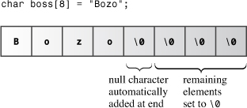当然，您应该确保数组足够大以容纳字符串的所有字符，包括空字符。使用字符串常量初始化字符数组是让编译器为您计算元素数可能更安全的一种情况。除了浪费空间之外，使数组大于字符串没有任何害处。这是因为处理字符串的函数由空字符的位置指导，而不是数组的大小。C++对字符串的长度没有限制。


谨慎

确定保存字符串所需的最小数组大小时，请记住在计数中包含终止空字符。


请注意，字符串常量（带双引号）不能与字符常量（带单引号）互换。字符常量（如`“S”`）是字符代码的速记符号。在ASCII系统上，`“S”`只是编写83的另一种方式。因此，以下语句将值 83 赋给`shirt_size`：

字符 shirt_size = 'S';这很好但不是一个字符常数;它表示由两个字符（和字符）组成的字符串。更糟糕的是，它实际上表示存储字符串的内存地址。因此，像下面这样的语句尝试将内存地址分配给：`"S"``S``\0``"S"``shirt_size`字符 shirt_size = “S”;非法类型不匹配由于地址在C++中是单独的类型，因此C++编译器不允许这种无稽之谈。（在本章后面讨论指针后，我们将回到这一点。串联字符串文本有时，字符串可能太长，无法方便地放在一行代码上。C++使您能够连接字符串文本，即将两个带引号的字符串合并为一个。实际上，任何仅由空格（空格、制表符和换行符）分隔的字符串常量都将自动连接为一个。因此，以下所有输出语句彼此等效：cout<<“我会把我的右臂变成”一个伟大的小提琴家。
<<“我会用我的右臂成为一名伟大的小提琴家。
cout <<“我会给我的权利”
“成为一个伟大的小提琴家。请注意，联接不会向联接字符串添加任何空格。第二个字符串的第一个字符紧跟在第一个字符串的最后一个字符之后，不计算在内。第一个字符串中的字符将替换为第二个字符串的第一个字符。`\0``\0`在数组中使用字符串

将字符串放入数组的两种最常见方法是将数组初始化为字符串常量，并将键盘或文件输入读取到数组中。 [清单 4.2](#ch04ex02) 通过将一个数组初始化为带引号的字符串，并使用 将输入字符串放入第二个数组来演示这些方法。该程序还使用标准的 C 库函数来获取字符串的长度。标准头文件（或较旧的实现）为此函数和许多其他与字符串相关的函数提供声明。`cin``strlen()``cstring``string.h`

**清单 4.2.`字符串.cpp`**

------

```
strings.cpp -- 将字符串存储在数组
中#include <iostream>
\#include <cstring> // for the strlen（） 函数
int main（）
{
using namespace std;
const int Size = 15;
char name1[Size]; // 空数组
char name2[Size] = “C++owboy”; // 初始化数组
// 注意：某些实现可能需要静态关键字
// 来初始化数组 name2

<<“你好！我是“ <<名字2;
cout <<“！你叫什么名字？\n“;
cin >> name1;
cout << “嗯，”<<名字1<<“，你的名字有”;
cout << strlen（name1） << “字母并存储\n”;
cout << “in a array of ” << sizeof（name1） << “ bytes.\n”;
cout << “your initial is ” << name1[0] << “.\n”;
name2[3] = '\0';设置为空字符
cout <<“这是我名字的前 3 个字符：”;
cout << name2 << endl;
返回 0;
}
```

下面是[清单 4.2](#ch04ex02) 中程序的示例运行：

你好！我是C++小伙子！你叫什么名字？
**Basicman**
好吧，Basicman，你的名字有 8 个字母，存储在
一个 15 字节的数组中。
你的名字首字母是B.
这是我名字的前3个字符：C++

##### 计划说明

你能从[清单 4.2](#ch04ex02) 中学到什么？首先，请注意，运算符给出整个数组的大小（15 个字节），但该函数返回数组中存储的字符串的大小，而不是数组本身的大小。还仅计算可见字符，而不计算空字符。因此，对于 的长度，它返回值 ， 而不是 。如果 是字符串，则用于保存该字符串的最小数组大小为 。`sizeof``strlen()``strlen()``8``9``Basicman``cosmic``strlen(cosmic) + 1`

由于 和 是数组，因此可以使用索引来访问数组中的各个字符。例如，程序用于查找该数组中的第一个字符。此外，程序设置为空字符。这使得字符串在三个字符之后结束，即使数组中还保留更多字符（请参见[图 4.3](#ch04fig03)）。`name1``name2``name1[0]``name2[3]`

**图 4.3.使用 `\0` 缩短字符串。**

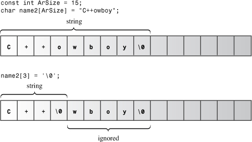

请注意，[清单 4.2](#ch04ex02) 中的程序使用符号常量作为数组大小。数组的大小通常出现在程序的多个语句中。使用符号常量来表示数组的大小简化了修改程序以使用不同的数组大小;您只需要更改一次值，其中定义了符号常量。

#### 字符串输入中的冒险

该程序有一个瑕疵，通过精心挑选的样本输入的通常有用的技术来隐藏。[清单 4.3](#ch04ex03) 去除了面纱，并表明字符串输入可能很棘手。`strings.cpp`

**清单 4.3.`instr1.cpp`**

------

```
instr1.cpp -- 读取多个字符串
\#include <iostream>
int main（）
{
using namespace std;
const int ArSize = 20;
char name[ArSize];
char dessert[ArSize];

cout << “输入您的姓名：\n”;
cin >>名称;
cout << “输入您最喜欢的甜点：\n”;
辛>>甜点;
<<“我有一些好吃的”<<甜点;
cout << “为你， ” << 名称 << “.\n”;
返回 0;
}
```

[清单 4.3](#ch04ex03) 中程序的意图很简单：从键盘上读取用户名和最喜欢的甜点，然后显示信息。下面是一个示例运行：

输入你的名字：
**Alistair Dreeb**
输入你最喜欢的甜点：
我有一些美味的Dreeb给你，Alistair。

我们甚至没有机会回应甜点提示！程序显示了它，然后立即继续显示最后一行。

问题在于如何确定何时完成输入字符串。您无法从键盘输入空字符，因此需要一些其他方法来查找字符串的末尾。该技术是使用空格（空格、制表符和换行符）来描述字符串。这意味着当它获得字符数组的输入时，只读取一个单词。读取此单词后，在将字符串放入数组中时自动添加终止空字符。`cin``cin``cin``cin``cin`

此示例中的实际结果是读取为整个第一个字符串并将其放入数组中。这使得穷人仍然坐在输入队列中。在输入队列中搜索对最喜欢的甜点问题的响应时，它发现仍然存在。然后吞噬并将其放入数组中（参见[图 4.4](#ch04fig04)）。`cin``Alistair``name``Dreeb``cin``Dreeb``cin``Dreeb``dessert`

**图 4.4.字符串输入的 `cin` 视图。**

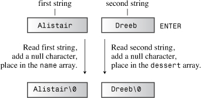另一个在示例运行中没有出现的问题是，输入字符串可能比目标数组长。使用此示例时，不提供防止将 30 个字符的字符串放入 20 个字符数组中的保护。`cin`

许多程序依赖于字符串输入，因此值得进一步探讨此主题。我们必须利用`cin`的一些更高级的功能，这些功能在第[17章](ch17.html#ch17)“[输入，输出和文件](ch17.html#ch17)”中进行了描述。

#### 读取字符串 一次输入一行

一次读取一个单词的字符串输入通常不是最理想的选择。例如，假设一个程序要求用户输入一个城市，用户用**`纽约`**或**`圣保罗`**进行响应。您可能希望程序读取和存储全名，而不仅仅是 和 。为了能够输入整个短语而不是单个单词作为字符串，您需要一种不同的字符串输入方法。具体来说，您需要一个面向行的方法，而不是一个面向单词的方法。你很幸运，因为类（其中就是一个例子）有一些面向行的类成员函数：和。两者都读取整个输入行，即直到换行符。但是，然后丢弃换行符，而将其保留在输入队列中。让我们看一下细节，从 开始。`New``Sao``istream``cin``getline()``get()``getline()``get()``getline()`

##### 面向线路的输入`getline()`

该函数读取整行，使用 Enter 键传输的换行符来标记输入的结束。通过使用作为函数调用来调用此方法。该函数采用两个参数。第一个参数是目标的名称（即，用于保存输入行的数组），第二个参数是对要读取的字符数的限制。如果此限制为 20，则该函数读取的字符不超过 19 个字符，从而留出空间在末尾自动添加空字符。当成员函数达到此数字限制或读取换行符（以先到者为准）时，它将停止读取输入。`getline()``cin.getline()``getline()`

例如，假设您要使用 将名称读入 20 元素名称数组中。您将使用此调用：`getline()`

cin.getline（name，20）;

这会将整行读入 `name` 数组，前提是该行由 19 个或更少的字符组成。（`getline（）` 成员函数还有一个可选的第三个参数，该参数 [第17章](ch17.html#ch17)讨论。

[清单 4.4](#ch04ex04) 将[清单 4.3](#ch04ex03) 修改为使用，而不是简单的 .否则，程序将保持不变。`cin.getline()``cin`

**清单 4.4.`instr2.cpp`**

------

instr2.cpp -- 使用 getline
\#include <iostream>
int main（）
{
using namespace std;
const int ArSize = 20;
char name[ArSize];
char dessert[ArSize];

cout << “输入您的姓名：\n”;
cin.getline（name， ArSize）;通读换行符
<<“输入您最喜欢的甜点：\n”;
cin.getline（dessert， ArSize）;
<<“我有一些好吃的”<<甜点;
cout << “为你， ” << 名称 << “.\n”;
返回 0;
}

下面是[清单 4.4](#ch04ex04) 的一些示例输出：

输入你的名字：
**Dirk Hammernose**
输入你最喜欢的甜点：
**萝卜蛋糕**
我有一些美味的萝卜Torte给你，Dirk Hammernose。

该程序现在读取完整的名称，并向用户提供他只是甜点！该函数可以方便地一次获取一行。它通过标记行尾的换行符读取输入，但不保存换行符。相反，在存储字符串时，它会将其替换为空字符（请参见[图 4.5](#ch04fig05)）。`getline()`

**图 4.5.`getline（）` 读取并替换换行符。**

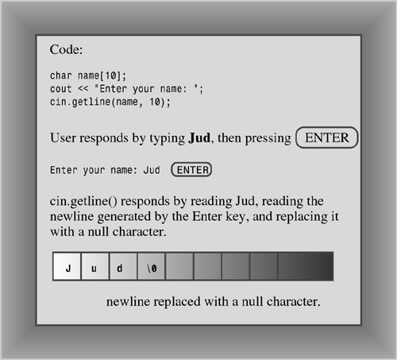面向线路的输入`get()`让我们尝试另一种方法。该类具有另一个成员函数 ，它有几种变体。一个变体的工作方式与 .它采用相同的参数，以相同的方式解释它们，并读取到一行的末尾。但是，与其读取并丢弃换行符，不如将该字符保留在输入队列中。假设您在一行中使用两个调用：`istream``get()``getline()``get()``get()`cin.get（name， ArSize）;
cin.get（甜点，Arsize）;一个问题

由于第一个调用将换行符保留在输入队列中，因此该换行符是第二个调用看到的第一个字符。因此，`get（）` 得出结论，它到达了行的末尾，而没有找到任何要阅读的内容。没有帮助，`get（）` 就无法超越换行符。

幸运的是，有以 的变体形式提供帮助。调用（不带参数）读取单个下一个字符，即使它是换行符，因此您可以使用它来释放换行符并为下一行输入做准备。也就是说，此序列有效：`get()``cin.get()`cin.get（name， ArSize）;读取第一行
cin.get（）;阅读换行符
cin.get（甜点，Arsize）;读取第二行另一种使用方法是*连接*或联接两个类成员函数，如下所示：`get()`cin.get（name， ArSize）.get（）;连接成员函数

使这成为可能的是`cin.get（名称，ArSize）`返回`cin`对象，然后将其用作调用`get（）`函数的对象。类似地，以下语句将两个连续的输入行读取到数组 `name1` 和 `name2` 中;它等效于对 `cin.getline（）` 进行两个单独的调用：

cin.getline（name1， ArSize）.getline（name2， ArSize）;

[清单 4.5](#ch04ex05) 使用串联。在第 [11 章](ch11.html#ch11)“[使用类](ch11.html#ch11)”中，您将学习如何将此功能合并到类定义中。

**清单 4.5.`instr3.cpp`**

------

instr3.cpp -- 使用 get（） & get（）
读取多个单词 #include <iostream>
int main（）
{
using namespace std;
const int ArSize = 20;
char name[ArSize];
char dessert[ArSize];

cout << “输入您的姓名：\n”;
cin.get（name， ArSize）.get（）;阅读字符串，换行符
<<“输入您最喜欢的甜点：\n”;
cin.get（dessert， ArSize）.get（）;
<<“我有一些好吃的”<<甜点;
cout << “为你， ” << 名称 << “.\n”;
返回 0;
}

下面是[清单 4.5](#ch04ex05) 中程序的示例运行：

输入你的名字：
**Mai Parfait**
输入你最喜欢的甜点：
**巧克力慕斯**
我有一些美味的巧克力慕斯给你，Mai Parfait。

需要注意的一点是，C++如何允许多个版本的函数，前提是它们具有不同的参数列表。例如，如果您使用 ，编译器会注意到您正在使用将字符串放入数组并设置相应成员函数的形式。相反，如果您使用 ，编译器会意识到您需要读取一个字符的形式。[第8章](ch08.html#ch08)“[函数历险记](ch08.html#ch08)”探讨了这个被称为*函数重载的功能*。`cin.get(name, ArSize)``cin.get()`

为什么要使用而不是根本使用？首先，较旧的实现可能没有 .其次，让你更加小心。例如，假设您曾经将一行读入数组。您如何判断它是否读取整行而不是因为数组已填充而停止？查看下一个输入字符。如果是换行符，则读取整行。如果它不是换行符，则该行上仍有更多输入。 [第17章](ch17.html#ch17)探讨了这种技术。简而言之，使用起来稍微简单一些，但使错误检查更简单。您可以使用任何一个来读取一行输入;只要记住稍微不同的行为。`get()``getline()``getline()``get()``get()``getline()``get()`

##### 空行和其他问题

在空行之后或读取空行后会发生什么？最初的做法是，下一个输入语句从最后一个或最后一个输入语句的位置拾取。但是，当前的做法是，在（但不是）读取空行之后，它设置了一个称为 *failbit 的东西*。此操作的含义是阻止进一步的输入，但您可以使用以下命令恢复输入：`getline()``get()``getline()``get()``get()``getline()`

cin.clear（）;

另一个潜在问题是输入字符串可能比分配的空间长。如果输入行的长度超过指定的字符数，则两者都保留其余字符在输入队列中。但是，还会设置故障位并关闭进一步的输入。`getline()``get()``getline()`

[第 5](ch05.html#ch05)、[6](ch06.html#ch06) 和 [17 章](ch17.html#ch17)研究了这些属性以及如何围绕它们进行编程。

#### 混合字符串和数字输入

将数字输入与面向行的字符串输入混合可能会导致问题。考虑[清单 4.6](#ch04ex06) 中的简单程序。

**清单 4.6.`数字.cpp`**

------

numstr.cpp -- 在数字输入与行输入
\#include <iostream>
int main（）
{
使用命名空间 std;
cout << “你的房子是哪一年建造的？\n”;
int year;
cin >> year;
cout << “what is its street address？\n”;
char address[80];
cin.getline（address， 80）;
cout << “Year built： ” << year << endl;
cout << “地址： ” << 地址 << endl;
cout << “Done！\n”;
返回 0;
}

运行[清单 4.6](#ch04ex06) 中的程序将如下所示：

你的房子是哪一年建造的？
**1966**
它的街道地址是什么？
建成年份： 1966
地址
完成！

您永远没有机会输入地址。问题是，当读取年份时，它会在输入队列中保留由 Enter 键生成的换行符。然后将换行符读作空行，并将空字符串分配给数组。解决方法是在读取地址之前读取并丢弃换行符。这可以通过多种方式完成，包括使用参数或不带参数，如前面的示例中所述。您可以单独进行以下调用：`cin``cin.getline()``address``get()``char`

cin >>年;
cin.get（）;或 cin.get（ch）;

或者，您可以连接调用，利用表达式返回对象的事实：`cin >> year``cin`

（cin >> year）.get（）;或 （cin >> year）.get（ch）;

如果对[清单 4.6](#ch04ex06) 进行以下更改之一，它将正常工作：

你的房子是哪一年建造的？
**1966**
它的街道地址是什么？
**43821未签名短街**
建成年份：1966
地址：43821未签名短街
完成！

C++程序经常使用指针而不是数组来处理字符串。在稍微讨论了指针之后，我们将讨论字符串的这一方面。同时，让我们看一下处理字符串的最新方法：C++类。`string`

### 课程介绍`string`

ISO/ANSI C++98 标准通过添加一个类来扩展C++库。因此，现在，您可以使用类型变量（或对象，以使用C++术语）来保存字符串，而不是使用字符数组来保存字符串。如您所见，该类比数组更易于使用，并且还提供了字符串作为类型的更真实的表示形式。`string``string``string`

若要使用该类，程序必须包含头文件。该类是命名空间的一部分，因此您必须提供指令或声明，否则将类引用为 。类定义隐藏了字符串的数组性质，并允许您像处理普通变量一样对待字符串。[清单 4.7](#ch04ex07) 说明了对象和字符数组之间的一些相似之处和不同之处。`string``string``string``std``using``std::string``string`

**清单 4.7.`strtype1.cpp`**

------

strtype1.cpp -- 使用 C++ 字符串类
\#include <iostream>
\#include <string> // 使用命名空间 std 使字符串类可用
int main（）
{
;
char charr1[20]; // 创建一个空数组
char charr2[20] = “jaguar”; // 创建一个初始化的数组
字符串 str1; // 创建一个空字符串对象
字符串 str2 = “panther”; // 创建一个初始化的字符串

cout << “输入一种猫科动物：”;
cin >> charr1;
cout << “进入另一种猫科动物：”;
cin >> str1;使用cin作为输入
cout<<“这里有一些猫科动物：\n”;
cout << charr1 <<“”<< charr2 <<“”
<< str1 <<“” << str2 // 使用 cout 作为输出
<< endl;
cout << “<< charr2 <<”中的第三个字母是“
<< charr2[2] << endl;
cout << “<< str2 << 中的第三个字母是 ”
<< str2[2] << endl;使用数组表示法

返回 0;
}

下面是[清单 4.7](#ch04ex07) 中程序的示例运行：

输入一种猫科动物：**豹猫**
输入另一种猫科动物：**老虎**
这里有一些猫科动物：
豹猫虎豹 美洲虎中的第
三个字母是g
豹中的第三个字母是n

您应该从此示例中了解到，在许多方面，您可以像使用字符数组一样使用字符串对象：

• 您可以将对象初始化为 C 样式字符串。`string`

• 您可以使用 将键盘输入存储在对象中。`cin``string`

• 您可以使用 来显示对象。`cout``string`

• 您可以使用数组表示法来访问存储在对象中的单个字符。`string`

[清单 4.7](#ch04ex07) 中所示`的字符串`对象和字符数组之间的主要区别在于，您将对象声明为简单变量，而不是数组：`string`

字符串 str1;创建一个空字符串对象
字符串 str2 = “panther”;创建初始化字符串

类设计允许程序自动处理大小调整。例如，的声明创建了一个长度为零的对象，但程序在将输入读入 ：`str1``string``str1``str1`

cin >> str1;str1 调整大小以适应输入

这使得使用对象比使用数组更方便、更安全。从概念上讲，人们认为数组是用于存储字符串的存储单元的集合，但类变量是表示字符串的单个实体。`string``char``char``string`

#### C++11 字符串初始化

正如您现在所期望的那样，C++11 为 C 样式的字符串和对象启用列表初始化：`string`

char first_date[] = {“Le Chapon Dodu”};
char second_date[] {“The Elegant Plate”};
字符串 third_date = {“面包碗”};
字符串fourth_date {“汉克的美食”};

#### 分配、串联和追加

该类使某些操作比数组更简单。例如，不能简单地将一个数组分配给另一个数组。但是您可以将一个字符串对象分配给另一个字符串对象：`string`

字符字符1[20];创建一个空数组
char charr2[20] = “jaguar”;创建一个初始化的数组
字符串 str1;创建一个空字符串对象
字符串 str2 = “panther”;创建一个初始化的字符串
charr1 = charr2;无效，无数组赋值
str1 = str2;有效，对象分配正常

该类简化了字符串的组合。可以使用运算符将两个对象相加，并使用运算符将字符串附加到现有对象的末尾。继续上面的代码，我们有以下可能性：`string``+``string``+=``string`

字符串 str3;
str3 = str1 + str2;将 str3 的连接字符串
分配 str1 += str2;将 str2 添加到 str1 的末尾

[清单 4.8](#ch04ex08) 说明了这些用法。请注意，您可以向对象添加和追加 C 样式字符串以及对象。`string``string`

**清单 4.8.`strtype2.cpp`**

------

strtype2.cpp –- 赋值、添加和追加
\#include <iostream>
\#include <string> // 使用命名空间 std 使字符串类可用
int main（）
{
;
字符串 s1 = “penguin”;
字符串 s2， s3;

cout << “您可以将一个字符串对象分配给另一个字符串对象：s2 = s1\n”;
s2 = s1;
cout << “s1： ” << s1 << “， s2： ” << s2 << endl;
cout <<“您可以将 C 样式的字符串分配给字符串对象。\n”;
cout << “s2 = \”buzzard\“\n”;
s2 = “秃鹫”;
cout << “s2： ” << s2 << endl;
cout << “你可以连接字符串： s3 = s1 + s2\n”;
s3 = s1 + s2;
cout << “s3： ” << s3 << endl;
cout <<“您可以追加字符串。\n”;
s1 += s2;
cout <<“s1 += s2 得到 s1 = ” << s1 << endl;
s2 += “一天”;
cout <<“s2 += \” 表示一天\“ 产生 s2 = ”<< s2 << endl;

返回 0;
}

回想一下，转义序列 `\“` 表示用作文字字符而不是标记字符串限制的双引号。下面是[清单 4.8](#ch04ex08) 中程序的输出：

您可以将一个字符串对象分配给另一个字符串对象：s2 = s1
s1：企鹅，s2：企鹅
您可以将 C 样式字符串分配给字符串对象。
s2 = “buzzard”
s2： buzzard
你可以连接字符串： s3 = s1 + s2
s3： penguinbuzzard
你可以附加字符串。
s1 += s2 产生 s1 = 企鹅鼬
s2 += “一天” 产生 s2 = 秃鹫一天

#### 更多类操作`string`

甚至在将字符串类添加到C++之前，程序员就需要执行诸如分配字符串之类的操作。对于 C 样式字符串，他们使用 C 库中的函数来完成这些任务。`cstring` 头文件（以前称为 `string.h`）支持这些函数。例如，可以使用 `strcpy（）` 函数将字符串复制到字符数组，也可以使用 `strcat（）` 函数将字符串追加到字符数组：

strcpy（charr1， charr2）;将 charr2 复制到 charr1
strcat（charr1， charr2）;将 charr2 的内容附加到 char1

[清单 4.9](#ch04ex09) 比较了用于对象的技术与用于字符数组的技术。`string`

**清单 4.9.`strtype3.cpp`**

------

strtype3.cpp -- 更多字符串类功能
\#include <iostream
\>#include <string> // 使字符串类可用
\#include <cstring> // C 样式字符串库
int main（）
{
using namespace std;
char charr1[20];
char charr2[20] = “jaguar”;
string str1;
string str2 = “panther”;

// 字符串对象和字符数组的
赋值 str1 = str2;将 str2 复制到 str1
strcpy（charr1， charr2）;将 charr2 复制到 charr1

// 附加字符串对象和字符数组
str1 += “paste”;将糊状物添加到str1
strcat（charr1，“果汁”）的末尾;将果汁添加到 charr1

的末尾 // 查找字符串对象的长度和 C 样式字符串
int len1 = str1.size（）;获得 str1
int len2 的长度 = strlen（charr1）;获取 charr1

cout << “字符串 ” << str1 << “ 包含 ”
<< len1 << “ 字符。\n”;
cout << “字符串” << charr1 << “ 包含 ”
<< len2 << “ 字符。\n”;

返回 0;
}

下面是输出：

字符串黑豹粘贴包含 13 个字符。
字符串美洲虎汁包含12个字符。使用字符串对象的语法往往比使用 C 字符串函数更简单。对于更复杂的操作尤其如此。例如，C 库等效于str3 = str1 + str2;是这样的：strcpy（charr3， charr1）;
strcat（charr3， charr2）;此外，对于数组，始终存在目标数组太小而无法保存信息的危险，如以下示例所示：char site[10] = “house”;
strcat（site， “of pancakes”）;内存问题该函数将尝试将所有 12 个字符复制到数组中，从而溢出相邻内存。这可能会导致程序中止，或者程序可能会继续运行但数据已损坏。该类可根据需要自动调整大小，从而避免了此类问题。C 库确实提供了 和 的表亲，称为和，它们通过采用第三个参数来指示目标数组的最大允许大小来更安全地工作，但是使用它们会增加编写程序的另一层复杂性。`strcat()``site``string``strcat()``strcpy()``strncat()``strncpy()`请注意用于获取字符串中字符数的不同语法：int len1 = str1.size（）;获得 str1
int len2 的长度 = strlen（charr1）;获取字符的长度1

```
strlen（）` 函数是一个常规函数，它采用 C 样式字符串作为其参数，并返回字符串中的字符数。`size（）` 函数基本上做同样的事情，但它的语法是不同的。`str1` 不是显示为函数参数，而是在函数名称之前，并用点连接到该函数名称。正如您在第 3 章中看到的 `put（）` 方法所示，此语法指示 它是一个对象，这是一个类方法。方法是只能由与该方法属于同一类的对象调用的函数。在这种特殊情况下，是一个对象，并且是一个方法。简而言之，C 函数使用函数参数来标识要使用的字符串，C++类对象使用对象名称和点运算符来指示要使用的字符串。`str1``size()``str1``string``size()``string``string
```

#### 有关 I/O 类的更多信息`string`

如您所见，您可以与运算符一起使用来读取对象，并与运算符一起使用，以使用与 C 样式字符串相同的语法来显示对象。但是一次读一行，而不是一次读一个字，使用不同的语法。[清单 4.10](#ch04ex10) 显示了这种差异。`cin``>>``string``cout``<<``string`

**清单 4.10.`strtype4.cpp`**

------

strtype4.cpp -- 行输入
\#include <iostream>
\#include <string> // 使字符串类可用
\#include <cstring> // C 样式字符串库
int main（）
{
using namespace std;
char charr[20];
string str;

cout << “输入前 charr 中的字符串长度：”
<< strlen（charr） << endl;
cout << “输入前 str 中的字符串长度：”
<< str.size（） << endl;
cout << “输入一行文本：\n”;
cin.getline（charr， 20）;<<“您输入：”<< charr << endl 表示最大长度
;
cout << “输入另一行文本：\n”;
getline（cin， str）;cin现在是一个论点;没有长度说明符
cout << “您输入了：” << str << endl;
cout << “输入后 charr 中的字符串长度： ”
<< strlen（charr） << endl;
cout << “输入后 str 中的字符串长度：”
<< str.size（） << endl;

返回 0;
}

下面[是清单 4.10](#ch04ex10) 中程序的示例运行：

输入前的字符串长度： 27
输入前 str 中的字符串长度： 0
输入一行文本：
**花生酱**
您输入的： 花生酱
输入另一行文本：
**蓝莓果酱**
您输入的： 蓝莓果酱
输入后的字符串长度 charr： 13
输入后的字符串长度

请注意，程序在输入之前说数组 `charr` 中的字符串长度为 27，这比数组的大小大！这里正在发生两件事。首先是未初始化数组的内容未定义。第二个是 `strlen（）` 函数的工作原理是从数组的第一个元素开始，然后计算字节，直到它达到空字符。在这种情况下，第一个空字符直到数组末尾*几个字节后*才会出现。在未初始化的数据中出现第一个空字符的位置本质上是随机的，因此使用此程序您很可能会得到不同的数值结果。

另请注意，输入前的字符串长度为 0。这是因为未初始化的对象会自动设置为零大小。`str``string`这是将行读入数组的代码：cin.getline（charr， 20）;点表示法指示该函数是该类的类方法。（回想一下，这是一个对象。如前所述，第一个参数指示目标数组，第二个参数是数组大小，用于避免溢出数组。`getline()``istream``cin``istream``getline()`这是将一行读入对象的代码：`string`getline（cin，str）;没有点表示法，这表明*这不是*一个类方法。因此，它作为一个参数，告诉它在哪里可以找到输入。此外，字符串的大小也没有参数，因为对象会自动调整大小以适合字符串。`getline()``cin``string`那么，为什么一个是类方法，而另一个不是呢？该类在添加该类之前很久就成为C++的一部分。因此，该设计识别基本C++类型，例如 和 ，但它对类型一无所知。因此，有用于处理的类方法、和其他基本类型，但没有用于处理对象的类方法。`getline()``istream``getline()``istream``string``istream``double``int``string``istream``double``int``istream``string`由于没有用于处理字符串对象的类方法，您可能想知道为什么像这样的代码可以工作：`istream`cin >> str;将单词读入 str 字符串对象事实证明，像下面这样的代码（以伪装的表示法）使用类的成员函数：`istream`cin >> x;将值读取为基本C++类型

但是`字符串`类等效项使用`字符串`类的友元函数（也采用伪装的表示法）。你必须等到[第11章](ch11.html#ch11)才能看到什么是朋友功能以及这种技术是如何工作的。同时，您可以使用 和 对象，而不必担心内部工作原理。`cin``cout``string`

#### 字符串文本的其他形式的

C++，回想一下，除了`char`之外，还具有`wchar_t`类型。C++11 增加了`char16_t`和`char32_t`类型。可以创建这些类型的数组和这些类型的字符串文本。C++分别对这些类型的字符串文本使用 `L`、`u` 和 `U` 前缀。以下是如何使用它们的示例：

wchar_t头衔[] = L“首席天体测量师”;w_char字符串
char16_t name[] = u“Felonia Ripova”;char_16弦
char32_t车[] = U“亨伯超级狙击手”;char_32字符串C++11 还支持一种名为 UTF-8 的 Unicode 字符编码方案。在此方案中，给定字符可以存储在从一个 8 位单位或八位字节到四个 8 位单位的任意位置，具体取决于数值。C++使用前缀来指示该类型的字符串文本。`u8`

另一个C++11的补充是原始字符串。在原始字符串中，字符只是代表自己。例如，序列 `\n` 不被解释为表示换行符;相反，它是两个普通字符，一个反斜杠和一个`n`，它将在屏幕上显示为这两个字符。作为另一个例子，您可以在字符串中使用一个简单的 `“，`而不是我们在``[清单 4.8](#ch04ex08) 中使用的更尴尬的 \”。当然，如果允许字符串文本内部，则无法再使用它来分隔字符串的末尾。因此，原始字符串使用 和 作为分隔符，并使用前缀将它们标识为原始字符串：`"``"(``)"``R`

cout << R“（Jim ”King“ Tutt 使用 ”\n“ 而不是 endl.）” << '\n';

这将显示以下内容：

Jim “King” Tutt 使用 \n 而不是 endl。

标准字符串文本等效项是这样的：

cout << “Jim \”King\“ Tutt 使用 \” \\n\“ 而不是 endl。” << '\n';

在这里，我们必须使用显示，因为单个被解释为转义序列的第一个字符。`\\``\``\`

如果在键入原始字符串时按 Enter 或 Return 键，这不仅会将光标移动到屏幕上的下一行，还会在原始字符串中放置一个回车符。

如果要在原始字符串中显示组合，该怎么办？（谁不会呢？编译器不会将 第一次出现的 会不会将 字符串的末尾解释为结尾？是的，它会的。但是，原始字符串语法允许您在开头和之间放置其他字符。这意味着在 final 和 之间必须出现相同的附加字符。因此，以 开头的原始字符串必须以 结尾。因此，该语句`)"``)"``"``(``)``"``R"+*``)+*"`

cout << R“+*（”（谁不会？）“，她低声说。+*“ << endl;

将显示以下内容：

“（谁不会？）”她低声说。

简而言之，`“（` 和 `）`”的默认分隔符已被`替换为“+*（` 和 `）+*”。`除了空格、左括号、右括号、反斜杠和控制字符（如制表符或换行符）之外，还可以使用基本字符集的任何成员作为分隔符的一部分。

该前缀可以与其他字符串前缀组合在一起，以生成原始字符串等。它可以是复合前缀的第一部分或最后一部分：、 、 等。`R``wchar_t``Ru``UR`现在让我们继续讨论另一种compound类型-结构。结构介绍假设您要存储有关篮球运动员的信息。您可能希望存储他或她的姓名，薪水，身高，体重，平均得分，罚球命中率，助攻等。您需要某种数据形式，可以将所有这些信息保存在一个单元中。数组不起作用。尽管数组可以包含多个项目，但每个项目必须具有相同的类型。也就是说，一个数组可以容纳20个，另一个数组可以容纳10个，但单个数组不能在某些元素中存储s，而在其他元素中存储s。`int``float``int``float`你渴望的答案（关于存储有关篮球运动员的信息的答案）是C++结构。*结构*是比数组更通用的数据形式，因为单个结构可以保存多个数据类型的项。这使您能够通过将所有相关的篮球信息存储在单个结构变量中来统一数据表示。如果要跟踪整个团队，可以使用一系列结构。结构类型也是通往C++ OOP（该类）的堡垒的垫脚石。现在，学习一些关于结构的知识会让你更接近C++的OOP核心。结构是用户可定义的类型，其结构声明用于定义类型的数据属性。定义类型后，可以创建该类型的变量。因此，创建结构是一个由两部分组成的过程。首先，定义一个结构描述，用于描述和标记可以存储在结构中的不同类型的数据。然后，您可以创建结构变量，或者更一般地说，创建遵循描述计划的结构数据对象。例如，假设 Bloataire， Inc. 想要创建一个类型来描述其设计师充气玩具产品线的成员。特别是，该类型应包含物品的名称，其体积（以立方英尺为单位）及其销售价格。以下是满足这些需求的结构描述：结构充气 // 结构声明
{
字符名称[20];
浮动体积;
双倍价格;
};

关键字 `struct` 指示代码定义结构的布局。`可膨胀标识符`是此表单的名称或*标记*;这使得`可充气`成为新类型的名称。因此，您现在可以创建`可膨胀`类型的变量，就像创建 `char` 或 `int` 类型的变量一样。接下来，大括号之间是要保留在结构中的数据类型列表。每个列表项都是一个声明语句。您可以在此处使用任何C++类型，包括数组和其他结构。此示例使用 `char` 数组，该数组适用于存储字符串、`浮点数`和`双精度型`。列表中的每个单独项目称为结构*成员*，因此可膨胀结构有三个成员（请参见[图 4.6](#ch04fig06)）。简而言之，结构定义定义了类型的特征，在本例中为类型。`inflatable`

**图 4.6.结构描述的各个部分。**

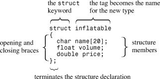定义结构后，可以创建该类型的变量：充气帽;帽子是一种结构变量型充
气充气woopie_cushion;型充气可变
充气主机;型充气变量如果您熟悉C结构，您会注意到（可能很高兴）C++允许您在声明结构变量时删除关键字：`struct`结构充气鹅;C
充气文森特中所需的关键字结构;关键字结构在C++中不需要在C++中，结构标记的使用方式与基本类型名称相同。此更改强调结构声明定义了新类型。它还从诅咒诱导错误的列表中删除了省略。`struct`

假设`帽子`的类型是`可充气的`，您可以使用成员资格运算符 （`.`） 来访问各个成员。例如，`hat.volume` 是指结构的`卷`成员，`hat.price` 是指`价格`成员。同样，`vincent.price` 是 `vincent` 变量`的价格`成员。简而言之，成员名称使您能够访问结构的成员，就像索引使您能够访问数组的元素一样。由于`价格`成员被声明为 `double` 类型，`因此 hat.price` 和 `vincent.price` 都等效`于 double 类型`变量，并且可以以任何方式使用普通类型 `double` 变量。简而言之，`帽子`是一种结构，但`帽子价格`是`双倍`的。顺便说一句，用于访问类成员函数（如`cin.getline（））`的方法起源于用于访问结构成员变量（如`vincent.price）的方法`。

在程序中使用结构

现在我们已经介绍了结构的一些主要功能，现在是时候将这些想法放在一个结构使用程序中了。 [清单 4.11](#ch04ex11) 说明了关于结构的这些要点。它还显示了如何初始化一个。

**清单 4.11.`结构.cpp`**

------

结构.cpp -- 一个简单的结构
\#include <iostream>
结构充气 // 结构声明
{
char name[20];
float volume;
double price;
};

int main（）
{
using namespace std;
inflatable guest =
{
“Glorious Gloria”， // name value
1.88， // volume value
29.99 // price value
}; // guest 是一个充气类型的结构变量
// 它被初始化为指示值
可充气 pal =
{
“Audacious Arthur”，
3.12，
32.99
};pal 是充
气型// 类型的第二个变量 注意：某些实现需要使用
// 静态充气来宾 =

cout << “扩展您的来宾列表” << guest.name;
cout << “ 和 ” << pal.name << “！\n”;
// pal.name 是 pal 变量
cout 的名称成员，<< “你可以同时拥有两者”;
<<客人价格 + pal.price << “！\n”;
返回 0;
}

下面是[清单 4.11](#ch04ex11) 中程序的输出：

扩大你的客人名单与光荣的格洛丽亚和大胆的亚瑟！
您可以以$ 62.98的价格拥有两者！

##### 计划说明

[与清单 4.11](#ch04ex11) 中的程序相关的一个重要问题是结构声明的位置。有两种选择。您可以将声明放在函数内，紧跟在左大括号之后。第二个选择，也是这里所做的选择，是将其放在外面和前面。当声明发生在任何函数外部时，它被称为*外部声明*。对于此程序，两种选择之间没有实际区别。但对于由两个或多个函数组成的程序，差异可能至关重要。外部声明可以由它后面的所有函数使用，而内部声明只能由找到声明的函数使用。大多数情况下，您需要一个外部结构声明，以便所有函数都可以使用该类型的结构（请参见[图 4.7](#ch04fig07)）。`structur.cpp``main()``main()`

**图 4.7.本地和外部结构声明。**

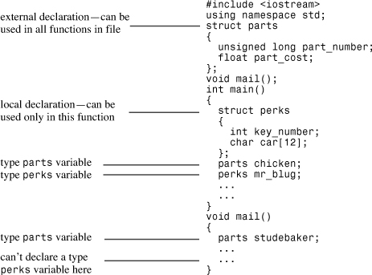

变量也可以在内部或外部定义，外部变量在函数之间共享。（[第 9 章](ch09.html#ch09)“[内存模型和命名空间](ch09.html#ch09)”，将进一步探讨该主题。C++做法不鼓励使用外部变量，但鼓励使用外部结构声明。此外，在外部声明符号常量通常也是有意义的。

接下来，请注意初始化过程：充气客人 =
{
“光荣的格洛丽亚”， // 名称值
1.88， // 体积值
29.99 // 价格值
};与数组一样，您可以使用以逗号分隔的值列表，这些值括在一对大括号中。程序每行放置一个值，但您可以将它们全部放在同一行上。只需记住用逗号分隔项目：充气鸭 = {“达芙妮”， 0.12， 9.98};您可以将结构的每个成员初始化为适当的数据类型。例如，成员是一个字符数组，因此您可以将其初始化为字符串。`name`每个结构成员都被视为该类型的变量。因此，是一个变量，并且是 的数组。当程序用于显示 时，它将成员显示为字符串。顺便说一句，由于 是字符数组，因此我们可以使用下标来访问数组中的各个字符。例如，是 字符 。但它是没有意义的，因为它是一个结构，而不是一个数组。`pal.price``double``pal.name``char``cout``pal.name``pal.name``pal.name[0]``A``pal[0]``pal`C++11 结构初始化与数组一样，C++11 扩展了列表初始化的功能。该符号是可选的：`=`充气鸭{“达芙妮”， 0.12， 9.98};可以省略 C++11 中的 =接下来，空大括号将导致单个成员设置为 0。例如，以下声明导致 设置为 0，并且所有字节都设置为 0：`mayor.volume``mayor.price``mayor.name`充气市长 {};最后，不允许缩小范围。结构可以使用类成员吗？`string`是否可以对成员使用类对象而不是字符数组？也就是说，是否可以声明如下结构：`string``name`#include <字符串>
结构充气 // 结构定义
{
std：：字符串名称;
浮动交易量;
双倍价格;
};

答案是肯定的，除非您使用的是不支持使用`字符串`类成员初始化结构的过时编译器。

确保结构定义有权访问命名空间。您可以通过移动指令使其位于结构定义之上来执行此操作。如前所述，更好的选择是声明为具有类型 。`std``using``name``std::string`其他结构特性

C++使用户定义类型尽可能类似于内置类型。例如，可以将结构作为参数传递给函数，并且可以让函数使用结构作为返回值。还可以使用赋值运算符 （`=`） 将一个结构赋值给同一类型的另一个结构。这样做会导致将一个结构的每个成员设置为另一个结构中相应成员的值，即使该成员是数组也是如此。这种分配称为*按成员分配*。我们将推迟传递和返回结构，直到我们在[第 7 章](ch07.html#ch07)“[函数：C++编程模块](ch07.html#ch07)”中讨论函数，但我们现在可以快速浏览一下结构赋值。[清单 4.12](#ch04ex12) 提供了一个示例。

**清单 4.12.`assgn_st.cpp`**

------

assgn_st.cpp -- 分配结构
\#include <iostream>
结构充
气{
char name[20];
float volume;
double price;
};
int main（）
{
using namespace std;
inflatable bouquet =
{
“sunflowers”，
0.20，
12.49
};
inflatable choice;
cout << “bouquet： ” << bouquet.name << “ for $”;
cout << bouquet.price << endl;

选择=花束;将一个结构分配给另一个
<<“选择：”<< choice.name <<“为$”;
cout << choice.price << endl;
返回 0;
}

下面是[清单 4.12](#ch04ex12) 中程序的输出：

花束： 向日葵 $12.49
选择： 向日葵 $12.49

如您所见，按成员分配正在工作，因为结构的成员被分配了存储在结构中的相同值。`choice``bouquet`

您可以将结构形式的定义与结构变量的创建相结合。为此，请在右大括号后面加上一个或多个变量名称：

struct perks
{
int key_number;
char car[12];
} mr_smith， ms_jones;两个福利变量

您甚至可以以这种方式初始化您创建的变量：

struct perks
{
int key_number;
char car[12];
} mr_glitz =
{
7， // value for mr_glitz.key_number member
“Packard” // value for mr_glitz.car member
};

但是，将结构定义与变量声明分开通常使程序更易于阅读和遵循。

您可以对结构执行的另一件事是创建一个没有类型名称的结构。您可以通过省略标签名称，同时定义结构形式和变量来实现此目的：

struct // no tag
{
int x; // 2 个成员
int y;
} position;结构变量

这将创建一个名为 的结构变量。可以使用成员资格运算符访问其成员，如 中所示，但该类型没有通用名称。您不能随后创建相同类型的其他变量。本书没有使用这种有限的结构形式。`position``position.x`

除了C++程序可以使用结构标记作为类型名称这一事实之外，C结构还具有迄今为止讨论的C++结构的所有功能，除了C++11更改。但C++结构走得更远。例如，与C结构不同，C++结构除了成员变量外，还可以具有成员函数。但是这些更高级的功能通常与类一起使用，而不是与结构一起使用，因此我们将在介绍类时讨论它们，从[第10章](ch10.html#ch10)“[对象和类](ch10.html#ch10)”开始。

#### 结构数组

`可膨胀`结构包含一个数组（`名称`数组）。也可以创建其元素为结构的数组。该技术与创建基本类型的数组完全相同。例如，要创建包含 100 个`可充气结构的`数组，可以执行以下操作：

充气礼品[100];100 个充气结构的阵列这将生成一个 s 数组。因此，数组的每个元素（如 or ）都是一个对象，可以与成员资格运算符一起使用：`gifts``inflatable``gifts[0]``gifts[99]``inflatable`cin >> 礼品[0].卷;使用第一结构
件的体积件<<礼品[99].价格<<端;显示上一个结构的价位成员请记住，它本身是一个数组，而不是一个结构，因此诸如 之类的构造是无效的。`gifts``gifts.price`若要初始化结构数组，请将用于初始化数组的规则（每个元素的大括号括起来的逗号分隔值列表）与结构规则（每个成员的大括号括起来的逗号分隔值列表）组合在一起。由于数组的每个元素都是一个结构，因此其值由结构初始化表示。因此，您最终会得到一个大括号括起来的逗号分隔值列表，每个值列表本身都是一个大括号括起来的逗号分隔值列表：充气客人[2] = // 初始化结构数组
{
{“Bambi”， 0.5， 21.99}， // 数组
中的第一个结构 {“哥斯拉”， 2000， 565.99} // 数组中的下一个结构
  };像往常一样，您可以按照自己喜欢的方式格式化它。例如，两个初始化可以位于同一行上，或者每个单独的结构成员初始化可以得到自己的一行。

[清单 4.13](#ch04ex13) 显示了一个使用结构数组的简短示例。请注意，因为 是 的数组，所以类型为 ，因此您可以将其与点运算符一起使用来访问结构的成员。`guests``inflatable``guest[0]``inflatable``inflatable`

**清单 4.13.`arrstruc.cpp`**

------

arrstruc.cpp -- 一系列结构
\#include <iostream>
结构充
气{
char name[20];
float volume;
double price;
};
int main（）
{
using namespace std;
inflatable guest[2] = // 初始化一个结构数组
{
{“Bambi”， 0.5， 21.99}， // 数组
中的第一个结构 {“哥斯拉”， 2000， 565.99} // 数组
中的下一个结构 };

<<“客人”<<客人[0].姓名<<“和”<<客人[1].姓名
<<“\nhave”
<<客人[0]的组合体积+客人[1]体积<<“立方英尺。
返回 0;
}

下面是[清单 4.13](#ch04ex13) 中程序的输出：

客人Bambi和哥斯拉
的总体积为2000.5立方英尺。

#### 结构中的位场

C++（如 C）使您能够指定占用特定位数的结构成员。这对于创建与某些硬件设备上的寄存器相对应的数据结构非常方便。字段类型应为整数或枚举类型（本章稍后将讨论枚举），冒号后跟数字表示要使用的实际位数。您可以使用未命名字段来提供间距。每个成员都称为位*字段*。下面是一个示例：

结构 torgle_register
{
无符号 int SN ： 4; // SN 值
无符号 int 的 4 位： 4; // 4 位未使用的
bool goodInIn ： 1; // 有效输入 （1 位）
bool goodTorgle ： 1; // 成功调整
};

您可以按照通常的方式初始化字段，并使用标准结构表示法来访问位字段：

torgle_register tr = { 14， true， false };
...
if （tr.goodIn） // if 语句在第 6
章中涵盖...

位字段通常用于低级编程。通常，使用整数类型和[附录 E](app05.html#app05)“其他运算符”中列出的按位[运算符](app05.html#app05)提供了另一种方法。

### 工会

*联合*是一种数据格式，可以保存不同的数据类型，但一次只能保存一种类型。也就是说，一个结构可以容纳一个`整数`、一个`多头`*和*一`个双精度`，而一个并集可以容纳一个`整数`*、*一`个长线`*或*`一个双精度`。语法与结构的语法类似，但含义不同。例如，请考虑以下声明：

union one4all
{
  int int_val;
  long long_val;
  double double_val;
};您可以使用变量来保存 、 a 或 a ，只要您在不同时间这样做：`one4all``int``long``double`一4所有桶;
pail.int_val = 15;存储一个 int
cout << pail.int_val;
pail.double_val = 1.38;存储双倍，int值丢失
<< pail.double_val;因此，可以在一种情况下用作变量，而在另一个时间可以用作变量。成员名称标识变量在其中起作用的容量。由于联合一次只保存一个值，因此它必须有足够的空间来保存其最大成员。因此，工会的规模是其最大成员的规模。`pail``int``double`联合的一个用途是，当数据项可以使用两种或多种格式但不能同时使用时，可以节省空间。例如，假设您管理小部件的混合清单，其中一些具有整数 ID，另一些具有字符串 ID。在这种情况下，您可以使用以下内容：结构小部件
{
字符品牌[20];
整型;
union id // 格式取决于 widget type
{
long id_num; // type 1 widget char
id_char[20]; // other widgets
} id_val;
};
...
小部件奖品;
...
if （prize.type == 1） // if-else statement （Chapter 6）
cin >> prize.id_val.id_num;使用成员名称来指示模式
else
cin >> prize.id_val.id_char;

*匿名工会*没有名字;从本质上讲，它的成员成为共享相同地址的变量。当然，一次只能有一个成员是最新的：

struct widget
{
char brand[20];
int type;
union // anonymous union
{
long id_num; // type 1 widget char
id_char[20]; // other widgets
};
};
...
小部件奖品;
...
if （prize.type == 1）
cin >> prize.id_num;
否则
\>> prize.id_char;因为联盟是匿名的，并且被视为共享相同地址的两个成员。无需*`中间标识符id_val`*。由程序员来跟踪哪个选择是活跃的。`id_num``id_char``prize`联合通常（但不是完全）用于节省内存空间。在当今千兆字节的RAM和TB级存储的时代，这似乎没有必要，但并非所有C++程序都是为此类系统编写的。C++还用于嵌入式系统，例如用于控制烤箱，MP3播放器或火星探测器的处理器。在这些应用中，空间可能非常宝贵。此外，在处理操作系统或硬件数据结构时，通常使用联合。枚举C++工具提供了创建符号常量的替代方法。它还允许您以相当受限制的方式定义新类型。的语法类似于结构语法。例如，请考虑以下语句：`enum``const``enum`枚举光谱{红色，橙色，黄色，绿色，蓝色，紫色，靛蓝，紫外线};此语句执行两项操作：•它使新类型的名称; 被称为*枚举*，就像变量被称为结构一样。`spectrum``spectrum``struct`• 它将 、 、 等建立为整数值 0–7 的符号常量。这些常量称为*枚举数*。`red``orange``yellow`

默认情况下，将为枚举器分配整数值，第一个枚举器以 0 开头，第二个枚举数以 1 开头，依此类推。您可以通过显式分配整数值来覆盖默认值。您将在本章后面看到如何操作。

可以使用枚举名称来声明枚举类型的变量：频谱频段;频带类型频谱的变量枚举变量具有一些特殊属性，现在我们将检查这些属性。可以在没有类型强制转换的情况下分配给枚举变量的唯一有效值是用于定义类型的枚举器值。因此，我们有以下几点：波段 = 蓝色;有效，蓝色是枚举器
波段 = 2000;无效，2000 年不是枚举数因此，变量被限制为仅八个可能的值。如果您尝试分配无效值，某些编译器会发出编译器错误，而其他编译器则会发出警告。为了获得最大的可移植性，应将为变量赋值视为错误。`spectrum``enum``enum`仅为枚举定义了赋值运算符。特别是，未定义算术运算：波段 = 橙色;有效
++带;无效，++在第5
章中讨论的带=橙色+红色;无效，但有点棘手
...但是，某些实现不遵循此限制。这可能会使违反类型限制成为可能。例如，如果具有值 或 ，则 ，如果有效，则递增为 ，这不是类型的有效值。同样，为了获得最大的可移植性，您应该采用更严格的限制。`band``ultraviolet``7``++band``band``8``spectrum`枚举器是整数类型，可以提升为类型，但类型不会自动转换为枚举类型：`int``int`整型颜色 = 蓝色;有效，频谱类型提升为int
频带= 3;无效，int 未转换为光谱
颜色 = 3 + 红色;有效，红色转换为整数
...请注意，在此示例中，即使对应于枚举器，赋值也是一个类型错误。但是分配到是可以的，因为它们都是类型。同样，某些实现不强制执行此限制。在表达式中，没有为枚举器定义加法。但是，将转换为类型 ，并且结果是 类型 。由于在这种情况下从枚举到枚举的转换，您可以在算术表达式中使用枚举将它们与普通整数组合，即使算术本身没有定义。`3``green``3``band``green``band``spectrum``3 + red``red``int``int``int`前面的示例波段 = 橙色 + 红色;无效，但有点棘手

由于某种复杂原因而失败。确实，没有为枚举器定义 `+` 运算符。但是，在算术表达式中使用时，枚举器被转换为整数也是事实，因此表达式`orange + red`被转换为`1 + 0`，这是一个有效的表达式。但它是`int`型，因此不能分配给类型`谱`变量`带`。

您可以将值赋给 ，前提是该值有效并且使用显式类型强制转换：`int``enum`频带 = 频谱（3）;类型转换 3 到类型频谱如果尝试键入不适当的值，该怎么办？结果是未定义的，这意味着尝试不会被标记为错误，但您不能依赖结果的值：频带 = 频谱（40003）;定义

（请参阅本章后面的“[枚举的值范围](#ch04lev2sec21)”一节，了解哪些值是合适的，哪些值是不合适的。

如您所见，管理枚举的规则具有相当严格的限制性。在实践中，枚举更常用作定义相关符号常量的一种方式，而不是定义新类型的手段。例如，可以使用枚举来定义语句的符号常量。（有关示例，请参见[第 6 章](ch06.html#ch06)“[分支语句和逻辑运算符](ch06.html#ch06)”。如果计划仅使用常量而不创建枚举类型的变量，则可以省略枚举类型名称，如以下示例所示：`switch`

enum {红色， 橙色， 黄色， 绿色， 蓝色， 紫色， 靛蓝， 紫外线};

#### 设置枚举器值

可以使用赋值运算符显式设置枚举器值：

枚举位{一 = 1， 二 = 2， 四 = 4， 八 = 8};

分配的值必须是整数。您还可以显式定义一些枚举器：

enum bigstep{first， second = 100， third};

在这种情况下，是 默认的。后续未初始化的枚举器比其前几个枚举器大 1。因此，将具有值。`first``0``third``101`

最后，您可以创建多个具有相同值的枚举器：

枚举 {零， 空值 = 0， 一， numero_uno = 1};

在这里，两者和都是，并且两者和都是。在早期版本的 C++ 中，只能将值（或提升为 的值）分配给枚举器，但该限制已被删除，以便您可以使用类型甚至值。`zero``null``0``one``numero_uno``1``int``int``long``long long`

#### 枚举的值范围

最初，枚举的唯一有效值是声明中指定的值。但是，C++扩展了可以通过使用类型强制转换分配给枚举变量的有效值的列表。每个枚举都有一个*范围*，您可以使用类型转换为枚举变量来分配该范围中的任何整数值，即使它不是枚举器值。例如，假设`位`和 `myflag` 是这样定义的：

枚举位{一 = 1， 二 = 2， 四 = 4， 八 = 8};
位我的旗帜;在这种情况下，以下内容有效：myflag = bits（6）;有效，因为 6 在位范围内这里不是枚举之一，但它位于枚举定义的范围内。`6`范围定义如下。首先，要找到上限，请取最大的枚举器值。然后，您找到大于此最大值的两个的最小幂并减去一个;结果是范围的上限。（例如，如前所述，最大值为 101。大于此值的 2 的最小幂为 128，因此范围的上限为 127。接下来，若要查找下限，请查找最小的枚举器值。如果为 0 或更大，则范围的下限为 0。如果最小的枚举数为负数，则使用与查找上限相同的方法，但折腾为减号。（例如，如果最小枚举数为 -6，则 2 [乘以减号] 的下一个幂为 -8，下限为 -7。`bigstep`这个想法是编译器可以选择使用多少空间来保存枚举。对于具有较小范围的枚举，它可能使用 1 个字节或更少字节，对于具有类型值的枚举，它可能使用 4 个字节。`long`

C++11 使用称为*作用域*枚举的形式扩展枚举。 [第 10 章](ch10.html#ch10)在“[类作用域](ch10.html#ch10lev1sec6)”一节中简要讨论了此表单。

### 指针和免费商店

[第3章](ch03.html#ch03)的开头提到了计算机程序在存储数据时必须跟踪的三个基本属性。为了节省这本书的磨损，你拇指回到那一章，这里再次是这些属性：

• 信息的存储位置

•保留在那里的价值

• 存储什么样的信息

您已经使用了一种策略来实现这些目的：定义一个简单的变量。声明语句提供值的类型和符号名称。它还会导致程序为值分配内存并在内部跟踪位置。

现在让我们来看看第二个策略，这个策略在开发C++类时变得尤为重要。此策略基于指针，指针是存储值地址的变量，而不是值本身。但在讨论指针之前，让我们先来谈谈如何显式查找普通变量的地址。您只需将地址运算符（由 `&`）应用于变量即可获取其位置;例如，如果 `home` 是一个变量，`&home` 是它的地址。[清单 4.14](#ch04ex14) 演示了这个运算符。

**清单 4.14.`地址.cpp`**

------

address.cpp -- 使用 & 运算符查找 address
\#include <iostream>
int main（）
{
using namespace std;
int donuts = 6;
double cups = 4.5;

cout << “甜甜圈值 = ” <<甜甜圈;
cout << “ 和甜甜圈地址 = ” << &甜甜圈 << endl;
注意：您可能需要使用无符号（&甜甜圈）
//和未签名（&cups）
cout<<“cups value = ”<< cups;
cout << “ 和 cups address = ” << &cups << endl;
返回 0;
}

下面是[清单 4.14](#ch04ex14) 中程序在一个系统上的输出：

甜甜圈值 = 6 和甜甜圈地址 = 0x0065fd40
杯子值 = 4.5 和杯子地址 = 0x0065fd44

此处显示的特定实现在显示地址值时使用十六进制表示法，因为这是用于指定内存地址的常用表示法。（某些实现使用 base 10 表示法代替。我们的实现存储在比 的内存位置低。两个地址之间的差异0x0065fd44 - 0x0065fd40或4。这是有道理的，因为 is type 使用 4 个字节。当然，不同的系统会为地址提供不同的值。还有一些可能首先存储，然后，给出8个字节的差异，因为是 。有些甚至可能不使用相邻的位置。`cout``donuts``cups``donuts``int``cups``donuts``cups``double`

然后，使用普通变量将值视为命名数量，将位置视为派生数量。现在让我们看一下指针策略，它对内存管理的C++编程理念至关重要。（请参阅下面的侧边栏“[指针和哲学C++](#ch04sb04)”。

------

指针与C++哲学

面向对象编程与传统的过程式编程不同，因为 OOP 强调在运行时而不是编译时做出决策。*运行时*表示程序正在运行时，*编译时间*表示编译器将程序放在一起的时间。运行时决策就像在度假时，根据天气和您当前的心情选择要看的景点，而编译时决策更像是遵守预设的时间表，而不管条件如何。运行时决策提供了适应当前情况的灵活性。例如，考虑为数组分配内存。传统的方法是声明一个数组。若要在 C++中声明数组，必须将自己提交到特定的数组大小。因此，数组大小是在编译程序时设置的;这是一个编译时决策。也许你认为20个元素的数组在80%的时间内就足够了，但有时程序需要处理200个元素。为了安全起见，请使用包含 200 个元素的数组。这会导致程序在大部分使用时浪费内存。OOP试图通过将此类决策延迟到运行时来使程序更加灵活。这样，在程序运行后，您可以告诉它一次只需要20个元素，或者另一次需要205个元素。简而言之，使用OOP，您希望使数组大小成为运行时决定。为了使这种方法成为可能，该语言必须允许您在程序运行时创建数组（或等效数组）。正如您很快就会看到的那样，C++方法涉及使用关键字请求正确的内存量，并使用指针来跟踪新分配的内存的查找位置。`new`做出运行时决策并非 OOP 所独有。但是C++使编写代码比C语言更简单。


处理存储数据的新策略通过将位置视为命名数量并将值视为派生数量来切换事物。一种特殊类型的变量（*指针*）保存值的地址。因此，指针的名称表示位置。应用 `*` 运算符（称为*间接值*或*取消引用*运算符）将在该位置生成值。（是的，这与用于乘法的`*`符号相同;C++使用上下文来确定您指的是乘法还是取消引用。例如，假设`男子气概`是一个指针。在这种情况下，`manly` 表示一个地址，`*manly` 表示该地址的值。组合 `*manly` 变得等价于普通类型的 `int` 变量。[清单 4.15](#ch04ex15) 演示了这些想法。它还演示如何声明指针。

**清单 4.15.`指针.cpp`**

------

pointer.cpp -- 我们的第一个指针变量
\#include <iostream>
int main（）
{
using namespace std;
int updates = 6; // 声明一个变量
int * p_updates; // 声明指向 int
p_updates 的指针 = &updates; // 将 int 的地址赋给指针

// 表达式值两种方式
cout << “值： updates = ” <<更新;
cout << “， *p_updates = ” << *p_updates << endl;

// 表达地址两种方式
cout << “地址： &updates = ” << &updates;
cout << “， p_updates = ” << p_updates << endl;

使用指针更改值
*p_updates = *p_updates + 1;
cout << “Now updates = ” << updates << endl;
返回 0;
}

下面是[清单 4.15](#ch04ex15) 中程序的输出：

值：更新 = 6，*p_updates = 6
地址：&updates = 0x0065fd48，p_updates = 0x0065fd48
现在更新 = 7

如您所见，变量和指针变量只是同一枚硬币的两面。变量将值表示为主地址，并使用运算符获取地址，而变量将地址表示为主地址，并使用运算符获取值（请参见[图 4.8](#ch04fig08)）。因为 指向 和 是完全等价的。您可以完全像使用类型变量一样使用。如[清单 4.15](#ch04ex15) 中的程序所示，您甚至可以为 分配值。这样做会更改指向的值 。`int``updates``p_updates``updates``&``p_updates``*``p_updates``updates``*p_updates``updates``*p_updates``int``*p_updates``updates`

**图 4.8.硬币的两面。**

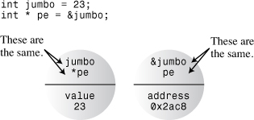声明和初始化指针

让我们来看看声明指针的过程。计算机需要跟踪指针所引用的值的类型。例如，`char` 的地址通常看起来与 `double` 的地址相同，但 `char` 和 `double` 使用不同的字节数和不同的内部格式来存储值。因此，指针声明必须指定指针指向的数据类型。

例如，前面的示例具有以下声明：int * p_updates;

这表示组合 `* p_updates`是 `int` 类型。由于通过将 `*` 运算符应用于指针来使用它，因此`p_updates`变量本身*必须是*指针。我们说`p_updates`指向键入 `int`。我们还说`p_updates`的类型是指针到`int`，或者更简洁地说，`int *`。重复一遍：`p_updates`是指针（地址），`*p_updates`是`int`而不是指针（参见[图4.9](#ch04fig09)）。

**图 4.9.指针存储地址。**

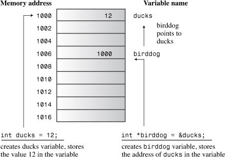顺便说一句，在操作员周围使用空格是可选的。传统上，C程序员使用这种形式：`*`int *ptr;这强调了组合是类型值的想法。另一方面，许多C++程序员都使用这种形式：`*ptr``int`int* ptr;

这强调了 `int*` 是一种类型，指向 `int 的`指针。放置空格的位置对编译器没有影响。您甚至可以这样做：

int*ptr;但是，请注意，以下声明会创建一个指针 （） 和一个普通 （）：`p1``int``p2`int* p1， p2;每个指针都需要一个变量名称。`*`


注意

在C++中，组合是复合类型，指向指针。`int *``int`

您可以使用相同的语法来声明指向其他类型的指针：双倍 * tax_ptr;tax_ptr点键入双
字符 * str;str 指向字符类型因为您声明为指向的指针，所以编译器知道这是一个类型值。也就是说，它知道 表示以浮点格式存储的数字，该数字（在大多数系统上）占用8个字节。指针变量绝不是简单的指针。它始终是指向特定类型的指针。 是指针指向的类型（或类型），并且是指针指向（或 ）的类型。虽然两者都是指针，但它们是两种不同类型的指针。与数组一样，指针基于其他类型。`tax_ptr``double``*tax_ptr``double``*tax_ptr``tax_ptr``double``double *``str``char``char *`请注意，虽然 并指向两种不同大小的数据类型，但这两个变量和它们本身通常大小相同。也就是说，a 的地址与 a 的地址大小相同，就像 1016 可能是百货商店的街道地址一样，而 1024 可能是小平房的街道地址。地址的大小或值并不能真正告诉您有关在该地址找到的大小或变量或建筑物的任何信息。通常，地址需要 2 或 4 个字节，具体取决于计算机系统。（某些系统可能具有较大的地址，并且系统可以对不同类型的使用不同的地址大小。`tax_ptr``str``tax_ptr``str``char``double`可以使用声明语句来初始化指针。在这种情况下，将初始化指针，而不是指向的值。也就是说，以下语句设置而不是值：`pt``*pt``&higgens`int higgens = 5;
int * pt = &higgens;

[清单 4.16](#ch04ex16) 演示了如何初始化指向地址的指针。

**清单 4.16.`init_ptr.cpp`**

------

init_ptr.cpp -- 初始化一个指针
\#include <iostream>
int main（）
{
using namespace std;
int higgens = 5;
int * pt = &higgens;

cout << “higgens的值 = ” << higgens
<< “;higgens 的地址 = “ << &higgens << endl;
cout << “*pt = ” << *pt
<< “;pt 的值 = “ << pt << endl;
返回 0;
}

下面是[清单 4.16](#ch04ex16) 中程序的一些示例输出：

希根斯值 = 5;希根斯的地址 = 0012FED4
*pt = 5 的值;pt 的值 = 0012FED4

您可以看到程序将 初始化为 的地址，而不是 。（您的系统很可能会显示不同的地址值，并可能以不同的格式显示它们。`pt``*pt``higgens`

#### 指针危险

危险等待着那些不谨慎使用指针的人。一个非常重要的一点是，当您在C++中创建指针时，计算机会分配内存来保存地址，但不会分配内存来保存地址指向的数据。为数据创建空间涉及一个单独的步骤。省略该步骤（如下所述）是灾难的邀请：

长*研究员;创建一个指向 long
*fellow 的指针 = 223323;在永不落地上放置一个价值

当然，是一个指针。但它指向哪里呢？代码无法将地址分配给 。那么价值放在哪里呢？我们不能说。因为未初始化，所以它可能具有任何值。无论该值是什么，程序都会将其解释为存储的地址。如果碰巧有值，那么计算机会尝试将数据放在地址，即使那恰好是程序代码中间的地址。有可能，无论在哪里点，那都不是你想把数字放在哪里。这种错误会产生一些最阴险和难以追踪的错误。`fellow``fellow``223323``fellow``223323``fellow``1200``1200``fellow``223323`

------

谨慎

指针黄金法则：在对指针应用取消引用运算符 （） 之前，*始终*初始化指向确定且适当的地址的指针。`*`

指针和数字

指针不是整数类型，即使计算机通常将地址作为整数处理。从概念上讲，指针与整数的类型不同。整数是可以加、减、除等的数字。但是指针描述一个位置，例如，将两个位置相乘是没有意义的。就您可以使用它们执行的操作而言，指针和整数彼此不同。因此，您不能简单地将整数分配给指针：

int * pt;
pt = 0xB8000000;类型不匹配此处，左侧是指向 的指针，因此您可以为其分配一个地址，但右侧只是一个整数。您可能知道0xB8000000是老化计算机系统上视频内存的组合段偏移地址，但语句中没有任何内容告诉程序此数字是地址。C99 之前的 C 允许您进行这样的分配。但是C++更严格地强制执行类型协议，编译器会给你一条错误消息，指出你有一个类型不匹配。如果要使用数值作为地址，则应使用类型转换将数字转换为适当的地址类型：`int`int * pt;
pt = （int *） 0xB8000000;类型现在匹配现在赋值语句的两边都表示整数的地址，因此赋值是有效的。请注意，仅仅因为它是类型值的地址并不意味着它本身就是类型 。例如，一个平台的类型是 2 字节值，地址是 4 字节值。`int``pt``int``int`指针还有其他一些有趣的属性，我们将在它们变得相关时进行讨论。同时，让我们看一下如何使用指针来管理内存空间的运行时分配。分配内存`new`现在您已经了解了指针的工作原理，让我们看看它们如何实现在程序运行时分配内存的重要技术。到目前为止，您已经初始化了指向变量地址的指针;变量*被命名为*在编译时分配的内存，每个指针仅提供一个内存的别名，您无论如何都可以通过名称直接访问。当您在运行时分配*未命名*的内存来保存值时，指针的真正价值就会发挥作用。在这种情况下，指针将成为对该内存的唯一访问。在 C 语言中，您可以使用库函数 分配内存。您仍然可以在C++中执行此操作，但C++也有更好的方法：操作员。`malloc()``new`

让我们通过为类型 `int` 值创建未命名的运行时存储并使用指针访问该值来尝试此新技术。关键是C++`新`操作员。你告诉`新的`数据类型，你想要什么内存;`new` 查找正确大小的块并返回该块的地址。您将此地址分配给指针，然后您就开始营业了。下面是该技术的一个示例：

int * pn = new int;该部分告诉程序您想要一些适合容纳.运算符使用该类型来确定需要多少字节。然后，它找到内存并返回地址。接下来，将地址分配给 ，该地址被声明为指针指向的类型。现在是地址，是存储在那里的值。将此与将变量的地址分配给指针进行比较：`new int``int``new``pn``int``pn``*pn`int higgens;
int * pt = &higgens;在这两种情况下 （ 和 ），您都可以将 的地址分配给指针。在第二种情况下，您还可以访问 by name：。在第一种情况下，您唯一的访问是通过指针。这就提出了一个问题：因为记忆中哪些点缺少名称，所以你怎么称呼它？我们说这指向一个*数据对象*。这不是“面向对象编程”意义上的“对象”;它只是“物”意义上的“对象”。术语“数据对象”比术语“变量”更通用，因为它表示为数据项分配的任何内存块。因此，变量也是数据对象，但指向的内存不是变量。用于处理数据对象的指针方法乍一看似乎更笨拙，但它可以更好地控制程序管理内存的方式。`pn``pt``int``int``higgens``pn``pn``pn`获取和分配单个数据对象的内存的一般形式是这样的，它可以是结构，也可以是基本类型：*typeName* * *pointer_name* = new *typeName*;

使用数据类型两次：一次用于指定请求的内存类型，一次用于声明合适的指针。当然，如果您已经声明了正确类型的指针，则可以使用它而不是声明新指针。[清单 4.17](#ch04ex17) 说明了如何使用两种不同的类型。`new`

**清单 4.17.`use_new.cpp`**

------

use_new.cpp -- 使用新的运算符
\#include <iostream>
int main（）
{
using namespace std;
int nights = 1001;
int * pt = new int; // 为 int
*pt = 1001 分配空间; // <<

“nights value = ”;
<<晚<<“：位置”<<&晚<<;
cout << “int ”;
cout << “value = ” << *pt << “： location = ” << pt << endl;

双倍 * pd = 新的双倍;为双倍
分配空间 *pd = 10000001.0;存储一个双

层<<“双层”;
cout << “value = ” << *pd << “： location = ” << pd << endl;
cout << “指针的位置 pd： ” << &pd << endl;
cout << “大小 pt = ” << sizeof（pt）;
cout << “： 大小 *pt = ” << sizeof（*pt） << endl;
cout << “pd 的大小 = ” << pd 的大小;
cout << “： 大小 *pd = ” << sizeof（*pd） << endl;
返回 0;
}

下面是[清单 4.17](#ch04ex17) 中程序的输出：

nights 值 = 1001： 位置 0028F7F8
int 值 = 1001： 位置 = 00033A98
双精度值 = 1e+007： 位置 = 000339B8
指针的位置 pd： 0028F7FC
大小 pt = 4： 大小 *pt = 4
pd 大小 = 4： 大小 *pd = 8

当然，内存位置的确切值因系统而异。

##### 计划说明

[清单 4.17](#ch04ex17) 中的程序用于为数据类型和类型数据对象分配内存。这发生在程序运行时。指针指向这两个数据对象。没有它们，您将无法访问这些内存位置。有了它们，您可以使用变量，就像使用变量一样。您可以向新数据对象赋值，也可以将值赋给新数据对象。同样，您可以打印并显示这些值。`new``int``double``pt``pd``*pt``*pd``*pt``*pd``*pt``*pd`

[清单 4.17](#ch04ex17) 中的程序还演示了您必须声明指针指向的类型的原因之一。地址本身仅显示所存储对象的起始地址，而不显示其类型或使用的字节数。查看这两个值的地址。它们只是没有类型或大小信息的数字。另请注意，指向 - 的大小与指向指针的大小相同。两者都只是地址。但是，由于声明指针类型，程序知道该值为 8 个字节，而值为 4 个字节。当打印 时，的值可以告诉要读取多少字节以及如何解释它们。`int``double``use_new.cpp``*pd``double``*pt``int``use_new.cpp``*pd``cout`

需要注意的另一点是，通常使用与我们一直在使用的普通变量定义不同的内存块。变量及其值都存储在称为*堆栈*的内存区域中，而 分配的内存存储在称为*堆*或*可用存储*的区域中。[第9章](ch09.html#ch09)对此进行了进一步的讨论。`new``nights``pd``new`

------

内存不足？


计算机可能没有足够的内存来满足`新`请求。在这种情况下，`new` 通常通过抛出异常来响应，这是第 [15 章](ch15.html#ch15)“[朋友、异常等](ch15.html#ch15)”中讨论的一种错误处理技术。在较旧的实现中，返回值 。在C++中，具有该值的指针称为*空指针。*C++保证空指针永远不会指向有效数据，因此它通常用于指示以其他方式返回可用指针的运算符或函数的故障。第[6章](ch06.html#ch06)中讨论的语句可帮助您处理这种可能性。目前，重要的是C++提供了检测和响应分配失败的工具。`new``0``0``if`

------

#### 释放内存`delete`

在需要时用于请求内存只是C++内存管理包中更迷人的一半。另一半是运算符，它使您能够在完成内存池时将内存返回到内存池。这是朝着最有效地利用内存迈出的重要一步。然后，您返回或*释放*的内存可以被程序的其他部分重用。您可以通过在它后面加上一个指针来使用，该指针指向最初分配给的内存块：`new``delete``delete``new`

int * ps = new int;使用新的
分配内存。 。 。 / // 使用内存
删除 ps;可用内存，完成后删除

这将删除内存到哪些点;它不会删除指针本身。例如，您可以重复使用 指向另一个分配。您应始终在 使用 与 使用 ;否则，您可能会遇到*内存泄漏*，即已分配但无法再使用的内存。如果内存泄漏变得太大，它可能会使寻求更多内存的程序停止。`ps``ps``ps``new``new``delete`

不应尝试释放以前释放的内存块。C++标准表示，这种尝试的结果是不确定的，这意味着后果可能是任何东西。此外，您不能用于释放通过声明普通变量创建的内存：`delete`

int * ps = new int;确定
删除ps;确定
删除ps;现在
不行 int jugs = 5;ok
int * pi = &jugs;确定
删除 pi;不允许，内存未由 new 分配

------

谨慎

应仅用于释放与 分配的内存。但是，应用于空指针是安全的。`delete``new``delete`


请注意，使用 `delete` 的关键要求是将其与 new 分配的内存`一起使用`。这并不意味着您必须使用与`new`相同的指针;相反，您必须使用相同的地址：

int * ps = new int;分配内存
int * pq = ps;设置第二个指针到同一块
删除pq;使用第二个指针删除通常，您不会创建指向同一内存块的两个指针，因为这会增加您错误地尝试删除同一块两次的可能性。但是，正如您很快就会看到的那样，当您使用返回指针的函数时，使用第二个指针确实有意义。用于创建动态数组`new`如果程序需要的只是一个值，则不妨声明一个简单的变量，因为与使用和指针来管理单个小数据对象相比，这更简单，如果不是不那么令人印象深刻的话。更常见的是，用于较大的数据块，如数组、字符串和结构。这是有用的地方。例如，假设您正在编写一个可能需要也可能不需要数组的程序，具体取决于程序运行时提供给该程序的信息。如果通过声明数组来创建数组，则在编译程序时会分配空间。无论程序最终是否使用数组，数组都在那里，耗尽内存。在编译时分配数组称为*静态绑定*，这意味着数组在编译时内置到程序中。但是，使用 ，如果需要，可以在运行时创建数组，如果不需要，则可以跳过创建数组。或者，您可以在程序运行后选择数组大小。这称为*动态绑定*，这意味着数组是在程序运行时创建的。这样的数组称为*动态数组*。使用静态绑定时，必须在编写程序时指定数组大小。使用动态绑定，程序可以在程序运行时决定数组大小。`new``new``new``new`现在，我们将介绍有关动态数组的两个基本问题：如何使用C++运算符创建数组，以及如何使用指针访问数组元素。`new`创建动态数组`new`在C++中创建动态数组很容易;你告诉数组元素的类型和你想要的元素的数量。该语法要求您在类型名称后面加上括号中的元素数。例如，如果您需要一个 10 秒的数组，请使用以下命令：`new``int`int * psome = new int [10];获取 10 个整数的块运算符返回块的第一个元素的地址。在此示例中，该值分配给指针 。`new``psome`与往常一样，您应该在调用与调用程序使用该内存块时取得平衡。但是，使用括号创建数组需要使用释放数组时的替代形式：`new``delete``new``delete`删除 [] psome;释放动态数组

括号的存在告诉程序它应该释放整个数组，而不仅仅是指针指向的元素。请注意，括号位于`删除`和指针之间。如果使用不带括号`的 new`，则应使用不带括号的 `delete`。如果使用`带括号的 new`，则应使用带括号的 `delete`。早期版本的C++可能无法识别括号表示法。但是，对于 ANSI/ISO 标准，`新`表单和`删除`表单不匹配的影响是未定义的，这意味着您不能依赖某些特定行为。下面是一个示例：

int * pt = new int;
短 * ps = 新短 [500];
删除 [] pt;效果未定义，不要删除它
ps;效果未定义，不要这样做简而言之，在使用 和 时应遵守这些规则：`new``delete`• 不要使用来释放未分配的内存。`delete``new`• 不要使用来连续两次释放同一个内存块。`delete`• 如果您用于分配数组，请使用。`delete []``new []`• 如果您用于分配单个实体，请使用（不带括号）。`delete``new`• 应用于空指针是安全的（没有任何反应）。`delete`现在让我们回到动态数组。注意，这是一个指向单个的指针，该块的第一个元素。您有责任跟踪块中有多少元素。也就是说，由于编译器不跟踪指向 10 个整数中的第一个整数的事实，因此您必须编写程序，以便它跟踪元素的数量。`psome``int``psome`实际上，该程序确实会跟踪分配的内存量，以便在以后使用运算符时可以正确释放它。但这些信息是公开的。例如，不能使用运算符来查找动态分配的数组中的字节数。`delete []``sizeof`为数组分配和分配内存的一般形式是：*type_name \* pointer_name* = 新*type_name* [*num_elements*];调用运算符将保护一个足够大的内存块，以容纳*`type_name`*类型的*`num_elements`*元素，*`pointer_name`*指向第一个元素。正如您即将看到的，您可以使用*`pointer_name`*的许多使用数组名称的方式相同。`new`使用动态数组创建动态数组后，如何使用它？首先，从概念上思考问题。下面的语句创建一个指针 ，该指针指向包含 10 个值的块的第一个元素：`psome``int`int * psome = new int [10];获取 10 个整数的块

把它想象成指向该元素的手指。假设一个 `int` 占用 4 个字节。然后，通过在正确的方向上移动手指4个字节，您可以指向第二个元素。总共有10个元素，这是您可以移动手指的范围。因此，`新`语句为您提供了标识块中每个元素所需的所有信息。


现在实际考虑一下这个问题。如何访问这些元素之一？第一个元素没有问题。因为 `psome` 指向数组的第一个元素，`所以 *psome` 是第一个元素的值。这还剩下九个元素可供访问。如果您尚未使用C，则访问元素的最简单方法可能会让您感到惊讶：只需使用指针，就好像它是数组名称一样。也就是说，你可以使用 `psome[0]` 而不是 `*psome` 作为第一个元素，`psome[1]` 作为第二个元素，依此类推。事实证明，使用指针访问动态数组非常简单，即使该方法的工作原理可能不会立即显现出来。您可以这样做的原因是C和C++使用指针在内部处理数组。数组和指针的这种近乎等价是C和C++的优点之一。（这有时也是一个问题，但那是另一回事了。稍后，您将了解有关此等效性的更多信息。首先，[清单 4.18](#ch04ex18) 显示了如何使用创建动态数组，然后使用数组表示法来访问元素。它还指出了指针和真实数组名称之间的根本区别。`new`

**清单 4.18.`数组新.cpp`**

------

arraynew.cpp -- 使用数组的新运算符
\#include <iostream>
int main（）
{
使用命名空间 std;
double * p3 = new double [3]; // 空格用于 3 doubles
p3[0] = 0.2; // 将 p3 视为数组名称
p3[1] = 0.5;
p3[2] = 0.8;
cout << “p3[1] 是 ” << p3[1] << “.\n”;
p3 = p3 + 1;将指针
cout <<“现在 p3[0] 是 ” << p3[0] << “ 和 ”;
cout << “p3[1] 是 ” << p3[1] << “.\n”;
p3 = p3 - 1;指向开始
删除 [] p3;释放内存
返回0;
}

下面是[清单 4.18](#ch04ex18) 中程序的输出：

p3[1]为0.5。
现在 p3[0] 是 0.5，p3[1] 是 0.8。

如您所见，`arraynew.cpp`使用指针 `p3`，就好像它是数组的名称一样，`p3[0]` 作为第一个元素，依此类推。数组名称和指针之间的根本区别显示在以下行中：

p3 = p3 + 1;指针正常，数组名称错误不能更改数组名称的值。但是指针是一个变量，因此您可以更改其值。请注意向 中添加 1 的效果。表达式现在引用数组的前第二个元素。因此，添加 1 会导致它指向第二个元素而不是第一个元素。减去一个将指针带回其原始值，以便程序可以提供正确的地址。`p3``p3[0]``p3``delete []`连续 s 的实际地址通常相差 2 或 4 个字节，因此，添加 1 以提供下一个元素的地址这一事实表明指针算术有一些特殊之处。有。`int``p3`指针、数组和指针算术

指针和数组名称的近似等效性源于*指针算法*以及C++在内部处理数组的方式。首先，让我们看看算术。将 1 个变量添加到整数变量会使其值增加 1，但向指针变量添加 1 个值会增加其值所指向类型的字节数。在具有 8 字节`双精度值`的系统上，将 1 与指针加到`双精度`值将 8 添加到指针，而将 1 添加到指针到`短`字节的系统上，如果`短`为 2 字节，则将向指针值添加 2。[清单 4.19](#ch04ex19) 证明了这一惊人的观点。它还显示了第二个要点：C++将数组名称解释为地址。

**清单 4.19.`addpntrs.cpp`**

------

addpntrs.cpp -- pointer addition
\#include <iostream>
int main（）
{
using namespace std;
double wages[3] = {10000.0， 20000.0， 30000.0};
short stacks[3] = {3， 2， 1};

这里有两种方法可以获得数组
双倍的地址 * pw = 工资;数组的名称 = 短地址
\* ps = &堆栈[0];或者使用地址运算符
//与数组元素
cout << “pw = ” << pw << “， *pw = ” << *pw << endl;
pw = pw + 1;
cout << “将 1 添加到 pw 指针：\n”;
cout << “pw = ” << pw << “， *pw = ” << *pw << “\n\n”;

cout << “ps = ” << ps << “， *ps = ” << *ps << endl;
ps = ps + 1;
cout << “将 1 添加到 ps 指针：\n”;
cout << “ps = ” << ps << “， *ps = ” << *ps << “\n\n”;

cout << “使用数组表示法访问两个元素\n”;
cout << “stacks[0] = ” << stacks[0]
<< “， stacks[1] = ” << stacks[1] << endl;
cout <<“使用指针表示法访问两个元素\n”;
cout << “*stacks = ” << *stacks
<< “， *（stacks + 1） = ” << *（stacks + 1） << endl;

cout << sizeof（wages） << “ = 工资数组的大小\n”;
cout << sizeof（pw） << “ = pw 指针\n的大小”;
返回 0;
}

下面是[清单 4.19](#ch04ex19) 中程序的输出：

pw = 0x28ccf0， *pw = 10000
向 pw 指针添加 1：
pw = 0x28ccf8， *pw = 20000

ps = 0x28ccea， *ps = 3
将 1 添加到 ps 指针：
ps = 0x28ccec， *ps = 2

访问两个具有数组表示法
堆栈的元素[0] = 3， 堆栈[1] = 2
访问两个具有指针表示法
的元素*堆栈 = 3， *（堆栈 + 1） = 2
24 = 工资数组
大小 4 = pw 指针的大小

#### 计划说明

在大多数上下文中，C++将数组的名称解释为其第一个元素的地址。因此，以下语句生成指向类型的指针，然后初始化为 ，这是数组中第一个元素的地址：`pw``double``pw``wages``wages`

双倍 * pw = 工资;

对于 ，与任何数组一样，我们有以下相等性：`wages`

工资 = &工资[0] = 数组第一个元素的地址

只是为了表明这不是jive，程序显式使用表达式中的地址运算符来初始化指向stacks数组第一个元素的指针。`&stacks[0]``ps`

接下来，程序检查 `pw` 和 `*pw` 的值。第一个是地址，第二个是该地址的值。由于 `pw` 指向第一个元素，因此为 `*pw` 显示的值是第一个元素 `10000 的值`。然后程序将一个添加到`pw`。如前所述，这会将 8 添加到数字地址值，因为此系统上`的 double` 是 8 字节。这使得 `pw` 等于第二个元素的地址。因此，`*pw` 现在是 `20000`，即第二个元素的值（参见[图 4.10](#ch04fig10)）。（调整图中的地址值以使图更清晰。

**图 4.10.指针添加。**

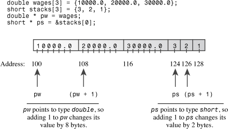在此之后，程序将执行类似的步骤。这一次，由于指向类型并且因为是 2 个字节，因此将 1 添加到指针会将其值增加 2（0x28ccea + 2 = 0x28ccec十六进制）。同样，结果是使指针指向数组的下一个元素。`ps``ps``short``short`


注意

向指针变量添加一个值会将其值增加其所指向类型的字节数。

现在考虑数组表达式 。编译器C++将此表达式视为 .s，就像您将其编写为 .第二个表达式表示计算数组第二个元素的地址，然后找到存储在其中的值。最终结果正是意味着什么。（运算符优先级要求您使用括号。如果没有它们，将被添加到 而不是 添加到 。）`stacks[1]``*(stacks + 1)``stacks[1]``1``*stacks``stacks`程序输出演示和 ] 是相同的。类似地，与 相同。通常，无论在何处使用数组表示法，C++都会进行以下转换：`*(stacks + 1)``stacks[1``*(stacks + 2)``stacks[2]`arrayname[i] 变为 *（arrayname + i）

如果您使用指针而不是数组名称，C++进行相同的转换：

指针名 [i] 变为 *（指针名 + i）因此，在许多方面，您可以以相同的方式使用指针名称和数组名称。您可以将数组括号表示法与任一符号一起使用。您可以将取消引用运算符 （） 应用于任一操作符。在大多数表达式中，每个表达式都表示一个地址。一个区别是，您可以更改指针的值，而数组名称是常量：`*`指针名 = 指针名 + 1;有效
数组名 = 数组名 + 1;不允许

第二个区别是，将 `sizeof` 运算符应用于数组名称会产生数组的大小，但将 `sizeof` 应用于指针会产生指针的大小，即使指针指向数组也是如此。例如，在[清单 4.19](#ch04ex19) 中，两者都引用同一个数组。但是，将运算符应用于它们会产生以下结果：`pw``wages``sizeof`

24 = 数组显示的大小`wages``<<``sizeof wages`

4 = 指针显示的大小`pw``<<``sizeof pw`

在这种情况下，C++不会将数组名称解释为地址。

------

数组的地址

获取数组的地址是另一种不将数组名称解释为其地址的情况。但是等等，数组的名称不是被解释为数组的地址吗？不完全是 - 数组的名称被解释为数组的第一个元素的地址，而应用地址运算符则产生整个数组的地址：短传[10];告诉一个20字节
的数组cout<<告诉<< endl;显示 &告诉[0]
cout << &告诉<< endl;显示整个阵列的地址从数字上讲，这两个地址是相同的，但在概念上，因此是2字节内存块的地址，而20字节内存块的地址。因此，表达式添加到地址值，而增加地址值。另一种表示方式是说，类型为指针指向或 ，类型为指针指向数组的 20-s 或 。`&tell[0]``tell``&tell``tell + 1``2``&tell + 1``20``tell``short``short *``&tell``short``short (*)[20]`现在您可能想知道最后一种类型描述的起源。首先，下面介绍如何声明和初始化该类型的指针：短 （*pas）[20] = &告诉;pas 指向 20 个短裤的数组如果省略括号，则优先规则将首先与 相关联，从而形成一个包含 20 个指向指针的数组，因此括号是必需的。接下来，如果要描述变量的类型，可以使用该变量的声明作为指导并删除变量名称。因此，的类型为 。另请注意，因为 设置为 ，所以等价于 ，所以将是数组的第一个元素。`[20]``pas``pas``short``pas``short (*)[20]``pas``&tell``*pas``tell``(*pas)[0]``tell`


简而言之，使用`new`创建数组并使用指针访问不同的元素是一件简单的事情。您只需将指针视为数组名称即可。然而，理解为什么这有效是一个有趣的挑战。如果您真的想了解数组和指针，则应仔细检查它们的相互关系。

汇总指针点您最近接触了相当多的指针知识，因此让我们总结一下迄今为止有关指针和数组的揭示。声明指针若要声明指向特定类型的指针，请使用以下格式：*类型名称* * *指针名称*;以下是一些示例：双倍 * pn;pn可以指向一个双值
字符* pc;pc可以指向一个字符值这里 和 是指针，并且是指针指向和指向指针的类型C++表示法。`pn``pc``double *``char *``double``char`为指针赋值应为指针分配内存地址。可以将运算符应用于变量名以获取命名内存的地址，运算符返回未命名内存的地址。`&``new`以下是一些示例：双倍 * pn;pn 可以指向双精度值
双精度值 * pa;所以可以 pa
char * pc;pc可以指向一个字符值
双气泡= 3.2;
pn = &气泡;将气泡的地址分配给 pn
pc = 新字符;将新分配的字符内存的地址分配给 pc
pa = 新的双精度[30];将数组 30 双精度数组的第一个元素的地址赋给 pa取消引用指针取消引用指针意味着引用指向的值。将取消引用或间接值运算符 （） 应用于指针以取消引用它。因此，如果 是指向 的指针，如前面的示例所示，则在本例中为指向值或 3.2。`*``pn``bubble``*pn`以下是一些示例：cout << *pn;打印气泡
*pc = 'S'的值;将“S”放入地址为pc的内存位置

数组表示法是取消引用指针的第二种方法;例如，`pn[0]` 与 `*pn` 相同。切勿取消引用尚未初始化为正确地址的指针。

区分指针和指向值请记住，如果 是指向的指针，则不是指向的指针;相反，是完全等效于类型变量。这就是指针。`pt``int``*pt``int``*pt``int``pt`以下是一些示例：int * pt = new int;为指针分配一个地址 pt
*pt = 5;在该地址存储值 5阵列名称在大多数情况下，C++将数组的名称视为等同于数组第一个元素的地址。下面是一个示例：int 炸玉米饼[10];现在炸玉米饼和 &玉米饼一样[0]一个例外是将数组的名称与运算符一起使用时。在这种情况下，返回整个数组的大小（以字节为单位）。`sizeof``sizeof`指针算术C++允许您向指针添加整数。添加 1 的结果等于原始地址值加上等于指向对象中的字节数的值。还可以从指针中减去一个整数，以取两个指针之间的差值。最后一个运算，产生一个整数，只有当两个指针指向同一数组时才有意义（也允许指向末尾之后的一个位置）;然后，它产生两个元素之间的分离。以下是一些示例：int tacos[10] = {5，2，8，4，1，2，2，4，6，8};
int * pt = 炸玉米饼;假设 pf 和 tacos 是地址 3000
pt = pt + 1;现在 pt 是 3004 如果一个 int 是 4 字节
int *pe = &tacos[9];pe 为 3036，如果 int 为 4 字节
pe = pe - 1;现在 pe 是 3032， tacos[8]
int diff = pe - pt 的地址;差异是7，//炸玉米饼[8]和炸玉米饼[1]之间的
分离数组的动态绑定和静态绑定可以使用数组声明创建具有静态绑定的数组，即在编译过程中设置其大小的数组：int 炸玉米饼[10];静态绑定，大小在编译时固定

使用`新的 []` 运算符可以创建具有动态绑定的数组（动态数组），即已分配且其大小可在运行时设置的数组。完成后，使用`删除 []` 释放内存：

整型大小;
cin >>尺寸;
int * pz = new int [size];动态绑定，在运行时
设置大小...
删除 [] pz;完成后可用内存数组表示法和指针表示法使用括号数组表示法等效于取消引用指针：炸玉米饼[0] 表示 *tacos 表示地址 tacos tacos
的值[3] 表示 *（tacos + 3） 表示地址 tacos + 3 处的值对于数组名称和指针变量都是如此，因此您可以将指针表示法或数组表示法与指针和数组名称一起使用。以下是一些示例：int * pt = new int [10];pt 指向 10 个
整数的块*pt = 5;设置元素编号 0 到 5
pt[0] = 6;重置元件编号 0 至 6
pt[9] = 44;将第十个元素（元素编号9）设置为44
个int涂层[10];
*（外套 + 4） = 12;套衣[4] 至 12指针和字符串数组和指针之间的特殊关系扩展到 C 样式的字符串。请考虑以下代码：叉花[10] = “玫瑰”;
<<花<<“s是红色\n”;数组的名称是其第一个元素的地址，因此在语句中是包含字符的元素的地址。该对象假定 a 的地址是字符串的地址，因此它会在该地址处打印字符，然后继续打印字符，直到它遇到空字符 （）。简而言之，如果给定一个字符的地址，它将打印从该字符到其后的第一个空字符的所有内容。`flower``cout``char``r``cout``char``\0``cout`这里的关键元素不是数组名称，而是充当 .这意味着您可以使用指向变量的指针作为参数，因为它也是 .当然，该指针应指向字符串的开头。我们稍后会检查一下。`flower``flower``char``char``cout``char`

但是前面`cout`语句的最后一部分呢？如果 `flower` 实际上是字符串第一个字符的地址，那么表达式`“s are red\n”`是什么？为了与 `cout` 对字符串输出的处理保持一致，此带引号的字符串也应为地址。而且，在C++中，带引号的字符串（如数组名称）充当其第一个元素的地址。前面的代码并没有真正将整个字符串发送到`cout`;它只是发送字符串地址。这意味着数组中的字符串、带引号的字符串常量和指针描述的字符串都等效处理。每个实际上都作为一个地址传递。这肯定比传递字符串中的每个字符要少。


注意

对于大多数C++表达式，数组 、指向指针和带引号的字符串常量的名称都解释为字符串的第一个字符的地址。`cout``char``char`


[清单 4.20](#ch04ex20) 说明了不同形式的字符串的使用。它使用字符串库中的两个函数。该函数（以前使用过）返回字符串的长度。该函数将字符串从一个位置复制到另一个位置。两者都在头文件中具有函数原型（或者在不太最新的实现上）。该程序还使用注释来展示一些您应该尽量避免的指针误用。`strlen()``strcpy()``cstring``string.h`

**清单 4.20.`ptrstr.cpp`**

------

ptrstr.cpp -- 使用指向字符串
的指针#include <iostream>
\#include <cstring> // declare strlen（）， strcpy（）
int main（）
{
using namespace std;
char animal[20] = “bear”; // animal hold bear
const char * bird = “wren”; // bird hold address of string
char * ps; // 未初始化
的
cout << animal << “ and ”;显示熊
崽<<鸟<<“\n”;显示鹪鹩
// cout << ps << “\n”;可能会显示垃圾，可能会造成崩溃

<<“输入一种动物：”;
动物>>;如果输入< 20 个字符
// cin >> ps;太可怕的错误了，无法尝试;ps 不
// 指向分配的空间

ps = 动物;将 ps 设置为指向字符串
cout << ps << “！\n”;好的，与使用动物
粪便<<“在使用strcpy（）：\n”;
<<动物<<“在”<<（int *）动物<<端;
cout << ps << “ at ” << （int *） ps << endl;

ps = 新字符[strlen（animal） + 1];获得新的储存
链（ps，动物）;将字符串复制到新的存储
cout << “使用 strcpy（）：\n”;
<<动物<<“在”<<（int *）动物<< endl;
cout << ps << “ at ” << （int *） ps << endl;
删除 [] ps;
返回 0;
}

下面是[清单 4.20](#ch04ex20) 中程序的示例运行：

熊和鹪鹩
进入一种动物：**狐狸**
狐狸！
在使用 strcpy（）：
fox at 0x0065fd30
fox at 0x0065fd30
在使用 strcpy（）：
fox at 0x0065fd30
fox at 0x004301c8

##### 计划说明

[清单 4.20](#ch04ex20) 中的程序创建一个数组 （） 和两个指向变量的指针 （ 和 ）。程序首先将数组初始化为字符串，就像您之前初始化数组一样。然后，该程序会执行一些新操作。它初始化指向字符串的指针：`char``animal``char``bird``ps``animal``"bear"``char`

const char * bird = “wren”;鸟持有字符串的地址

请记住，实际上表示字符串的地址，因此此语句将 的地址分配给指针。（通常，编译器会在内存中留出一个区域来保存程序源代码中使用的所有带引号的字符串，并将每个存储的字符串与其地址相关联。这意味着您可以像使用字符串一样使用指针，如以下示例所示：`"wren"``"wren"``bird``bird``"wren"`

cout << “一个关心的”<<鸟<<“说话\n”;

字符串文本是常量，这就是代码在声明中使用关键字的原因。以这种方式使用意味着您可以使用来访问字符串，但不能更改它。[第7章](ch07.html#ch07)更详细地讨论了指针的主题。最后，指针保持未初始化状态，因此它不会指向任何字符串。（如您所知，这通常是一个坏主意，这个例子也不例外。`const``const``bird``const``ps`

接下来，该程序说明可以将数组名称和指针等效地与 .毕竟，两者都是字符串的地址，并显示存储在这些地址的两个字符串（ 和 ）。如果激活导致尝试显示 错误的代码，则可能会出现空行，可能会显示垃圾，并且可能会导致程序崩溃。创建未初始化的指针有点像分发空白的签名支票：您无法控制它的使用方式。`animal``bird``cout``cout``"bear"``"wren"``ps`

对于输入，情况略有不同。使用数组`动物`进行输入是安全的，只要输入足够短以适合数组。但是，使用 `bird` 进行输入是不合适的：

• 某些编译器将字符串文本视为只读常量，如果您尝试在其上写入新数据，则会导致运行时错误。字符串文本是常量是C++中的强制行为，但并非所有编译器都从旧行为中进行了更改。• 某些编译器仅使用字符串文本的一个副本来表示该文本在程序中出现的所有次数。让我们放大第二点。C++并不能保证字符串文本是唯一存储的。也就是说，如果在程序中多次使用字符串文本，编译器可能会存储字符串的多个副本或仅存储一个副本。如果它执行后者，则设置为指向一个会使它指向该字符串的唯一副本。将值读入一个字符串可能会影响您认为在其他地方的独立字符串。在任何情况下，由于指针声明为 ，编译器会阻止任何更改 所指向位置的内容的尝试。`"wren"``bird``"wren"``bird``const``bird`更糟糕的是，试图将信息读取到哪个点的位置。因为 没有初始化，所以你不知道信息最终会在哪里。它甚至可能覆盖内存中已有的信息。幸运的是，很容易避免这些问题：您只需使用足够大的数组来接收输入，而不要使用字符串常量来接收输入，或者使用未初始化的指针来接收输入。（或者，您可以回避所有这些问题，并使用对象而不是数组。`ps``ps``char``std::string`


谨慎

将字符串读入程序样式的字符串时，应始终使用以前分配的内存的地址。此地址可以是数组名称的形式，也可以是已使用 初始化的指针的形式。`new`

接下来，请注意以下代码完成的任务：ps = 动物;将 ps 设置为指向字符串
...
cout << 动物<< “ << （int *） 动物<< endl;
cout << ps << “ at ” << （int *） ps << endl;它生成以下输出：狐狸在0x0065fd30 0x0065fd30
狐狸

通常，如果您给 `cout` 一个指针，它会打印一个地址。但是，如果指针的类型为 `char *`，`则 cout` 将显示指向的字符串。如果要查看字符串的地址，则必须键入将指针转换为另一个指针类型，例如 `int *`，此代码执行此操作。因此`，ps` 显示为字符串`“fox”`，但 `（int *） ps` 显示为找到字符串的地址。请注意，将`动物`分配给`ps`不会复制字符串;它复制地址。这会产生两个指针（`animal` 和 `ps）`指向相同的内存位置和字符串。

若要获取字符串的副本，需要执行更多操作。首先，您需要分配内存来保存字符串。可以通过声明第二个数组或使用 来执行此操作。第二种方法使您能够自定义将存储适合字符串：`new`ps = 新字符[strlen（animal） + 1];获取新存储字符串不会完全填充数组，因此此方法会浪费空间。这段代码用于查找字符串的长度;它添加一个来获取长度，包括空字符。然后，程序使用分配足够的空间来保存字符串。`"fox"``animal``strlen()``new`接下来，您需要一种方法将字符串从数组复制到新分配的空间。分配给它不起作用，因为这只会更改存储在中的地址，从而丢失程序必须访问新分配的内存的唯一方式。相反，您需要使用库函数：`animal``animal``ps``ps``strcpy()`动物）;将字符串复制到新存储该函数采用两个参数。第一个是目标地址，第二个是要复制的字符串的地址。由您来确保目的地确实已分配，并且有足够的空间来保存副本。这是通过 using 找到正确的大小和 using 获取可用内存来实现的。`strcpy()``strlen()``new`请注意，通过使用 和 ，您将获得两个单独的副本：`strcpy()``new``"fox"`狐狸在0x004301c8 0x0065fd30
狐狸另请注意，将新存储定位在与阵列非常远的内存位置。`new``animal`通常，您会遇到将字符串放入数组的需要。初始化数组时使用运算符;否则，请使用 或 。您已经看到了该功能;它的工作原理如下：`=``strcpy()``strncpy()``strcpy()`炭食[20] = “胡萝卜”;初始化
strcpy（food， “flan”）;否则请注意，如下所示的内容可能会导致问题，因为数组小于字符串：`food`strcpy（食物，“装满许多好东西的野餐篮”）;

在这种情况下，该函数将字符串的其余部分复制到紧跟在数组后面的内存字节中，这可以覆盖程序正在使用的其他内存。为了避免这个问题，你应该改用`strncpy（）。`它采用第三个参数：要复制的最大字符数。但请注意，如果此函数在到达字符串末尾之前空间不足，则不会添加空字符。因此，您应该像这样使用该函数：

strncpy（食物，“装满许多好东西的野餐篮”，19）;
食物[19] = '\0';这会将最多 19 个字符复制到数组中，然后将最后一个元素设置为 null 字符。如果字符串少于 19 个字符，请更早地添加一个空字符以标记字符串的真正结尾。`strncpy()`


谨慎

使用 或 ，而不是赋值运算符，将字符串赋值到数组。`strcpy()``strncpy()`

现在，您已经了解了使用 C 样式字符串和库的某些方面，您可以欣赏使用 C++ 类型的相对简单性。您（通常）不必担心字符串溢出数组，您可以使用赋值运算符代替 或 。`cstring``string``strcpy()``strncpy()`用于创建动态结构`new`您已经了解了在运行时而不是在编译时创建数组是多么有利。结构也是如此。在特定运行期间，您只需要为程序所需的结构分配空间。同样，操作员是要使用的工具。有了它，您可以创建动态结构。同样，*动态*意味着内存是在运行时分配的，而不是在编译时分配的。顺便说一句，由于类与结构非常相似，因此您也可以将本节中学到的技术用于具有类的结构。`new`与结构一起使用有两个部分：创建结构和访问其成员。要创建结构，请将结构类型与 结合使用。例如，若要创建该类型的未命名结构并将其地址分配给合适的指针，可以使用以下命令：`new``new``inflatable`充气 * ps = 新的充气;这将分配给足够大的可用内存块的地址，以容纳该类型的结构。请注意，语法与C++内置类型的语法完全相同。`ps``inflatable`

棘手的部分是访问成员。创建动态结构时，不能将点成员身份运算符与结构名称一起使用，因为结构没有名称。你所拥有的只是它的地址。C++仅针对这种情况提供了一个运算符：箭头成员资格运算符 （`->`）。此运算符由键入连字符，然后键入大于符号组成，用于指向结构的指针，就像点运算符用于结构名称一样。例如，如果`ps`指向一个类型`充气`结构，那么`ps->price`是指向结构`的价格`成员（见[图4.11](#ch04fig11)）。

**图 4.11.标识结构成员。**

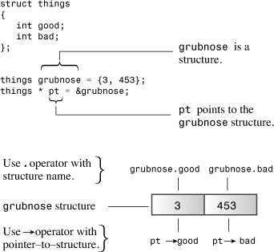


提示

有时，新C++用户会对何时使用点运算符以及何时使用箭头运算符指定结构成员感到困惑。规则很简单：如果结构标识符是结构的名称，请使用点运算符。如果标识符是指向结构的指针，请使用箭头运算符。

访问结构成员的第二种更丑陋的方法是认识到，如果是指向结构的指针，则表示指向的值 - 结构本身。那么，因为是结构，所以是结构的成员。C++运算符优先级规则要求您在此构造中使用括号。`ps``*ps``*ps``(*ps).price``price`

[清单 4.21](#ch04ex21) 用于创建一个未命名的结构，并演示了用于访问结构成员的两种指针表示法。`new`

**清单 4.21.`新结构.cpp`**

------

newstrct.cpp -- 使用带有结构
的新#include <iostream>
结构充气 // 结构定义
{
char name[20];
float volume;
double price;
};
int main（）
{
using namespace std;
inflatable * ps = new inflatable; // allle memory for structure
cout << “输入充气项目的名称： ”;
cin.get（ps->name， 20）;方法1用于成员访问
cout<<“以立方英尺为单位输入体积：”;
cin >> （*ps）.volume;方法 2 用于会员访问
cout << “输入价格： $”;
辛>>ps->价格;
cout << “Name： ” << （*ps）.name << endl;方法2
<<“体积：”<< ps->体积<<“立方英尺\n”;方法 1
<< “价格： $” << ps->price << endl;方法 1
删除 ps;结构
使用的可用内存返回0;
}

下面是[清单 4.21](#ch04ex21) 中程序的示例运行：

输入充气物品的名称： **神话般的弗罗多**
输入体积（立方英尺）：**1.4**
输入价格：**$ 27.99**
名称：神话般的弗罗多
体积：1.4立方英尺
价格：$ 27.99

##### 使用和的示例`new``delete`

让我们看一个示例，该示例使用和管理从键盘存储字符串输入。[清单 4.22](#ch04ex22) 定义了一个函数，该函数返回指向输入字符串的指针。此函数将输入读取到一个大型临时数组中，然后以适当的大小使用以创建大小适合输入字符串的内存块。然后，该函数返回指向该块的指针。这种方法可以为读取大量字符串的程序节省大量内存。（在现实生活中，我们许多人都住在那里，使用这个类会更容易，它的设计已经使用并内置于其中。`new``delete``getname()``new []``string``new``delete`

假设您的程序必须读取 1，000 个字符串，并且最大的字符串长度可能为 79 个字符，但大多数字符串都比这短得多。如果使用数组来保存字符串，则需要 1，000 个数组，每个数组 80 个字符。这是80，000字节，大部分内存块最终将被使用。或者，您可以创建一个包含 1，000 个指针的数组，然后用于仅分配每个字符串所需的内存量。这可以节省数万个字节。您不必为每个字符串使用一个大数组，而是将内存适合输入。更好的是，您还可以使用空间来仅存储所需数量的指针。好吧，现在这有点太雄心勃勃了。即使使用 1，000 个指针的数组，现在也有点过于雄心勃勃，但[清单 4.22](#ch04ex22) 说明了一些技术。同样只是为了说明工作原理，该程序使用它来释放内存以供重用。`char``char``new``new``delete`

**清单 4.22.`删除.cpp`**

------

delete.cpp -- 使用 delete 运算符
\#include <iostream
\>#include <cstring> // 或 string.h
使用 namespace std;
char * getname（void）;函数原型
int main（）
{
char * name; // 创建指针但没有存储

名称 = getname（）; // 将字符串的地址分配给名称
cout << 名称<< “ at ” << （int *） 名称 << “\n”;
删除 [] 名称;内存释放

名称 = getname（）;重用释放的内存
cout <<名称<< “ at ” << （int *） 名称 << “\n”;
删除 [] 名称;内存释放再次
返回0;
}

char * getname（） // 返回指向 new string
{
char temp[80]; // 临时存储
cout << “输入姓氏： ”;
温度>>;
char * pn = new char[strlen（temp） + 1];
strcpy（pn， temp）;将字符串复制到较小的空间中

返回pn;函数结束时温度丢失
}

下面是[清单 4.22](#ch04ex22) 中程序的示例运行：

输入姓氏： Fredeldumpkin
Fredeldumpkin at 0x004326b8
输入姓氏： Pook
Pook at 0x004301c8

##### 计划说明

考虑[清单 4.22](#ch04ex22) 中程序中的函数。它用于将输入词放入数组中。接下来，它用于分配新的内存来保存单词。包括空字符在内，程序需要字符来存储字符串，因此这是给定给 的值。空间可用后，使用标准库函数将字符串从 复制到新块。该函数不检查字符串是否合适，但通过请求具有`new`的正确字节数来覆盖它。最后，该函数返回 `pn`，即字符串副本的地址。`getname()``cin``temp``new``strlen(temp) + 1``new``getname()``strcpy()``temp``getname()`

在 中，返回值（地址）分配给指针 。此指针在 中定义，但它指向函数中分配的内存块。然后，程序打印字符串和字符串的地址。`main()``name``main()``getname()`接下来，在释放 由 指向的块后，再次调用。C++并不能保证新释放的内存是下次使用时首先选择的内存，在此示例运行中，则不然。`name``main()``getname()``new`请注意，在此示例中，它分配内存并释放内存。将 和 放在单独的函数中通常不是一个好主意，因为这会使 忘记使用 。但是这个例子确实与仅仅为了表明这是可能的。`getname()``main()``new``delete``delete``new``delete`

要了解此程序的一些更微妙的方面，您应该更多地了解C++如何处理内存。因此，让我们预览一些在第9章中更全面介绍[的材料](ch09.html#ch09)。

#### 自动存储、静态存储和动态存储

C++有三种管理数据内存的方法，具体取决于用于分配内存的方法：自动存储、静态存储和动态存储，有时称为*可用存储*或*堆。*以这三种方式分配的数据对象在存在时间上彼此不同。我们将快速浏览每种类型的类型。（C++11 添加了第四种形式，称为*线程存储*，我们将在[第 9 章](ch09.html#ch09)中简要讨论。

##### 自动存储

函数内定义的普通变量使用*自动存储*，称为*自动变量*。这些术语意味着，当调用包含变量的函数时，变量会自动存在，并在函数终止时过期。例如，[清单 4.22](#ch04ex22) 中的数组仅在函数处于活动状态时才存在。当程序控制返回到 时，用于 的内存会自动释放。如果返回 的地址，则 指针将指向一个即将被重用的内存位置。这是您必须在 中使用的原因之一。实际上，自动值是包含它们的块的本地值。*块*是括在大括号之间的代码段。到目前为止，我们所有的块都是完整的功能。但是，正如您将在下一章中看到的那样，您可以在函数中拥有块。如果在其中一个块中定义了一个变量，则该变量仅在程序在块内执行语句时存在。`temp``getname()``main()``temp``getname()``temp``name``main()``new``getname()`

自动变量通常存储在*堆栈*上。这意味着当程序执行进入代码块时，其变量将连续添加到内存中的堆栈中，然后在执行离开该块时以相反的顺序释放。（这称为*后进先出*或*后进先出*过程。因此，堆栈随着执行的进行而增长和收缩。

##### 静态存储

静态存储是在整个程序执行过程中存在的存储。有两种方法可以使变量成为静态变量。一种是在函数外部定义它。另一种是在声明变量时使用关键字 `static`：

静态双倍费用 = 56.50;在K&R C下，您只能初始化静态数组和结构，而C++2.0版（及更高版本）和ANSI C也允许您初始化自动数组和结构。但是，您可能已经发现，某些C++实现尚未实现自动数组和结构的初始化。

[第 9 章](ch09.html#ch09)更详细地讨论了静态存储。关于自动和静态存储，您现在应该注意的要点是，这些方法严格定义了变量的生存期。该变量要么在程序的整个持续时间内存在（静态变量），要么仅在执行特定函数时存在（自动变量）。

##### 动态存储

和 运算符提供了比自动变量和静态变量更灵活的方法。它们管理一个内存池，C++将其称为*空闲存储*或*堆*。此池独立于用于静态和自动变量的内存。如[清单 4.22](#ch04ex22) 所示，使您能够在一个函数中分配内存，并在另一个函数中释放它。因此，数据的生存期不会任意地与程序的寿命或函数的寿命相关联。与使用普通变量相比，使用 和 一起可以让您更好地控制程序使用内存的方式。但是，内存管理变得更加复杂。在堆栈中，自动添加和删除机制导致正在使用的内存部分始终是连续的。但是，和 之间的相互作用可能会在免费存储中留下漏洞，使得跟踪分配新内存请求的位置变得更加困难。`new``delete``new``delete``new``delete``new``delete`

------

堆栈、堆和内存泄漏

如果在使用运算符在免费存储（或堆）上创建变量后*不*调用，会发生什么情况？如果未调用，则在自由存储上动态分配的变量或构造将继续保留，即使包含指针的内存由于作用域和对象生存期规则而被释放也是如此。实质上，您无法访问免费存储上的构造，因为指向包含它的内存的指针已消失。您现在已经创建了*内存泄漏*。在程序的整个生命周期内，已泄漏的内存仍然不可用;它已被分配，但无法解除分配。在极端（尽管并非罕见）的情况下，内存泄漏可能非常严重，以至于它们会耗尽应用程序可用的所有内存，从而导致应用程序崩溃并出现内存不足错误。此外，这些泄漏可能会对某些操作系统或在同一内存空间中运行的其他应用程序产生负面影响，从而导致它们失败。`delete``new``delete`

即使是最好的程序员和软件公司也会造成内存泄漏。为了避免它们，最好养成立即加入`新`运算符和`删除`运算符的习惯，一旦您在免费商店中动态分配构造，就立即计划并输入删除构造。C++的智能指针（[第16章](ch16.html#ch16)）有助于自动执行任务。

------

------

注意

指针是C++工具中最强大的工具之一。它们也是最危险的，因为它们允许对计算机不友好的操作，例如使用未初始化的指针访问内存或尝试两次释放相同的内存块。此外，在通过练习习惯指针表示法和指针概念之前，指针可能会令人困惑。因为指针是C++编程的重要组成部分，所以它们在本书未来的讨论中交织在一起。本书多次讨论指针。希望每次曝光都会让你对它们更满意。

类型组合本章介绍了数组、结构和指针。这些可以通过各种方式组合，因此让我们从结构开始回顾一些可能性：结构antarctica_years_end
{
int year;
/* 一些非常有趣的数据，等等。
};我们可以创建这种类型的变量：antarctica_years_end s01， s02， s03;s01、s02、s03 是结构然后，我们可以使用成员资格运算符访问成员：s01.year = 1998;我们可以创建一个指向此类结构的指针：antarctica_years_end * pa = &s02;如果指针已设置为有效地址，则我们可以使用间接成员资格运算符来访问成员：pa->年= 1999;我们可以创建结构数组：antarctica_years_end三重奏[3];3 个结构的数组然后，我们可以使用成员资格运算符来访问元素的成员：三重奏[0].年份 = 2003;三重奏[0]是一个结构这里，是一个数组，但是一个结构，并且是该结构的成员。因为数组名称是一个指针，所以我们也可以使用间接成员资格运算符：`trio``trio[0]``trio[0].year`（三重奏+1）->年= 2004;与三重奏[1]相同，年份 = 2004;我们可以创建一个指针数组：const antarctica_years_end * arp[3] = {&s01， &s02， &s03};

这开始看起来有点复杂。我们如何使用此数组访问数据？好吧，如果 `arp` 是一个指针数组，那么 `arp[1]` 必须是一个指针，我们可以使用间接成员资格运算符来访问成员：

标准：：cout << arp[1]->年份 << 标准：：endl;我们可以创建一个指向这样一个数组的指针：const antarctica_years_end ** ppa = arp;这里，是数组的名称;因此，它是其第一个元素的地址。但是它的第一个元素是指针，所以必须是指向 的指针，因此 .有几种方法可以搞砸这个声明。例如，可以省略 ，忘记一个或两个字母，或者以其他方式修改结构类型。下面是一个实例，其中 C++11 版本很方便。编译器完全知道类型是什么，因此它可以为您推断出正确的类型：`arp``ppa``const antarctica_years_end``**``const``*``auto``arp`自动 ppb = arp;C++11 自动类型扣除过去，编译器利用其正确类型的知识来抱怨您可能在声明中犯的错误;现在它可以让它的知识为你工作。如何使用来访问数据？因为 是指向结构的指针的指针，是指向结构的指针，因此您可以将其与间接成员资格运算符一起使用：`ppa``ppa``*ppa`std：：cout << （*ppa）->年份 << std：：endl;
std：：cout << （*（ppb+1））->年份 << std：：endl;因为指向 的第一个成员 是 的第一个成员，即 。的成员也是如此。在第二条语句中，指向下一个元素 ，即 。需要括号才能获得正确的关联。例如，将尝试将运算符应用于 ，这将失败，因为该成员不是指针。`ppa``arp``*ppa``&s01``(*ppa)->year``year``s01``ppb+1``arp[1]``&s02``*ppa->year``*``ppa->year``year`

这一切真的是真的吗？ [清单 4.23](#ch04ex23) 将上述所有语句合并到一个简短的程序中。

**清单 4.23.`混合类型.cpp`**

------

mixtypes.cpp -- 一些类型组合
\#include <iostream>

结构antarctica_years_end
{
int year;
/* 一些非常有趣的数据，等等。


int main（）
{
antarctica_years_end s01， s02， s03;
s01.year = 1998;
antarctica_years_end * pa = &s02;
pa->year = 1999;
antarctica_years_end trio[3]; // array of 3 structures
trio[0].year = 2003;
std：：cout << trio->year << std：：endl;
const antarctica_years_end * arp[3] = {&s01， &s02， &s03};
标准：：cout << arp[1]->年份 << 标准：：endl;
const antarctica_years_end ** ppa = arp;
自动 ppb = arp;C++11 自动类型推断
//或使用 const antarctica_years_end ** ppb = arp;
std：：cout << （*ppa）->year << std：：endl;
std：：cout << （*（ppb+1））->年份 << std：：endl;
返回 0;
}

下面是输出：

2003
年 1999
年 1998
年 1999年该程序编译并按承诺工作。阵列替代方案本章前面提到 和 模板类作为内置数组的替代方法。现在让我们简要介绍一下它们的使用方式以及使用它们的一些好处。`vector``array`模板类`vector`模板类与该类类似，因为它是一个动态数组。您可以在运行时设置对象的大小，并且可以将新数据追加到末尾或在中间插入新数据。基本上，它是 用于创建动态数组的替代方法。实际上，该类确实使用和管理内存，但它会自动执行此操作。`vector``string``vector``new``vector``new``delete`

目前，我们不会深入探讨作为模板类意味着什么。相反，我们将看一些基本的实际问题。首先，要使用`矢量`对象，您需要包含`矢量`头文件。其次，`向量`标识符是 `std` 命名空间的一部分，因此可以使用 `using` 指令、`using` 声明或 `std：：vector`。第三，模板使用不同的语法来指示存储的数据类型。第四，`向量`类使用不同的语法来指示元素的数量。以下是一些示例：

\#include <向量>
...
使用命名空间标准;
vector<int> vi;创建一个零大小的 int int
n 数组;
cin >> n;
vector<double> vd（n）;创建一个 n 个双精度数组我们说这是一个类型的对象，那是一个 类型的对象。由于对象在插入或添加值时会自动调整大小，因此可以从 0 大小开始。但是，要使调整大小起作用，您将使用作为包一部分的各种方法。`vi``vector<int>``vd``vector<double>``vector``vi``vector`通常，以下声明创建一个对象，该对象可以容纳*`类型为Name的n_elem`*元素：*``*`vector``vt`vector<*typeName*> vt（*n_elem*);*`参数n_elem`*可以是整数常量或整数变量。模板类 （C++11）`array`该类比内置数组类型具有更多的功能，但这样做的代价是效率略低。如果您只需要一个固定大小的数组，那么使用内置类型可能是有利的。但是，这有其降低便利性和安全性的成本。C++11 通过添加模板类（命名空间的一部分）来响应这种情况。与内置类型一样，数组对象具有固定大小，并使用堆栈（或静态内存分配）而不是空闲存储，因此它共享内置数组的效率。为此，它增加了便利性和额外的安全性。要创建对象，您需要包含头文件。语法与 ：`vector``array``std``array``array``vector`#include <数组>
...
使用命名空间标准;
数组<int， 5> ai;创建 5 ints
数组的数组对象<双， 4> ad = {1.2， 2.1， 3.43. 4.3};更一般地说，以下声明创建一个对象*`，`*其中包含*`n_elem类型Name`*的元素：`array``arr`数组<*类型名称*， *n_elem*> arr;与向量的情况不同，*`n_elem`*不能是变量。使用 C++11，可以将列表初始化与 和 对象一起使用。但是，对于C++98对象，这不是一个选项。`vector``array``vector`比较数组、对象和对象`Vector``Array`

也许理解数组、`向量`对象和数组对象之间相似性和差异性的最简单方法是看一个``使用这三种方法的简短示例（[清单 4.24](#ch04ex24)）。

**清单 4.24.`选择.cpp`**

------

choices.cpp -- 数组变体
\#include <iostream>
\#include <vector> // STL C++98
\#include <array> // C++11
int main（）
{
using namespace std;
C， 原始C++
双 a1[4] = {1.2， 2.4， 3.6， 4.8};
C++98 STL
向量<双> a2（4）;创建具有4个元素
的向量//没有简单的方法来初始化C98
a2[0] = 1.0 / 3.0;
a2[1] = 1.0/5.0;
a2[2] = 1.0/7.0;
a2[3] = 1.0/9.0;
// C++11 -- 创建并初始化数组对象
数组<double， 4> a3 = {3.14， 2.72， 1.62， 1.41};
阵列<双倍， 4> a4;
a4 = a3;对相同大小的
数组对象有效// 使用数组表示法
cout << “a1[2]： ” << a1[2] << “ at ” << &a1[2] << endl;
cout << “a2[2]： ” << a2[2] << “ at ” << &a2[2] << endl;
cout << “a3[2]： ” << a3[2] << “ at ” << &a3[2] << endl;
cout << “a4[2]： ” << a4[2] << “ at ” << &a4[2] << endl;
// 不当行为
a1[-2] = 20.2;
cout << “a1[-2]： ” << a1[-2] <<“ at ” << &a1[-2] << endl;
cout << “a3[2]： ” << a3[2] << “ at ” << &a3[2] << endl;
cout << “a4[2]： ” << a4[2] << “ 在 ” << &a4[2] << endl;
返回 0;
}下面是一些示例输出：

a1[2]： 3.6 在 0x28cce8 a2[2]：
0.142857 在0xca0328
a3[2]： 1.62 在0x28ccc8
a4[2]： 1.62 在0x28cca8
a1[-2]： 20.2 在0x28ccc8
a3[2]： 20.2 在0x28ccc8
a4[2]： 1.62 在0x28cca8

计划说明首先，请注意，无论我们使用内置数组、对象还是对象，我们都可以使用标准数组表示法来访问各个成员。其次，您可以从地址中看到对象使用与内置数组相同的内存区域（在本例中为堆栈），而对象存储在不同的区域（空闲存储或堆）中。第三，请注意，您可以将一个对象分配给另一个对象。对于内置数组，必须逐个元素复制数据。`vector``array``array``vector``array``array`接下来，这值得特别注意，请注意以下行：a1[-2] = 20.2;的指数是什么意思？回想一下，这转化为以下内容：`-2`*（a1-2） = 20.2;用文字表达这一点，看看点在哪里，向后移动两个元素，然后放在那里。也就是说，将信息存储在阵列外部的某个位置。C++（如 C）不会检查此类超出范围的错误。在这种特殊情况下，该位置原来位于 对象 。另一个编译器把任性放在 ，其他编译器可能会做出其他糟糕的选择。这是内置数组的不安全行为的一个示例。`a1``double``20.2``array``a3``20.2``a4`和 对象是否可防止此行为？如果你让他们，他们可以。也就是说，您仍然可以编写不安全的代码，如下所示：`vector``array`a2[-2] = .5;仍然允许
a3[200] = 1.4;但是，您还有其他选择。一种是使用成员函数。正如您可以将成员函数与对象一起使用一样，您可以将成员函数与 or 类型的对象一起使用：`at()``getline()``cin``at()``vector``array`a2.at（1） = 2.3;将 2.3 赋给 a2[1]

使用括号表示法和 `at（）` 成员函数之间的区别在于，如果使用 `at（`），则在运行时会捕获无效索引，并且程序会默认中止。这种添加的检查确实以增加运行时间为代价，这就是为什么C++为您提供了使用任一表示法的选项。不仅如此，这些类还提供了使用对象的方法，可以减少意外范围错误的可能性。例如，类具有 `begin（）` 和 `end（）` 成员函数，这些函数允许您在不意外超出边界的情况下分隔范围。但是我们将把这个讨论留到[第16章](ch16.html#ch16)。

### 总结

数组、结构和指针是三种C++复合类型。数组可以在单个数据对象中保存多个值，所有值的类型相同。通过使用索引或下标，可以访问数组中的各个元素。

结构可以在单个数据对象中保存多个不同类型的值，并且可以使用成员资格运算符 （） 来访问各个成员。使用结构的第一步是创建一个结构模板，用于定义结构包含哪些成员。然后，此模板的名称或标记将成为新的类型标识符。然后，您可以声明该类型的结构变量。`.`联合可以包含单个值，但它可以是多种类型的，其成员名称指示正在使用的模式。指针是设计用于保存地址的变量。我们说一个指针指向它所持有的地址。指针声明始终声明指针指向的对象类型。将取消引用运算符 （） 应用于指针将在指针指向的位置生成值。`*`字符串是由空字符终止的一系列字符。字符串可以用带引号的字符串常量表示，在这种情况下，可以隐式理解 null 字符。可以将字符串存储在 的数组中，并且可以用初始化为指向该字符串的指针来表示字符串。该函数返回字符串的长度，不计算空字符。该函数将字符串从一个位置复制到另一个位置。使用这些函数时，将包含 或 头文件。`char``char``strlen()``strcpy()``cstring``string.h`C++类由头文件支持，它提供了一种替代的、更用户友好的方法来处理字符串。特别是，会自动调整对象的大小以容纳存储的字符串，并且您可以使用赋值运算符复制字符串。`string``string``string`该运算符允许您在程序运行时请求数据对象的内存。运算符返回它获取的内存的地址，您可以将该地址分配给指针。访问该内存的唯一方法是使用指针。如果数据对象是简单变量，则可以使用取消引用运算符 （） 来指示值。如果数据对象是数组，则可以像使用数组名称一样使用指针来访问元素。如果数据对象是结构，则可以使用指针取消引用运算符 （） 来访问结构成员。`new``*``->`指针和数组紧密相连。如果 是数组名称，则表达式被解释为 ，数组名称解释为数组的第一个元素的地址。因此，数组名称与指针起着相同的作用。反过来，可以使用带有数组表示法的指针名称来访问 由 分配的数组中的元素。`ar``ar[i]``*(ar + i)``new`

`使用 new` 和 `delete` 运算符可以显式控制何时分配数据对象以及何时将数据对象返回到内存池。自动变量（即在函数内声明的变量）和静态变量（在函数外部定义或使用关键字 `static` 定义）的灵活性较低。当输入包含它的块（通常是函数定义）时，自动变量就出现了，当块离开时，它就会过期。静态变量在程序期间持续存在。

由 C++98 标准添加的标准模板库 （STL） 提供了一个模板类，该模板类提供了一种自行动用动态数组的替代方法。C++11 提供了一个模板类，该类提供了固定大小的内置数组的替代方法。`vector``array`章节回顾

[**1.**](app10.html#ch04qa1a1) 您如何声明以下各项？

**a.** 是 30 的数组。`actors``char`

**b.** 是 100 的数组。`betsie``short`

**c.** 是 13 的数组。`chuck``float`

**d.** 是 64 的数组。`dipsea``long double`

[**2.**](app10.html#ch04qa1a2) 章节回顾问题 1 是否使用数组模板类而不是内置数组。

[**3.**](app10.html#ch04qa1a3) 声明一个包含 5 s 的数组，并将其初始化为前 5 个奇数正整数。`int`

[**4.**](app10.html#ch04qa1a4) 编写一个语句，将问题 3 中数组的第一个元素和最后一个元素的总和分配给变量 。`even`

[**5.**](app10.html#ch04qa1a5) 编写一个语句，该语句显示数组中第二个元素的值。`float``ideas`

[**6.**](app10.html#ch04qa1a6) 声明一个数组并将其初始化为字符串 。`char``"cheeseburger"`

[**7.**](app10.html#ch04qa1a7) 声明一个对象并将其初始化为字符串 。`string``"Waldorf Salad"`

[**8.**](app10.html#ch04qa1a8) 设计一个描述鱼的结构声明。结构应包括种类、以整盎司为单位的重量和以小数英寸为单位的长度。

[**9.**](app10.html#ch04qa1a9) 声明问题 8 中定义的类型的变量并对其进行初始化。

[**10.**](app10.html#ch04qa1a10) 用于定义一个调用的类型，该类型具有可能的值 、 和 。 应该是 、应该是 、并且应该是 。`enum``Response``Yes``No``Maybe``Yes``1``No``0``Maybe``2`

[**11.**](app10.html#ch04qa1a11) 假设是一个变量。声明一个指向的指针，并使用该指针显示 的值。`ted``double``ted``ted`

[**12.**](app10.html#ch04qa1a12) 假设是一个 10 秒的数组。声明一个指向 的第一个元素的指针，并使用该指针显示数组的第一个和最后一个元素。`treacle``float``treacle`

[**13.**](app10.html#ch04qa1a13) 编写一个代码片段，要求用户输入一个正整数，然后创建一个包含该多个的动态数组。通过使用 执行此操作，然后再次使用对象。`int``new``vector`

[**14.**](app10.html#ch04qa1a14) 以下代码有效吗？如果是这样，它会打印什么？

cout << （int *） “Home of the jolly bytes”;

[**15.**](app10.html#ch04qa1a15) 编写一个代码片段，该代码片段动态分配问题 8 中描述的类型的结构，然后读取该结构成员的值。`kind`

[**16.**](app10.html#ch04qa1a16) [清单 4.6](#ch04ex06) 说明了一个问题，该问题是由使用面向行的字符串输入跟随数字输入而产生的。如何替换它：

cin.getline（address，80）;

有了这个：

\>>地址;

影响此程序的工作？

[**17.**](app10.html#ch04qa1a17) 声明一个包含 10 个字符串对象的向量对象和一个包含 10 个字符串对象的数组对象。显示必要的头文件，并且不要使用 。请使用 a 表示字符串数。`using``const`

### 编程练习

**1.** 编写一个请求和显示信息的 C++ 程序，如以下输出示例所示：

您的名字是什么？贝蒂·苏
你的姓氏是什么？Yewe
你应得的是什么字母等级？B
您的年龄是多少？22
姓名：Yewe， Betty Sue
等级： C
年龄： 22请注意，程序应该能够接受包含多个单词的名字。另请注意，该程序会向下调整等级，即向上调整一个字母。假设用户请求 A、B 或 C，这样您就不必担心 D 和 F 之间的间隙。

**2.** 重写[清单 4.4](#ch04ex04)，使用 C++ 类而不是数组。`string``char`

**3.** 编写一个程序，要求用户输入他或她的名字，然后输入姓氏，然后构造、存储和显示第三个字符串，该字符串由用户的姓氏后跟逗号、空格和名字组成。使用 `cstring` 头文件中的 `char` 数组和函数。示例运行可能如下所示：

输入您的名字： **翻转**
输入您的姓氏： **弗莱明**
这是单个字符串中的信息： 弗莱明， 翻转

**4.** 编写一个程序，要求用户输入他或她的名字，然后输入姓氏，然后构造、存储和显示第三个字符串，该字符串由用户的姓氏后跟逗号、空格和名字组成。使用`字符串`头文件中的`字符串`对象和方法。示例运行可能如下所示：

输入您的名字： **翻转**
输入您的姓氏： **弗莱明**
这是单个字符串中的信息： 弗莱明， 翻转

**5.** `CandyBar` 结构包含三个成员。第一个成员持有糖果棒的品牌名称。第二个成员持有糖果棒的重量（可能具有分数部分），第三个成员持有糖果棒中的卡路里数（整数值）。编写一个声明此类结构的程序，并创建一个名为 `snack` 的 `CandyBar` 变量，将其成员分别初始化为`“Mocha Munch”`、`2.3` 和 `350`。初始化应该是`零食`声明的一部分。最后，程序应显示`零食`变量的内容。


**6.** `CandyBar` 结构包含三个成员，如编程练习 5 中所述。编写一个程序，该程序创建一个包含三个 `CandyBar` 结构的数组，将它们初始化为您选择的值，然后显示每个结构的内容。


**7.** 威廉·温盖特（William Wingate）经营着一家披萨分析公司。对于每个披萨，他需要记录以下信息：

•比萨饼公司的名称，可以包含多个单词•比萨饼的直径•比萨饼的重量设计一个可以保存此信息的结构，并编写一个使用该类型结构变量的程序。程序应要求用户输入上述每个信息项，然后程序应显示该信息。使用（或其方法）和 。`cin``cout`

**8.** 做编程练习 7，但使用 `new` 来分配结构，而不是声明结构变量。在请求披萨公司名称之前，还要让程序请求披萨直径。


**9.** 执行编程练习 6，但不是声明包含三个 `CandyBar` 结构的数组，而是使用 `new` 来动态分配数组。


**10.** 编写一个程序，请求用户为 40 码破折号（或 40 米，如果您愿意）输入三次，然后显示时间和平均值。使用`数组`对象保存数据。（如果数组不可用，请使用内置`数组`。